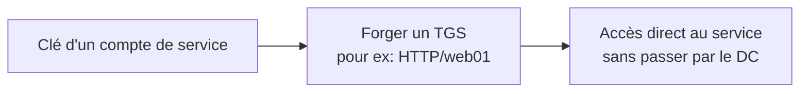

# 💠 Silver Ticket

> [!info] **En 1 phrase**
> Silver Ticket = forger un **TGS** (ticket de service) pour un service précis en possédant la clé
> du **compte de service** — sans toucher au KDC ni à krbtgt.

---

## 🎯 Concept



> [!info] 💡 **Différence avec le Golden Ticket**
> - **Golden** : forge un TGT (krbtgt) → **tout le domaine**.
> - **Silver** : forge un TGS pour **un service précis** → moins de bruit, pas de contact KDC.
> Les deux nécessitent une clé compromise.

---

## ⚙️ Comment ça marche

1. **Obtenir le hash NTLM** d'un compte de service (Kerberoast, mimikatz, secretsdump).
2. **Connaître** le SPN ciblé (ex : `HTTP/web01.corp.local`) et son SID.
3. **Forger** un TGS avec le bon SID (user arbitraire, groupes arbitraires).
4. Utiliser le ticket pour accéder **à ce service**.

> [!warning] 🚨 **Limite**
> Le Silver Ticket ne couvre **qu'un service** : si tu as le hash du service HTTP, tu peux forger
> des tickets HTTP — pas SMB. Mais beaucoup de services suffisent (CIFS, HTTP, LDAP...).

---

## 🛠️ Exploitation

```bash
# Mimikatz
kerberos::golden /user:fake /domain:corp.local /sid:S-1-5-21-... \
  /target:web01.corp.local /service:http /rc4:<hash_service> /ptt

# Impacket (Linux)
ticketer.py -nthash <hash_service> -domain-sid S-1-5-21-... \
  -domain corp.local -spn http/web01.corp.local fake
export KRB5CCNAME=fake.ccache
# puis utiliser avec les outils -k (ex: evil-winrm -k)
```

---

## 🔍 Détection & Défense

| Indicateur | Détail |
|---|---|
| **Événement 4624/4625** | Login via un TGS forgé : SID user/groupe cohérents mais session anormale |
| **Réponse** | Rotation des secrets de services, `Service Account` avec mdp forts/rotatifs, surveiller les accès service |

---

## ⚠️ Tips & Pièges

> [!tip] 💡 **Moins bruyant que le Golden**
> Pas de requête Kerberos vers le DC (le ticket est forgé localement) → passe souvent inaperçu des logs du KDC.

> [!warning] ⚠️ **Piège** : le TGS doit correspondre au **SPN exact** (majuscules, FQDN). Une erreur de casse = échec.

---

## 🔗 Liens

- [[Kerberos - Le protocole|👑 Kerberos]]
- [[Golden Ticket|👑 Golden Ticket]]
- [[Kerberoasting|🧀 Kerberoasting]] (source de la clé du service)
- → Note complète : [[05 - Active Directory|👑 Active Directory]]
