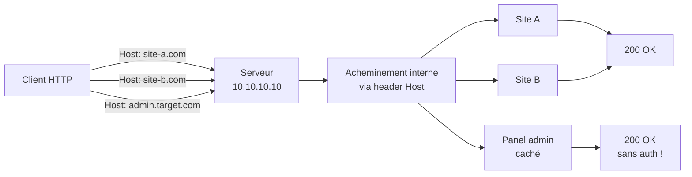

# 🏠 Virtual Hosts — énumération & exploitation

> [!info] **En 1 phrase**
> Un **vhost** = plusieurs sites hébergés sur une **même IP**, différenciés uniquement par le **header HTTP `Host`**
> → l'énumération des vhosts cachés expose des **apps internes, panneaux d'admin et endpoints invisibles**
> que la requête "par défaut" ne révèle jamais.
>
> Source principale : **[PayloadsAllTheThings — Virtual Hosts](https://github.com/swisskyrepo/PayloadsAllTheThings/blob/master/Virtual%20Hosts/README.md)**

---

## 🎯 Concept



> [!info] 💡 **Pourquoi c'est important**
> Apache/Nginx/IIS servent le **vhost par défaut** quand aucun `Host` ne correspond ou si le header est absent.
> Tout ce qui n'est pas déclaré comme vhost principal est invisible pour un scanner classique : apps de dev,
> staging, sous-domaines internes, admin panels. En bug bounty, ce sont souvent des **endpoints hors-scope**
> non référencés → bugs critiques.

```http
GET / HTTP/1.1
Host: site-b.com
```

> [!tip] 💡 Si le serveur ne connaît pas le `Host`, il retombe souvent sur le premier vhost configuré
> (site par défaut) : comparer systématiquement avec cette **réponse de référence**.

---

## 🕵️ Énumération

### ffuf (le standard)

```bash
# Le payload FUZZ remplace le sous-domaine dans le header Host
ffuf -w /usr/share/seclists/Discovery/DNS/subdomains-top1million-5000.txt \
     -u http://10.10.10.10/ \
     -H "Host: FUZZ.target.com" \
     -fs 12345                      # 🔥 filtre la TAILLE de la réponse par défaut

# Match par statut / filtre par statut
ffuf -w list.txt -u http://IP/ -H "Host: FUZZ.target.com" -mc 200,301,302
ffuf -w list.txt -u http://IP/ -H "Host: FUZZ.target.com" -fc 404,403

# Vhosts complets (wordlist de domaines entiers, pas de FUZZ prefixe)
ffuf -w vhosts.txt -u http://IP/ -H "Host: FUZZ" -fs 12345

# HTTPS + filtre multiple + slow (évite le rate limit)
ffuf -w list.txt -u https://IP/ -H "Host: FUZZ.target.com" -fs 12345,678 -t 20 -p 0.1
```

> [!warning] ⚠️ **`-fs` est la clé** : sans filtre, tous les vhosts inexistants matchent la page par défaut.
> On filtre d'abord la taille de la réponse de référence (`curl -s http://IP/ | wc -c`) puis on la met dans `-fs`.

### wfuzz

```bash
# FUZZ dans le header Host, --hh = filtre par taille de contenu
wfuzz -w subdomains.txt -u http://IP/ -H "Host: FUZZ.target.com" --hh 12345

# Afficher aussi code + taille + mots
wfuzz -w subdomains.txt -u http://IP/ -H "Host: FUZZ.target.com" -c --hc 404
```

### gobuster vhost

```bash
gobuster vhost -u http://target.com -w /usr/share/seclists/Discovery/DNS/subdomains-top1million-5000.txt

# Avec délai / requêtes par seconde (si WAF)
gobuster vhost -u https://target.com -w list.txt -t 20 --delay 100ms
```

### curl manuel (vérification ciblée)

```bash
# Forcer le header Host sur l'IP directement
curl -s -H "Host: admin.target.com" http://10.10.10.10/

# Avec résolution DNS forcée (si le domaine ne pointe PAS sur cette IP)
curl -s http://admin.target.com --resolve admin.target.com:80:10.10.10.10
curl -s https://admin.target.com --resolve admin.target.com:443:10.10.10.10 -k

# Comparer avec la réponse par défaut (référence)
curl -s http://10.10.10.10/ | wc -c
curl -s -H "Host: admin.target.com" http://10.10.10.10/ | wc -c
```

### 🔎 Sources de candidats

| Source | Commande / Exemple |
|---|---|
| Sous-domaines connus (recon) | `subfinder -d target.com`, `amass enum -passive -d target.com` |
| Censys / crt.sh (transparence des certificats) | `curl "https://crt.sh/?q=target.com&output=json"` |
| **SAN du certificat** | `echo | openssl s_client -connect IP:443 -servername target.com 2>/dev/null \| openssl x509 -noout -text \| grep -A1 "Subject Alternative Name"` |
| Wordlists SecLists | `/Discovery/DNS/subdomains-top1million-*.txt`, `vhosts` lists |
| Historique DNS (SecurityTrails, viewdns.info) | chercher les **anciennes IP** d'un domaine → vhosts cachés |
| Googlé / Github (code search) | `site:target.com intranet`, dumps de configs |

> [!tip] 💡 **DNS history** : si un domaine pointait vers une IP donnée dans le passé et que l'IP héberge
> aujourd'hui d'autres vhosts, "spray" le nom de domaine contre ces IP → révèle parfois le **vhost d'origine**
> (bypass Cloudflare/WAF en touchant l'origin server directement).

### 📏 Comparaison des réponses

```bash
# Taille de chaque réponse (le signal n°1)
for h in site-a.com site-b.com admin.target.com dev.target.com; do
  echo -n "$h : "; curl -s -H "Host: $h" http://IP/ | wc -c
done

# Diff visuel entre deux vhosts
diff <(curl -s -H "Host: reference" http://IP/) <(curl -s -H "Host: admin.target.com" http://IP/)

# En-têtes différents (Server, Location, Set-Cookie, X-Powered-By)
curl -sI -H "Host: admin.target.com" http://IP/
```

---

## 🖐️ Fingerprinting

> Un vhost trouvé doit être **confirmé** : les réponses différentes ne viennent pas d'une coïncidence.

| Indicateur | Exemple de signal |
|---|---|
| **Code statut** | défaut = `404`, vhost = `200` / `301` / `302` |
| **Content-Length** | défaut = 12345, vhost = 789 → différent = vhost actif |
| **Titre / contenu** | `<title>`, brand name, meta description, logo différent |
| **Page d'erreur custom** | 404 personnalisé ≠ 404 Apache par défaut |
| **En-têtes** | `Server:` (nginx vs apache), `Location:`, `Set-Cookie:` changent |
| **Chaîne de redirection** | vhost → redirige vers un autre domaine complet |
| **Certificat** | `Subject Alternative Name` liste d'autres domaines hébergés |

```bash
# Écarter le piège du wildcard : un vhost aléatoire (garbage) doit donner la MÊME réponse
curl -s -H "Host: gjhkqw9zq.target.com" http://IP/ | wc -c
curl -s -H "Host: admin.target.com"      http://IP/ | wc -c
```

> [!warning] ⚠️ **Piège du catch-all** : certains serveurs servent le même contenu pour TOUT hostname
> (vhost wildcard `*`). Un vhost "trouvé" doit se démarquer **clairement** de la réponse au hostname aléatoire.
> Compare toujours avec un **canary** (nom aléatoire), pas seulement avec la réponse par défaut.

---

## 💥 Exploitation

Une fois un vhost confirmé, tout le contenu devient accessible :

```http
GET / HTTP/1.1
Host: admin.target.com
```

```txt
Valeurs probables trouvées sur les vhosts cachés :
- /admin , /login , /panel          → authentification bypass / brute force
- /api , /graphql , /swagger        → endpoints API non protégés
- .git , .env , backups, /backup    → fuite de configs et secrets
- apps de staging / dev             → moins durcies, débogage activé
- sous-domaines internes            → intranet, monitoring, Jenkins, Grafana
- Token leaks : clés API, JWT de test, credentials en dur, .env
```

**Vecteurs concrets :**

```bash
# 1. Accès direct à l'app cachée via l'IP + header Host
curl -H "Host: admin.target.com" http://10.10.10.10/login

# 2. Si le vhost répond en HTTP mais pas en HTTPS (ou l'inverse)
curl -k -H "Host: admin.target.com" https://10.10.10.10/
curl -H "Host: admin.target.com" http://10.10.10.10:8080/

# 3. Fuzzing de répertoires DANS le vhost (défaut vs trouvé diffèrent)
ffuf -w /usr/share/seclists/Discovery/Web-Content/raft-small-directories.txt \
     -u http://IP/FUZZ -H "Host: admin.target.com" -fs 12345

# 4. Endpoint API du vhost
curl -H "Host: internal.target.com" http://IP/api/v1/users
```

> [!warning] ⚠️ Toujours vérifier la **scope** du bug bounty avant d'exploiter un vhost : un vhost caché
> peut correspondre à un domaine **hors-scope** même s'il est servi par la même IP.

---

## 🌐 DNS vs VHOST — ne pas confondre

| | Sous-domaine (DNS) | Virtual Host (vhost) |
|---|---|---|
| **Où c'est défini** | Zone DNS (`A` / `CNAME`) | Config du serveur web (Apache/Nginx/IIS) |
| **Comment c'est sélectionné** | Résolution DNS → IP différente | Header HTTP `Host` sur une même IP |
| **Test** | `dig A admin.target.com` | `curl -H "Host: admin.target.com" IP` |
| **Visible sur Internet** | Oui (le DNS le rend public) | Non (peut ne jamais apparaître dans le DNS) |

```bash
# Vérifier la résolution DNS réelle
dig A target.com +short          # → 1.2.3.4
dig A admin.target.com +short    # → 1.2.3.4  (même IP → candidat vhost)
dig A inexistant.target.com +short  # → 1.2.3.4  ⚠️ WILDCARD !

# Le wildcard DNS résout TOUT sous-domaine vers la même IP
# → l'énumération DNS classique devient inutile, il faut le fuzzing de vhosts
```

> [!tip] 💡 **Wildcard DNS** : si `*.target.com` → `1.2.3.4`, tous les sous-domaines "existent" côté DNS.
> On ne peut plus différencier par résolution : la seule façon de trouver les vhosts = fuzzer le header `Host`.

```txt
Résolution pour tester un vhost qui n'a pas de DNS public :
- /etc/hosts :  10.10.10.10  admin.target.com
- curl --resolve admin.target.com:443:10.10.10.10
- Proxy avec mise à jour du SNI/Host (Burp : hosts à la main)
```

---

## 🛠️ Outils

| Outil | Usage | Exemple |
|---|---|---|
| **ffuf** | Fuzzing vhost via `-H "Host: FUZZ.domain"` | `ffuf -w list -u http://IP/ -H "Host: FUZZ.target.com" -fs N` |
| **wfuzz** | Idem, `--hh` pour filtrer la taille | `wfuzz -w list -u http://IP/ -H "Host: FUZZ.target.com" --hh N` |
| **gobuster** | Mode `vhost` dédié | `gobuster vhost -u http://target.com -w list.txt` |
| **VHostScan** | Détecte catch-all, alias, pages dynamiques | `vhostscan -t IP -w list.txt` |
| **hakoriginfinder** | Trouver l'**origin** derrière un reverse proxy / CDN | `prips 93.184.216.0/24 \| hakoriginfinder -h https://example.com/foo` |
| **nmap** | Script `http-vhosts` | `nmap -p80 --script http-vhosts --script-args http-vhosts.default-host=target.com IP` |
| **amass** | Énumération passive des sous-domaines (donne les candidats) | `amass enum -passive -d target.com` |

```bash
# nmap : énumère les vhosts à partir d'une liste
nmap -p 80,443 --script http-vhosts \
     --script-args http-vhosts.default-host=target.com,\
     http-vhosts.hosts=/tmp/vhosts.txt IP
```

---

## 🔍 Détection & Défense

| Contre-mesure | Détail |
|---|---|
| **Valider le header `Host`** | Whitelist des hostnames autorisés → les vhosts inconnus reçoivent un 400/404 |
| **Pas de vhost par défaut révélateur** | Le vhost par défaut ne doit pas exposer de contenu sensible ni d'apps internes |
| **Restreindre l'accès par vhost** | Auth requise sur les vhosts internes/admin (SSO, IP allowlist) |
| **Protéger les vhosts internes** | `internal.target.com` derrière VPN/allowlist, pas sur l'IP publique |
| **Limiter les infos de fingerprint** | Titres, `Server:` banner, pages d'erreur customs sur TOUS les vhosts |
| **Vhosts de staging/CI** | Éteindre après usage, pas de credentials en dur, mêmes règles que la prod |
| **Surveillance** | Alertes sur les requêtes avec `Host:` inhabituel, scans volume élevé, accès à l'IP brute |

---

## ⚠️ Tips & Pièges

> [!tip] 💡 **Subdomain ≠ vhost**
> Un sous-domaine est un enregistrement **DNS** ; un vhost est une règle **serveur web**. Les deux peuvent
> coexister sans se recouper : un sous-domaine peut pointer ailleurs, un vhost peut ne jamais exister dans le DNS.
> Toujours tester les **deux** (recon DNS + fuzzing Host).

> [!tip] 💡 **Statut + taille = le signal**
> Comparer **code statut ET Content-Length** entre la réponse par défaut et chaque candidat.
> Une longueur identique au défaut = mauvais match. Une différence + un 200 = probablement bon.

> [!warning] ⚠️ **Pièges**
> - **Wildcard DNS** : si tous les hostnames résolvent, l'énumération DNS ne sert à rien → fuzzer le Host.
> - **Catch-all serveur** : vhost `*` qui sert le même contenu partout → comparer avec un **canary aléatoire**.
> - **www** : tester `www.target.com` et `target.com` séparément, ce sont parfois **deux vhosts différents**.
> - **TLS/SNI** : en HTTPS, le header Host et le SNI doivent être cohérents (`--resolve` + `-k`).
> - **Ports multiples** : tester 80, 443, 8080, 8443 — les vhosts peuvent différer par port.
> - **Requêtes HTTP/1.1 obligatoires** : certains outils envoient HTTP/1.0 sans Host → test raté.
> - Le vhost peut rediriger vers un **autre domaine** → suivre la redirection, pas s'arrêter au 302.

---

## 🔗 Liens

- [[01 - Reconnaissance|🔎 Reconnaissance]]
- [[Open Redirect|↩️ Open Redirect]]
- [[IDOR|🎯 IDOR]]
- [[SSRF|🌐 SSRF]]
- → Note complète : [[03 - Exploitation Web|🌍 Exploitation Web]]
- 📚 Source : [PayloadsAllTheThings — Virtual Hosts](https://github.com/swisskyrepo/PayloadsAllTheThings/blob/master/Virtual%20Hosts/README.md)
