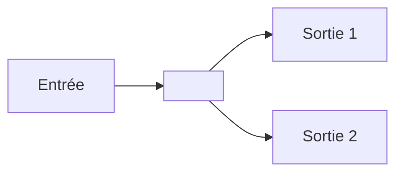

# <Emoji> <Nom> — <Sous-titre descriptif>

> [!info] **En 1 phrase**
> <Phrase résumant l'outil. CONSERVER la phrase existante mot pour mot si présente.>

---

## Overview

| Champ | Valeur |
|---|---|
| Nom complet | |
| Description | |
| Catégorie | |
| Sous-catégorie | |
| Fonction principale | |
| Type d'outil | CLI / GUI / framework / library / service |
| Licence | |
| Open source / propriétaire | |
| Langage(s) de programmation | |
| Développeur / organisation | |
| Projet officiel | |
| Dépôt officiel | |
| Documentation officielle | |
| Date de création | |
| État du projet | actif / maintenu / obsolète |
| Dernière version connue | |
| Systèmes compatibles | Linux / Windows / macOS / autres |

> [!note] Pour vérifier / compléter
> Champs laissés vides si l'information n'est pas confirmée par une source officielle.

---

## Concept

<Pourquoi cet outil existe, à quoi il sert, où il se place dans un pentest, historique, écosystème. 3-8 phrases approfondies.>



---

## Concepts fondamentaux

<Les concepts techniques nécessaires pour comprendre l'outil : protocoles, architecture client/serveur, formats, authentification, etc. Expliqués sans présumer que le lecteur les connaît. 5-15 lignes structurées.>

| Concept | Explication |
|---|---|
| | |

---

## Installation

### Debian / Ubuntu / Kali Linux

```bash
sudo apt update && sudo apt install -y <paquet>
```

### Arch Linux

```bash
sudo pacman -S <paquet>
```

### Fedora / RHEL

```bash
sudo dnf install <paquet>
```

### macOS

```bash
brew install <paquet>
```

### Windows

```powershell
# ex : choco install <paquet>
```

### Docker

```bash
docker pull <image>
docker run <image>
```

### Compilation depuis les sources

```bash
git clone <repo> && cd <repo>
# ./configure && make && sudo make install
```

> [!warning] Prérequis & problèmes potentiels
> <Dépendances, permissions, versions requises.>

---

## Configuration

<Fichiers de config, emplacements, variables d'environnement, paramètres. Pour chaque paramètre important :>

| Paramètre | Rôle | Valeur possible | Impact | Exemple |
|---|---|---|---|---|
| | | | | |

---

## Architecture interne

<Composants, modules, processus, bibliothèques, flux de données, protocoles utilisés, formats de fichiers, API, système d'extension. Ce qui se passe réellement à l'exécution.>

---

## Commandes

### Commandes principales

```bash
<outil> [options] [arguments]
```

<Pour chaque commande importante : syntaxe, objectif, options, arguments, résultat attendu, erreurs fréquentes.>

| Commande | Objectif | Résultat attendu |
|---|---|---|
| | | |

### Commandes avancées

```bash
# Exemples d'usage avancé
```

---

## Options et flags

| Option | Description | Exemple | Niveau |
|---|---|---|---|
| `--example` | Explication | `tool --example` | Basic |
| | | | Intermediate |
| | | | Advanced |
| | | | Expert |

> [!tip] Options les plus utiles au quotidien
> <Rappel des 3-5 options indispensables.>

---

## Exemples pratiques

### Beginner

<1-3 exemples simples. Pour chaque : objectif, commande, explication, résultat attendu, erreurs possibles.>

```bash
# Objectif : ...
<commande>
```

### Intermediate

<Scénarios réalistes.>

### Advanced

<Utilisation avancée.>

### Expert

<Cas complexes, automatisation, intégration, troubleshooting.>

---

## Workflow complet (scénario pas à pas)

1. **Étape** — explication
   ```bash
   # commande
   ```
2. **Étape** — explication

---

## Scénarios avancés

### Scénario 1 : <contexte>

<Cas d'usage précis avec commandes.>

### Scénario 2 : <contexte>

---

## Cybersecurity use cases

<Dans quelle phase d'une opération intervient l'outil : reconnaissance, énumération, vulnérabilité, exploitation, post-exploitation, etc.>

| Phase | Utilisation |
|---|---|
| | |

---

## MITRE ATT&CK

| Tactique | Technique / Sub-technique | ID | Raison | Détection | Mitigation |
|---|---|---|---|---|---|
| | | T1xxx.x | | | |

> [!note] Ne renseigner que si l'association est réellement pertinente.

---

## Defensive Security

<Comment détecter l'utilisation de l'outil, logs, indicateurs, traces réseau/système, processus, fichiers, événements Windows, logs Linux, SIEM, EDR, IDS/IPS.>

### Signes observables

| Indicateur | Détail |
|---|---|
| | |

### Règles de détection (Sigma / Suricata / Snort / YARA)

```yaml
# Exemple Sigma
```

```bash
# Exemple Suricata/Snort
alert tcp any any -> any any (msg:"..."; ...)
```

---

## Automatisation

<Bash, Python, PowerShell, API REST, JSON, pipelines, CI/CD, Docker, orchestration.>

```bash
# Exemple
```

```python
# Exemple
```

---

## Output et parsing

<Formats de sortie : stdout, stderr, JSON, XML, CSV, HTML, logs. Comment parser et exploiter la sortie.>

```bash
<outil> ... | jq '...'
```

```python
# Exemple de parsing
```

---

## Intégrations

<Outils avec lesquels cet outil est couramment utilisé. Workflows. Créer des liens Obsidian vers les outils du vault lorsqu'ils existent.>

```text
Tool A → <Outil> → Tool C → SIEM
```

- [[Tools| Outils]]

---

## Alternatives

| Outil | Avantages | Inconvénients | Cas d'usage |
|---|---|---|---|
| | | | |

> **Quand utiliser <X> plutôt que <Y> ?** <Réponse concise.>

---

## Performance

<Consommation CPU/mémoire/réseau/disque, parallélisation, threading, vitesse, limites, scalabilité, optimisation. Chiffres uniquement si sourcés.>

---

## Troubleshooting

### Common problems

#### Problème : <titre>

- **Cause** : ...
- **Solution** : ...
- **Vérification** : ...

---

## Sécurité de l'outil

<Risques d'utilisation, permissions, root/admin, secrets, télémétrie, plugins, mauvaises configurations, recommandations de sécurisation.>

---

## Limitations

<Ce que l'outil ne sait pas faire, faux positifs/négatifs, protocoles non supportés, environnements problématiques, dépendances.>

---

## Cheatsheet

```bash
# Commande 1 — objectif
<commande 1>

# Commande 2 — objectif
<commande 2>
```

---

## Quick reference

| | |
|---|---|
| **À quoi sert-il ?** | |
| **Quand l'utiliser ?** | |
| **Commande principale** | |
| **Alternative principale** | |
| **Concepts importants** | |
| **Liens associés** | |

---

## Détection & Défense

| Signe | Défense |
|---|---|
| | |

---

## Tips & Pièges

> [!tip] **Tips**
> <3-5 conseils concrets.>

> [!warning] **Pièges**
> <3-5 erreurs fréquentes à éviter.>

---

## References

### Official

- Documentation officielle : <URL>
- GitHub officiel : <URL>
- Wiki officiel : <URL>

### Security references

- MITRE ATT&CK : <URL>
- OWASP : <URL>
- NIST : <URL>

### Community

- <Articles techniques réputés, write-ups, blogs spécialisés>

---

**Liens :** [[Tools| Outils]] · <liens vers les fiches techniques liées du vault>
