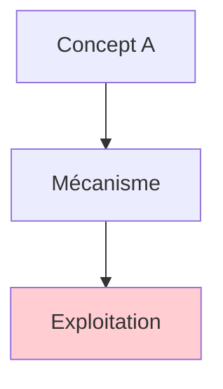
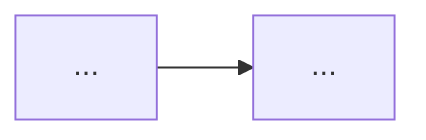
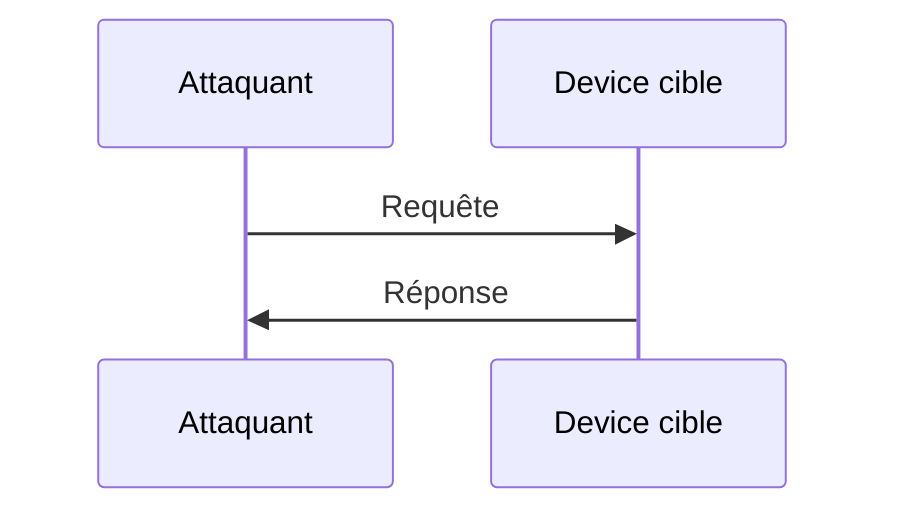
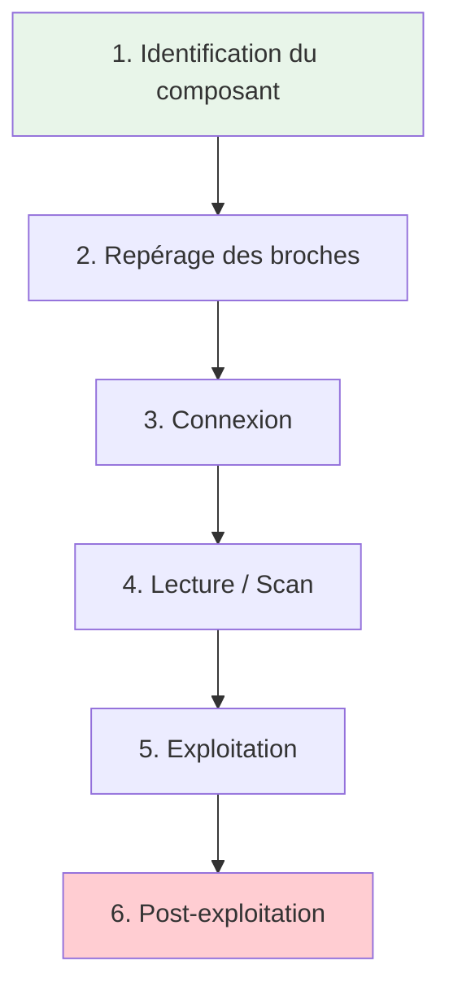
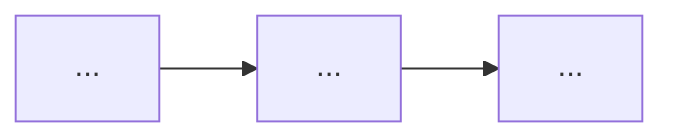
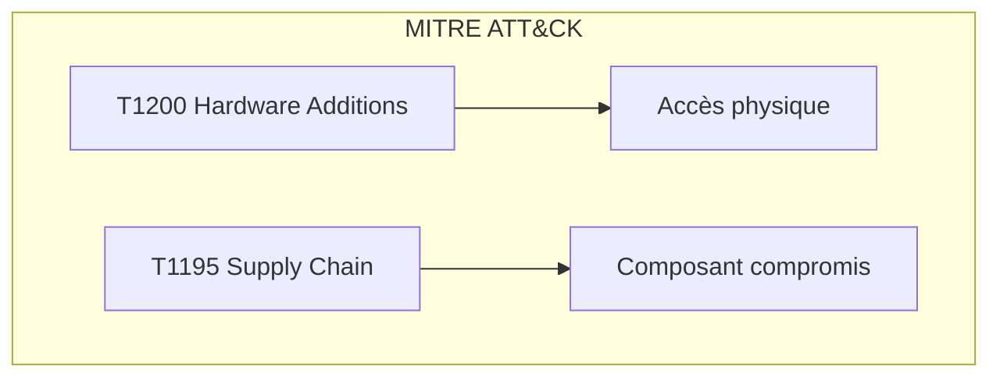
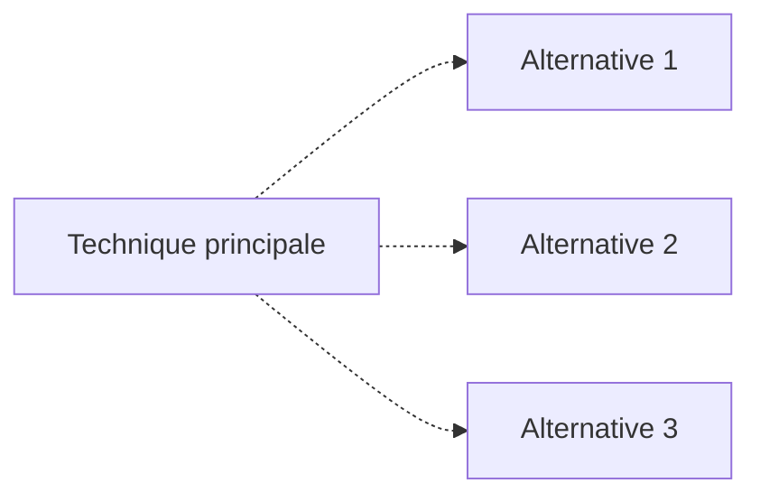

# <% tp.file.title %>

> [!info] **En 1 phrase**
> [résumé court de la technique]

---

## Overview

| Champ | Valeur |
|---|---|
| **Type** | Protocole / Bus / Outil / Carte / Concept |
| **Domaine** | Hardware Hacking |
| **Niveau** | Beginner → Expert |
| **OS cibles** | Linux embedded, bare-metal, RTOS |
| **Matériel requis** | [liste des cartes/prises nécessaires] |
| **Complexité** | Faible / Moyenne / Élevée |
| **Dernière mise à jour** | YYYY-MM-DD |

> [!info] **Diagramme de contexte**
> ```mermaid
> flowchart LR
>     A["Composant principal"] --> B["Bus/protocole"]
>     B --> C["Cible / Device"]
>     C --> D["Résultat"]
>     style A fill:#e1f5fe
>     style D fill:#c8e6c9
> ```

---

## Concept

> Description du concept : quoi, pourquoi, quand l'utiliser en pentest hardware.



---

## Concepts fondamentaux

### [Sous-concept 1]

Explication détaillée des mécanismes sous-jacents.

| Terme | Définition |
|---|---|
| | |

### [Sous-concept 2]



### [Sous-concept 3]

---

## Matériel / Composants

### Outils principaux

| Outil | Type | Usage | Prix | Source |
|---|---|---|---|---|
| | | | | |

### Cibles typiques

| Catégorie | Exemples | Protocoles | Vulnérabilités |
|---|---|---|---|
| | | | |

### Pinout / Brochage

```
Vue du composant (pin 1 marqué par un point/dot) :

       ┌──────────────┐
  VCC ─┤1            8├─ GND
   TX ─┤2            7├─ [unused]
   RX ─┤3            6├─ [unused]
  GND ─┤4            5├─ [unused]
       └──────────────┘
```

---

## Protocoles

### [Protocole 1]

| Paramètre | Valeur |
|---|---|
| **Type** | Série / Parallèle / Sans fil |
| **Vitesse** | |
| **Voltage** | |
| **Nombre de fils** | |
| **Direction** | Simplex / Full-duplex |

### [Protocole 2]



### Comparaison des protocoles

| Protocole | Vitesse | Complexité | Sécurité | Usage typique |
|---|---|---|---|---|
| | | | | |

---

## Installation / Setup

### Prérequis

| Composant | Version | Lien |
|---|---|---|
| | | |

### Connexion physique

```
PC ──── Adaptateur USB ──── Broches du device cible
│                          │
│  RX ──────────────────── TX
│  TX ──────────────────── RX
│  GND ─────────────────── GND
│  VCC ──[NE PAS BRANCHER]─
```

### Outils logiciels

```bash
# Installation
pip install <outil>

# Vérification
<outil> --version
```

---

## Configuration

### Paramètres du logiciel d'interfaçage

| Option | Valeur par défaut | Description |
|---|---|---|
| | | |

### Configuration matérielle

| Paramètre | Recommandé | Min | Max |
|---|---|---|---|
| | | | |

### Adaptateurs compatibles

| Adaptateur | Interface | Voltage | Note |
|---|---|---|---|
| CH341A | USB-SPI/I2C | 3.3V/5V | Bon marché |
| Bus Pirate | USB multi-protocole | 3.3V/5V | Polyvalent |
| FT232H | USB multi-protocole | 3.3V | Fiable |
| | | | |

---

## Commandes / Manipulations

### Commandes essentielles

| Commande | Description | Exemple |
|---|---|---|
| | | |

### Lecture / Écriture

```bash
# Lecture
<commande>

# Écriture
<commande>

# Scan / Découverte
<commande>
```

### Shell / Console

```bash
# Connexion à la console série
screen /dev/ttyUSB0 115200

# Ou avec minicom
minicom -D /dev/ttyUSB0 -b 115200
```

---

## Exemples pratiques

### Débutant — [Scénario 1]

```bash
# Étape 1
<commande>
# Étape 2
<commande>
```

### Intermédiaire — [Scénario 2]

```bash
# Script de scan complet
<commande>
```

### Avancé — [Scénario 3]

```python
# Script d'exploitation avancé
<code>
```

### Expert — [Scénario 4]

```python
# Technique de niveau expert
<code>
```

---

## Workflow complet (scénario pas à pas)



### Étape 1 — Identification

| Action | Commande | Résultat attendu |
|---|---|---|
| | | |

### Étape 2 — Repérage des broches

| Méthode | Difficulté | Fiabilité |
|---|---|---|
| | | |

### Étape 3 — Connexion

### Étape 4 — Exploitation

### Étape 5 — Post-exploitation

---

## Scénarios avancés

### Scénario 1 — [Nom]

| Élément | Détail |
|---|---|
| **Objectif** | |
| **Matériel** | |
| **Étapes** | |
| **Résultat** | |
| **Difficulté** | |



### Scénario 2 — [Nom]

| Élément | Détail |
|---|---|
| **Objectif** | |
| **Matériel** | |
| **Étapes** | |
| **Résultat** | |
| **Difficulté** | |

---

## Cybersecurity use cases

| Use case | Sévérité | Matériel requis | Impact |
|---|---|---|---|
| | | | |

| Phase pentest | Ce que permet cette technique |
|---|---|
| Recon | |
| Accès initial | |
| Maintien d'accès | |
| Évasion | |

---

## MITRE ATT&CK

| Technique ID | Nom | Catégorie | Applicabilité |
|---|---|---|---|
| T1200 | Hardware Additions | Initial Access | Ajout de matériel malveillant |
| T1195 | Supply Chain Compromise | Initial Access | Compromission de la chaîne d'approvisionnement |
| | | | |



### Mapping détaillé

| Phase MITRE | Technique | Cette fiche couvre |
|---|---|---|
| | | |

---

## Defensive Security

### Détection

| Signal de détection | Source | Fiabilité |
|---|---|---|
| | | |

| Indicateur | Log / Capteur | Seuil d'alerte |
|---|---|---|
| | | |

### Prévention

| Mesure | Efficacité | Coût | Priorité |
|---|---|---|---|
| | | | |

### Durcissement (hardening)

```bash
# Mesures de protection
<commande/configuration>
```

---

## Automatisation

### Scripts d'exploitation

```python
#!/usr/bin/env python3
"""Script d'automatisation pour [technique]"""
# Code d'exemple
```

### Outils d'automatisation

| Outil | Usage | Lien |
|---|---|---|
| | | |

### Intégration dans des frameworks

| Framework | Méthode d'intégration |
|---|---|
| Metasploit | |
| Custom framework | |

---

## Output et parsing

### Formats de sortie

| Format | Exemple | Utilité |
|---|---|---|
| | | |

### Parsing des résultats

```bash
# Extraction de données
<commande> | grep <filtre>

# Export
<commande> > output.txt
```

### Intégration SIEM / Logging

| Source | Format | Pipeline |
|---|---|---|
| | | |

---

## Intégrations

- [[13 - Hardware & IoT| Hardware & IoT]] global
- [Techniques similaires]
- [Outils complémentaires]

| Outils associés | Usage complémentaire |
|---|---|
| | |

| Intégration | Comment |
|---|---|
| | |

---

## Alternatives

| Alternative | Avantages | Inconvénients | Cas d'usage |
|---|---|---|---|
| | | | |



---

## Performance

| Métrique | Valeur | Impact |
|---|---|---|
| Vitesse de transfert | | |
| Latence | | |
| Fiabilité | | |
| Portée (si sans fil) | | |

### Optimisations

| Technique | Gain | Complexité |
|---|---|---|
| | | |

---

## Troubleshooting

| Problème | Cause probable | Solution |
|---|---|---|
| | | |

### Erreurs courantes

```
Erreur : [message d'erreur typique]
Cause : [explication]
Solution : [correction]
```

### Diagnostic

```bash
# Vérifier la connexion
<commande>

# Vérifier les pilotes
lsusb
dmesg | tail
```

---

## Sécurité

| Risque | Impact | Mitigation |
|---|---|---|
| | | |

> [!warning] Points de sécurité
> - [Recommandation 1]
> - [Recommandation 2]

### Restrictions légales

> [!danger] Cadre légal
> [Information sur le cadre légal d'utilisation]

---

## Limitations

| Limite | Impact | Contournement |
|---|---|---|
| | | |

### Cas où cette technique ne fonctionne pas

| Scénario | Raison |
|---|---|
| | |

---

## Cheatsheet

```
┌─────────────────────────────────────────────┐
│ [Technique] — Cheatsheet                    │
├─────────────────────────────────────────────┤
│ Scan :       <commande>                     │
│ Lecture :     <commande>                    │
│ Écriture :    <commande>                    │
│ Exploit :     <commande>                    │
│ Post-exploit: <commande>                    │
└─────────────────────────────────────────────┘
```

| Action | Commande |
|---|---|
| | |

---

## Quick reference

| Élément | Valeur / Commande |
|---|---|
| **Fonction** | |
| **Brochage** | |
| **Vitesse par défaut** | |
| **Voltage** | |
| **Logiciel principal** | |
| **Commande rapide** | |

---

## Détection & Défense

| Signal | Méthode de détection | Outil |
|---|---|---|
| | | |

| Countermeasure | Efficacité | Implémentation |
|---|---|---|
| | | |

> [!tip] Défense
> [Conseils de défense spécifiques]

---

## Tips & Pièges

- **Piège 1** : [description]
- **Piège 2** : [description]
- **Astuce 1** : [description]
- **Astuce 2** : [description]
- **Bonne pratique** : [description]

> [!tip] Astuces
> - [Astuce 1]
> - [Astuce 2]

---

## References

> [!info] **Sources**
> - [Lien 1](url)
> - [Lien 2](url)
> - [Lien 3](url)

### Documentation officielle

| Source | URL | Type |
|---|---|---|
| | | |

### Vidéos / Tutorials

| Titre | Auteur | Lien |
|---|---|---|
| | | |

### Livres / Articles

| Titre | Auteur | Année |
|---|---|---|
| | | |

---

**Liens :** [[13 - Hardware & IoT| Hardware & IoT]] · [liens vers fichiers similaires]
